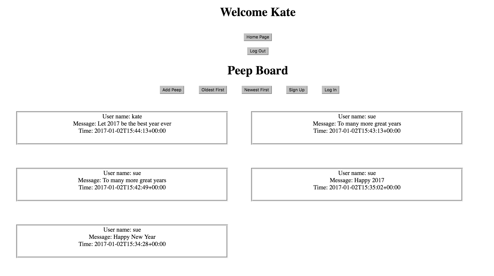
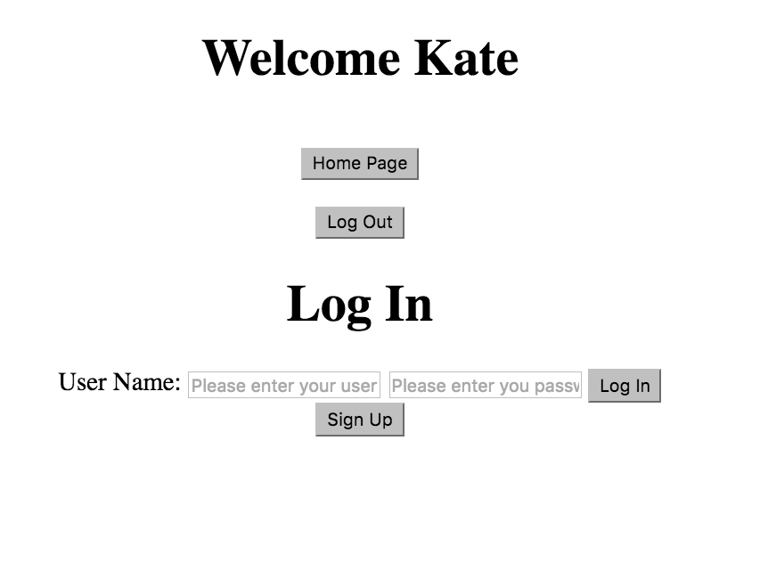
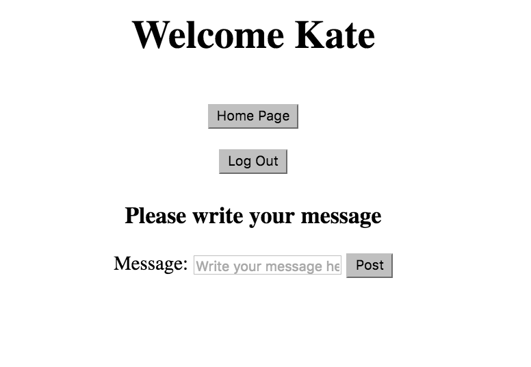
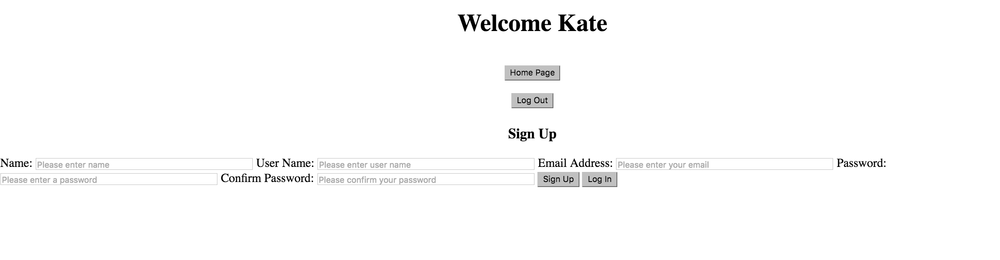

Chitter Challenge
=================

Author: Courtney Osborn










Task:
----

This is a replication of Twitter

It allows a user to do the following:

- sign up
- log in
- log out
- post a peep
- view all peeps when log in or not
- view peeps in chronological order
- view time stamp of when peep was posted

Access Chitter:
-------

```
$ git clone git@github.com:CourtneyLO/chitter-challenge.git
$ cd chitter-challenge
$ install bundle
$ visit https://chitter-manager-board.herokuapp.com/

(Ensure that you have bundler installed and initialized)

Enjoy!
```


Gems that should be Installed:
-----------------------------

- ruby '2.2.3'
- gem 'sinatra'
- gem 'bcrypt'
- gem 'sinatra-flash'
- gem 'dm-validations'
- gem 'pry'
- gem 'data_mapper'
- gem 'dm-postgres-adapter'
- gem 'dm-migrations'
- gem 'dm-transactions'
- gem 'capybara'
- gem 'rspec-sinatra'
- gem 'database_cleaner'
- gem 'rspec',  '3.4.0'
- gem 'rake'

Run Tests
---------

- $ rspec


Full Instructions: Task Set Out To Complete
-------------------------------------------

```
As a Maker
So that I can post messages on Chitter as me
I want to sign up for Chitter

As a Maker
So that I can post messages on Chitter as me
I want to log in to Chitter

As a Maker
So that I can avoid others posting messages on Chitter as me
I want to log out of Chitter

As a Maker
So that I can let people know what I am doing  
I want to post a message (peep) to chitter

As a maker
So that I can see what others are saying  
I want to see all peeps in reverse chronological order

As a maker
So that I can better appreciate the context of a peep
I want to see the time at which it was made
```
