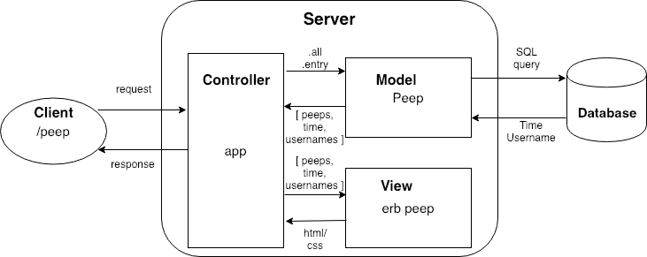

Chitter Challenge
=================

Chitter is a small Twitter clone that will allow the users to post messages to a public stream.

#### User Stories:

```
As a Maker
So that I can let people know what I am doing  
I want to post a message (peep) to chitter

As a maker
So that I can see what others are saying  
I want to see all peeps in reverse chronological order

As a Maker
So that I can better appreciate the context of a peep
I want to see the time at which it was made

As a Maker
So that I can post messages on Chitter as me
I want to sign up for Chitter

```

Technical Approach:
-----
Use PostgreSQL to integrate database into Chitter and make `SQL` queries with `PG` gem.

### Domain Model

<div style='float: center'>

</div>


### Class Responsibility Collaborator

```
|----------------------------------------|
|                  Chitter               |
|----------------------------------------|
| Responsibilities    |  Collaborators   |
|----------------------------------------|
| show peeps          | user             |
| show time of peep   |                  |
| show user's name    |                  |
| register users      |                  |
|----------------------------------------|

|----------------------------------------|
|                   User                 |
|----------------------------------------|
| Responsibilities    | Collaborators    |
|----------------------------------------|
| write a peep        |                  |
|----------------------------------------|

```


Notes on functionality:
------

* You don't have to be logged in to see the peeps.
* Makers sign up to chitter with their email, password, name and a username (e.g. samm@makersacademy.com, password123, Sam Morgan, sjmog).
* The username and email are unique.
* Peeps (posts to chitter) have the name of the maker and their user handle.
* Your README should indicate the technologies used, and give instructions on how to install and run the tests.
