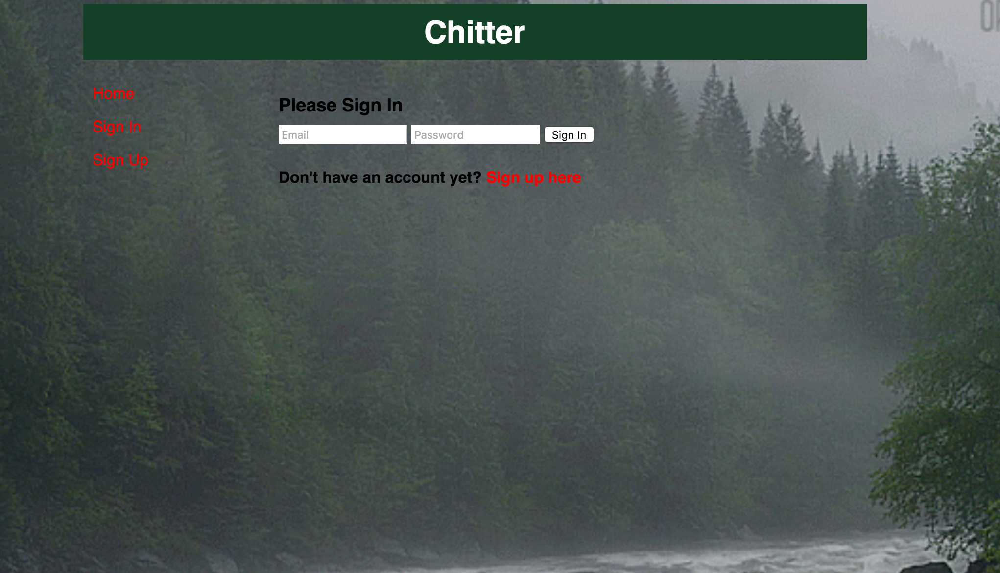
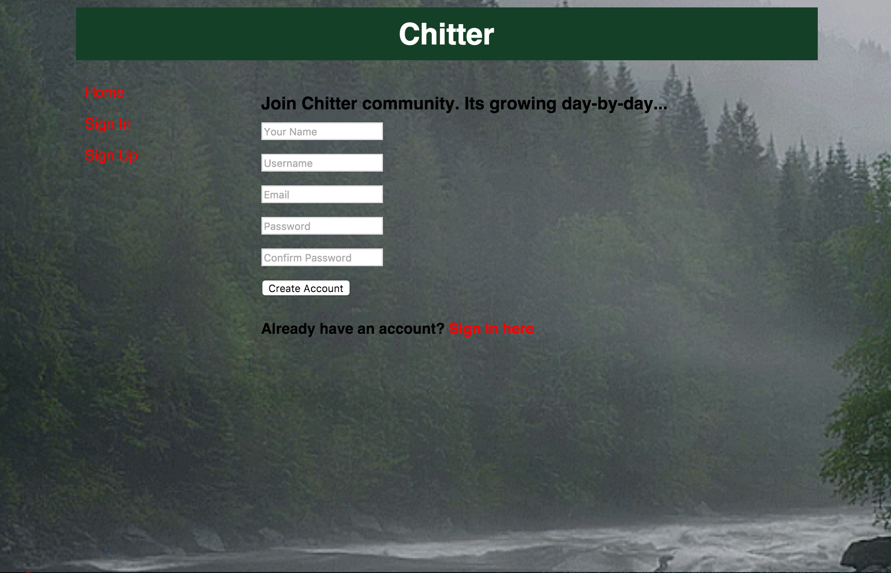
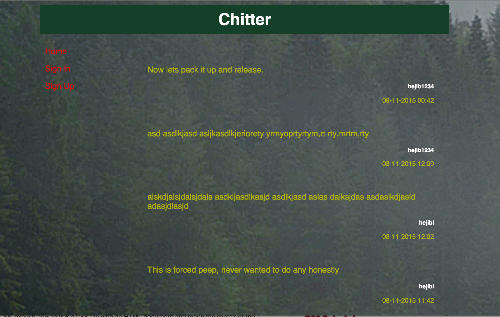

Chitter Challenge
=================
Specs
-----
This challenge is to create a twitter clone using Sinatra, Ruby and PostgreSQL. Although it is not a complete clone but I have made an attempt to create something similar during the weekend.

Following Technologies were used
--------------------------------
Ruby
Sinatra
PostgreSQL
DataMapper
Tested using Rspec/Capybara

Features Incorporated
---------------------

    As a Maker
    So that I can post messages on Chitter as me
    I want to sign up for Chitter

    As a Maker
    So that I can post messages on Chitter as me
    I want to log in to Chitter

    As a Maker
    So that I can avoid others posting messages on Chitter as me
    I want to log out of Chitter

    As a Maker
    So that I can let people know what I am doing  
    I want to post a message (peep) to chitter

    As a maker
    So that I can see what others are saying  
    I want to see all peeps in reverse chronological order

    As a maker
    So that I can better appreciate the context of a peep
    I want to see the time at which it was made

Notes on functionality
-----------------------
* All features tested using Rspec/Capybara.
* User signs up with userid, name, email and password
* The username and email are unique.
* Peeps (posts to chitter) have the name of the maker and their user handle.
* Used bcrypt to secure the passwords.
* Used datamapper and postgres to save the data.
* One can see peeps without login to the site.
* User can peep only when logged in.
* Used little CSS so as to make it look good

Couldn't achieve:
-----------------

* No functionality for user to reply to a peep

How to run
----------

rachup will start the server.

