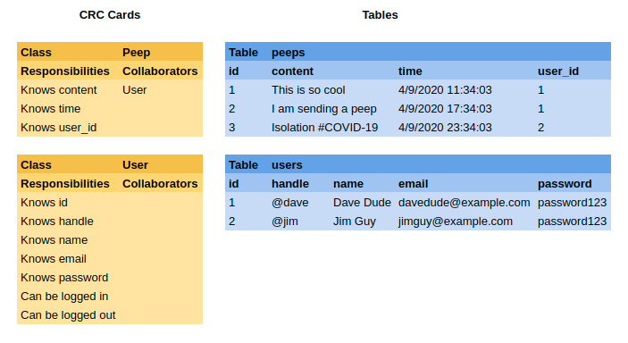

# Chitter Challenge

A small Twitter clone project to practice TDD, OOP, Database Integrated Web Apps.

## User Stories

Must have:

> As a Maker  
> So that I can let people know what I am doing  
> I want to post a message (peep) to Chitter

> As a maker  
> So that I can see what others are saying  
> I want to see all peeps in reverse chronological order

> As a Maker  
> So that I can better appreciate the context of a peep  
> I want to see the time at which it was made

> As a Maker  
> So that I can post messages on Chitter as me  
> I want to sign up for Chitter

Should have:

> As a Maker  
> So that only I can post messages on Chitter as me  
> I want to log in to Chitter

> As a Maker  
> So that I can avoid others posting messages on Chitter as me  
> I want to log out of Chitter

Nice to have:

> As a Maker  
> So that I can stay constantly tapped in to the shouty box of Chitter  
> I want to receive an email if I am tagged in a Peep

> As a Maker  
> In order to start a conversation  
> I want to reply to a peep from another Maker

> As a Maker  
> So that my eyes do not hurt  
> I want the site to be nicely styled

## Additional requirements

- [x] You don't have to be logged in to see the peeps.
- [x] Makers sign up to Chitter with their email, password, name and a username (e.g. samm@makersacademy.com, password123, Sam Morgan, sjmog).
- [x] The username and email are unique.
- [ ] Peeps (posts to Chitter) have the name of the maker and their user handle.
- [ ] Your README should indicate the technologies used, and give instructions on how to install and run the tests.
- [ ] High test coverage and all tests passing
- [ ] Configure Travis,[Travis Basics](https://docs.travis-ci.com/user/tutorial/), [Travis - Setting up Databases](https://docs.travis-ci.com/user/database-setup/)

## Instructions

_Coming soon_

### Dependencies

- Ruby
- Postgresql

### Database Setup

1. With `psql` set up the production and test databases with the following commands:

   ```psql
   CREATE DATABASE chitter;
   CREATE DATABASE chitter_test;
   ```

2. Run the commands in the files in `db/migrations` in order for each of the production and test databases.

## Screen Previews

_Coming soon_

## Development Journal

### Development Approach

I approached this project using Test Driven Development strategies:

- Only write the most basic test you need to fail.
- Only write production code to pass a failing test.
- Only write the most basic production code to pass the test.

I approached this project with object oriented programming in mind:

- Objects should encapsulate methods that are related to one another in purpose.
- Methods should have a single responsibility, so they do not do too much, and are concise.

In order to keep code clear and readable, I used rubocop for linting.

### Domain Modelling

I wrote a short CRC card model and an outline of Table Scheme:



### Prepare Testing Infrastructure

- Added Sinatra and Capybara to the gemfile.
- Added config.ru to allow rackup.
- Added testing gems and app file to `spec_helper.rb`, also configures Capybara app.
- Wrote Hello World test to check Sinatra and Capybara all working correctly. Red.
- Created `app.rb` with route for '/' returning Hello World. Green.

### User Stories 1, 2, 3

> As a Maker  
> So that I can let people know what I am doing  
> I want to post a message (peep) to Chitter

> As a maker  
> So that I can see what others are saying  
> I want to see all peeps in reverse chronological order

> As a Maker  
> So that I can better appreciate the context of a peep  
> I want to see the time at which it was made

Core functionality:

- See peeps, newest first
- Each peep has a timestamp
- Post a peep, entering the content

### Seeing some preloaded peeps

On the home page there should be a list of peeps.

Wrote a feature test to visit '/' and see a list of peeps. Red.

- Updated '/' with a hardcoded array of peeps, and to render index.erb.
- index.erb in views dir uses executive ruby to iterate over peeps array and print each one as a list item.

Green. Now should refactor the peeps from controller to model.

Wrote a test for a Peep class. The #all class method should return the previously hardcoded peep array. Red.

- Created lib dir, and peep.rb
- Wrote Peep class with class method all returning the hardcoded peep array.

Green. Now refactor for controller to use model.

- Required peep.rb in app.rb
- Removed hardcoded peep array from '/' route and replaced with Peep.all call.

Tests still green.

The second part of this is to be able to see them in reverse chronological order. Newest first. In order for that, each peep needs to have a timestamp attached.

### Switching to Databases

This is a good point to move the peeps to a database, before things get too messy in the model.

- Created a new PostgreSQL database: chitter using the psql command:

  ```psql
  CREATE DATABASE chitter;
  ```

- Also created a testing database with:

  ```psql
  CREATE DATABASE chitter_test;
  ```

- According to the table schema I had drawn up, the peeps table needs the following columns:

  - id - serial primary key.
  - content - variable characters up to 240 in length.
  - time - a timestamp.
  - user_id - representing which user authored the peep. (this will be added later when users are implemented)

- The query to set up a table to this schema is:

  ```sql
  CREATE TABLE peeps (id SERIAL PRIMARY KEY, content VARCHAR(240), time TIMESTAMP DEFAULT CURRENT_TIMESTAMP);
  ```

- This query was saved in `01_create_peeps_table.sql` in the db/migrations dir for later reference.

Now to add some data into the databases.

- Manually inserted three peeps using the following command(The id and time are generated automatically):

  ```sql
  INSERT INTO peeps (content) VALUES ('This is so cool');
  INSERT INTO peeps (content) VALUES ('I am sending a peep');
  INSERT INTO peeps (content) VALUES ('Isolation #COVID-19');
  ```

The model needs to be updated to access the database. This is achieved using the PG gem.

- Refactored Peep.all to use a PG connection, executing a query to select all columns from the peeps table.
- The result of the query is an object containing a series of hashes that are the rows of the table. The can be mapped through putting out the 'content' value as each item of an array.

Tests still green.

### Using Test Database

Now is probably a good time make sure than tests use `chitter_test`.

- At the top of spec_helper, set ENV['ENVIRONMENT'] to 'test'
- In Peep.all, connect to either the production or test database based on the ENVIRONMENT value.

### Resetting Database for Every Test

Each test should have an empty database to run on, and they should insert the data that is needed for the test.

- Wrote a setup_test_database method in file of the same name, which connects to `chitter_test` and truncates the peeps table.
- Required this in spec_helper.rb and configured the method to run before each test.
- Updated tests to insert the data required for using PG.connect

### Ordering the peeps correctly

Added a new scenario to the view peeps feature tests. The last peep added should be the first peep displayed. Red.

- Added "peep" class to lsit items so capybara can find the first('.peep').
- Edited the query in Peep.all to return the peeps ordered by time descending.

Green.

### Peeps Labelled with Date and Time

Wrote a new scenario in the view peeps feature tests. The time of the peeps should be displayed in an appropriate format. Red.

The format I have chosen, for example: Apr 10, 1:35pm.

- Adjusted Peep.all to map through and return a hash with the content and time as a time object parsed from time in the database, converted to the pretty format.
- Updated the view to render separate paragraphs in the list item, one for content and one for time, from the peep hash.

Green.

This also broke the previous peep_spec test as it was expecting an array of strings rather than an array of hashes. Updated that test to work with the new solution.

### Sending Peeps

A user should be able to send a peep.

Wrote a feature test for sending a peep. The peep content should be able to be entered in a form, the form submitted, then the peep should be displayed back on the homepage.

- Added button on homepage to go to /peeps/new.
- Added form posting to /peeps, with field for content and 'Peep' button.
- Added route for post /peeps.
- In that route, added logic to connect to the correct database with PG, then insert the peep content into the peep table, then redirect to homepage.

Green.

### Refactoring to Peep.create

The logic currently in the controller should be handled by the model.

Wrote a unit test for Peep.create, expecting a new peep to be created and pulled out of the database with Peep.all. Red.

- Moved logic from controller into Peep.create

Test green.

Refactored the controller to use new Peep.create instead of accessing the database itself.

At this point I also refactored tests that need test peeps added to use the new Peep.create method.

### Refactoring to Peep Instances

Rather than generating an array of hashes containing the peep data, an array of peep instances should be created. This way the peep can respond to #content and #time neatly rather than messily accessing hash keys.

Updated the unit test for Peep.all to expect an array of Peep instances, that respond to #content, #id, and #time. Red.

- Added an initialize method accepting id, content, and time, assigned to instance variables
- Added attribute readers for id and content, and a custom getter that converts the time from the database timestamp to a formatted string.
- Rewrote the Peep.all method to map through and return newly constructed peeps for each row of the sql query result.
- Refactored the index.erb to call content and time on the peep instance rather than trying to access a hash.

Green.

### Refactoring with ActiveRecord

ActiveRecord is a Object Relational Mapping (ORM) gem. It controls the way that objects (in this case peeps) are transferred into the database, and pulled out from the database.

_Wow, I should definitely have just started with this, it has replaced almost all of code in the Peep class, providing even more functionality right out of the box._

- Added activerecord, sinatra-activerecord, and rake gems to gemfile.
- Created a migration to create the peeps table use `rake db:create_migration NAME=create_peeps`
- Filled in the generated migration file with the table schema.
- Created a database/yml with details of where databases to connect to.
- Used the built in timestamps feature to set the `created_at` column of the peeps table.
- Peep inherits from `ActiveRecord::Base`.
- Rewrote Peep.time method to use the result of self.created_at and format it as the pretty time string.
- Updated the controller to use ActiveRecords syntax for ordering by `created_at` descending.
- Tweaked tests to use .created_at as this was previously known as .time.

### User Stories 4, 5, 6

> As a Maker  
> So that I can post messages on Chitter as me  
> I want to sign up for Chitter

> As a Maker  
> So that only I can post messages on Chitter as me  
> I want to log in to Chitter

> As a Maker  
> So that I can avoid others posting messages on Chitter as me  
> I want to log out of Chitter

These user stories complete the must haves (signing up), but also logging in and out are tightly linked to having signed up.

- Makers sign up to Chitter with their email, password, name and a username (e.g. davedude@example.com, password123, Dave Dude, dave).
- The username and email are unique.

### Signing up

Wrote a feature test for user to click Sign up, enter details and submit, and to be routed back to the homepage expecting it to have their handle (@username), and no longer to have Sign up. Red.

- Added link to Sign up, to /users/new.
- Added form with relevant fields and submit button, posting to /users.

Now the post /users route needs to create a new User and add it to the database. Wrote test for User class create method.

- Added a migration for users table with `rake db:create_migration NAME=create_users`
- Added the relevant details to the generated migration file to set up the table.
- Ran the migration with `rake db:migrate` to create the users table.

Green.

Back to fixing the feature test.

- Required users.rb in app.rb.
- Added User.create call using the params in post /users.
- Enabled sessions
- Captured the User.create call in a variable new_user.
- Set the session user_id key to new_user.id.
- Redirected to homepage.
- In get / created an instance variable @user
- @user is set to the user instance found from the session user_id, or if session user_id is nil, set to nil.

Now the user's handle needs to be displayed in the view. Wrote a test for user.handle to return the users handle (@username). Red.

- Wrote .handle to add a @ to the front of self.user_name.

Green. Now back to display that in the view

- In the homepage view, used ER to display user.handle only if @user is not nil, and otherwise show the Sign up link.

Feature green.

### Securing passwords

At the moment passwords are stored as plaintext, a big no no.

For this the bcrypt gem can be used, which is already part of ActiveRecord as part of ActiveModel::SecurePassword.

- Added bcrypt to the gemfile.
- `bundle` to install

Updated the User.create unit test to check if user.authenticate('password123') returns the user (it will return false if that is not the correct password). Red.

- Required in user.rb.
- Created a new migration to rename `password` to `password_digest`, as this is how hashed passwords need to be stored for ActiveRecord
- `rake db:reset` to recreate databases with new schema.
- Included the ActiveModel::SecurePassword method has_secure_password in User.

Green.

### Compose Peep Only If Logged In

- You don't have to be logged in to see the peeps.

This additional requirement says you do not need to be logged in to see peeps, but implies that you need to be logged in to compose peeps.

Added a scenario to Sending Peeps feature test, that the Compose peep link is not present when the user is not signed in. Red.

- Added ER in the view to only display Compose Peep if the user is @user is not nil.

Green.

The other scenario now fails, updated it to be a scenario for a signed in user can send a peep, which passes again.

### Logging In and Out

> As a Maker  
> So that only I can post messages on Chitter as me  
> I want to log in to Chitter

> As a Maker  
> So that I can avoid others posting messages on Chitter as me  
> I want to log out of Chitter

Now the user is signed up, they are permanently stuck logged in. They should be able to log in and out (called authentication).

There is one happy path, the email and password are correct.
The unhappy paths are if either the email or password are incorrect.

Wrote a feature test for a happy path for the an existing user to click 'Log in', enter the correct details, and to be returned to the homepage and see their handle. Red

- Added a link to Log in, directing to /sessions/new.
- Added route for /sessions/new, rendering sessions/new.erb.
- Added a form for login in the view, posting to /sessions.
- Added /sessions route, which assigns user by finding the row in users based on the email given.
- It then assigns auth with the result of user.authenticate(password), which will return the user if the password is correct, otherwise it will return false.
- The session user_id is set with auth.id, and redirects to homepage.

Green.

Refactored this from controller to model. Wrote test for User.authenticate method, to take the a correct email and password, and return the id of the user.

- Made new class method, User.authenticate.
- Extracted the logic from controller to User.authenticate.

Tests still green.

Wrote feature test scenario for the user attempting log in with an email that has not been registered, should be shown a flashed message that there is an error. Red.

Wrote a unit test for User.authenticate to return nil if email doesn't exist as a user. Also Red.

- Added guard clause to User.authenticate to return nil if that user is not in the database.

Unit test green.

- Restructured the post /sessions route to set user_id with the result of User.authenticate.
- If user_id is nil a flash notice is set up and redirected to /sessions/new.
- Otherwise sessions[:user_id] is set and redirected to the homepage as normal (happy path).
- Added sinatra-flash to gemfile, `bundle` to install, required it in app.rb, and registered it in Chitter class.
- Added the flash notice to the sessions/new erb view.

Feature green.

Wrote feature test scenario for the user attempting log in with a correct email, but incorrect password, should be shown a flashed message that there is an error. Red.

Wrote a unit test for User.authenticate to return nil if password doesn't match for that user. Also Red.

- Added guard clause to User.authenticate to return nil if the password does not match (user.authenticate(password) returns false).

Unit and feature green.

Now to allow the user to log out.

Wrote a feature test for the user to see log out link only if they are already logged in. Red.

- Added Log out button in form, using ER that displays if user logged in.

Green.

Wrote a feature test for a logged in user to be able to click Log out and for it to log them out (no longer see their handle displayed, and see flash notice). Red.

- Wrote log out form to post to /sessions/destroy.
- Added route for /sessions/destroy to clear the session, set a flash notice, and redirect to homepage.

Green.

### Ensuring Users Are Unique

- The username and email are unique.

This additional requirement means that if either the username or the email are already in the database, the user should not be created.

Happy path is that the user signs up with unique email and username
Unhappy path is that the user attempts to sign up with a email or username already in use.

Wrote a feature test for a new user to attempt to sign up with an existing email, expecting a notice to be raised on the new user page. Red.

- Added to user class the validates helper method, specifying that email should have uniqueness.
- Added logic to controller to check if the new_user.id is nil, setting a flash notice and redirecting back to /users/new, otherwise follow the regular happy path back to homepage.
- Added flash notice to homepage view to display.

Green.

Wrote a feature test for a new user to attempt to sign up with an existing username, expecting a notice to be raised on the new user page. Red.

- Added user_name to the validates helper method.
- Updated the flash notice text to cover both scenarios.

Green.

### Displaying User Names and Handles on Peeps

- Peeps have the name of the maker and their user handle.

For this the peeps table needs a new row with the id of the user who peeped it.

- Created a new migration to add `user_id` to the peeps table as a reference to `id` in the users table as a foreign key.
- `rake db:reset` to recreate databases with new schema.

Updated feature tests for sending a peep to make sure the user's handle and name are present in the peep. Red.

The peep should hold responsibility for fetching its authors name and handle.

Wrote a unit test for peep.author_name to returns the name of the author (first and last name). Red.

- Wrote peep.author_name to look in the users table and fetch the user with the id matching the peep's user_id, then return the users first and last name interpolated together.

Green.

Wrote a unit test for peep.author_handle to returns the handle of the author (@username). Red.


## Reflections

- The peep input will throw an error if you innocently try to use an apostrophe in your peep (I guess this is also vulnerable to sql injection perhaps?). This could be solved I think by subbing out any problem characters with escaped alternatives before submitting that to Peep.create. Perhaps some class or module for this task. Unfortunately I have no idea how to TDD this as trying to express that entering an unescaped string will not raise an error seems impossible as preparing an unescaped string in the test breaks the file.

- I like ActiveRecord, but I am a noob, and I am definitely using it wrong, especially as rspec and hosting the server with rackup both appear to use the development env in database.yml, and I don't know how to make rspec use test and localhost use production. I have duped it with some ER tags for now.

- ActiveRecord makes things very simple, for example the create methods for peeps and users are pretty much written for you, just need to inherit from ActiveRecord::Base and off you go. However, though it is simple now that I know how, researching how to get things to work was quite difficult almost every resource refers to ActiveRecords use in Rails, rather than in Sinatra. Ah well.
