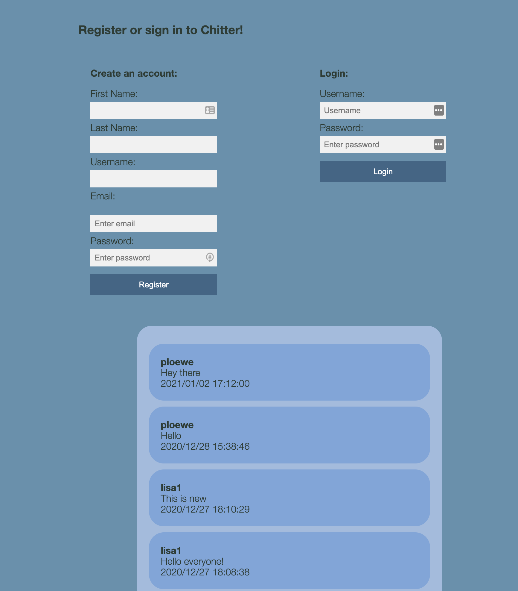

Chitter
=================
Features:
-------

```
STRAIGHT UP

As a Maker
So that I can let people know what I am doing  
I want to post a message (peep) to chitter

As a maker
So that I can see what others are saying  
I want to see all peeps in reverse chronological order

As a Maker
So that I can better appreciate the context of a peep
I want to see the time at which it was made

As a Maker
So that I can post messages on Chitter as me
I want to sign up for Chitter

HARDER

As a Maker
So that only I can post messages on Chitter as me
I want to log in to Chitter

As a Maker
So that I can avoid others posting messages on Chitter as me
I want to log out of Chitter

ADVANCED

As a Maker
So that I can stay constantly tapped in to the shouty box of Chitter
I want to receive an email if I am tagged in a Peep
```
# Languages used
1. Ruby
2. HTML
3. CSS


# Installation:

**Chitter Dabatase Setup**

**Create Tweet and Users Tables**


1. Connect to psql
2. Create a database: `CREATE DATABASE chitter;`
3. Connect to the database: `\c chitter;`
4. Run the query saved in the file ```01_create_users_table.sql``` to create the table Users.
5. Run the query saved in the file ```02_create_tweets_table.sql``` to create the table Tweets.

**Chitter_test Dabatase Setup**

**Test Enviroment**

1. Create a test database using the `CREATE DATABASE chitter_test;`
2. Connect to the database: `\c chitter_test;`
3. Run the query saved in the file ```01_create_users_table.sql``` to create the table Users.
4. Run the query saved in the file ```02_create_tweets_table.sql``` to create the table Tweets.


## How to Run:

After setting up your databases, run the app with ```ruby app.rb```.
From here, navigate to ```localhost:4567``` in your browser.


