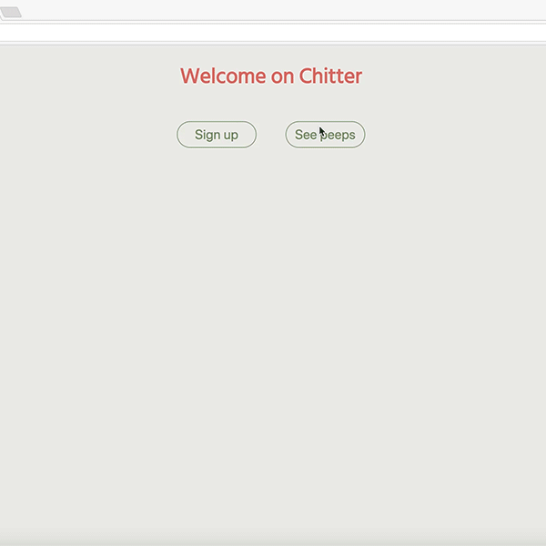

# Chitter Challenge

This challenge aims to build a clone of 'Twitter' using the framework Sinatra, Ruby and PostgreSQL databases.
This program was built test-first using RSpec and Capybara.


## Preview



## Features

```
As a Maker
So that I can let people know what I am doing  
I want to post a message (peep) to chitter

As a maker
So that I can see what others are saying  
I want to see all peeps in reverse chronological order

As a Maker
So that I can better appreciate the context of a peep
I want to see the time at which it was made

As a Maker
So that I can post messages on Chitter as me
I want to sign up for Chitter

As a Maker
So that only I can post messages on Chitter as me
I want to log in to Chitter

As a Maker
So that I can avoid others posting messages on Chitter as me
I want to log out of Chitter
```

## Database Model

To run this app, you will need two databases (test and development environments). Since I used activerecord and provided the migration files in this repo, you only need to run the followings commands:  

```
$ rake db:create # to create the databases
$ rake db:migrate # to migrate the table
$ rake db:migrate RACK_ENV=test # in case the previous command did not set up the tables for the test database
```

Table 1: users

| Column Name | Data Type |
| ----------- | --------- |
| id          | serial primary key |
| username    | varchar |
| email       | varchar |
| name        | varchar |
| password    | varchar |

Table 2: peeps

| Column Name | Data Type |
| ----------- | --------- |
| id          | serial primary key |
| peep        | varchar   |
| created_at  | timestamp |
| updated_at  | timestamp |
| user_id     | foreign_key |


## Run the app and tests

To download and run the app:

```sh
$ git clone git@github.com:ChocolatineMathou/chitter-challenge.git
$ cd chitter-challenge
$ bundle
$ rackup -p 4567
```

Then in your favourite browser, type `localhost:4567/` to access the homepage.  
Type `rspec` to run the tests and discover 100% coverage.
