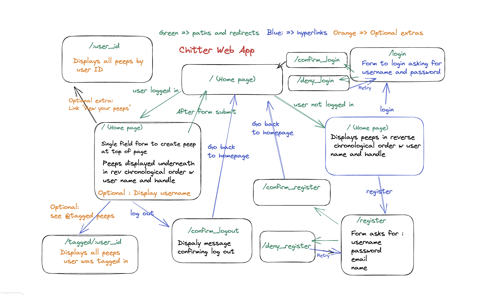
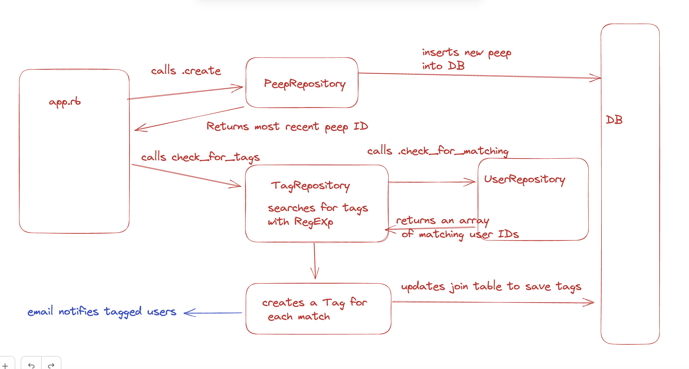

Chitter Challenge
=================

* This project is the culmination of Makers Academy's 'Web Applications' module (in Ruby)
* The application is built with the Sinatra web framework, rendering view files using ERB
* The application uses a Postgresql database for the backend
* The database connection is established in `lib/database_connection.rb` using the `pg` gem
* Seed data for tests is included in `spec/seeds.sql`

The Brief:
-------
We were tasked with writing a small Twitter clone that will allow the users to post messages to a public stream, and given the following user stories as our brief:

```
STRAIGHT UP

As a Maker
So that I can let people know what I am doing  
I want to post a message (peep) to chitter

As a maker
So that I can see what others are saying  
I want to see all peeps in reverse chronological order

As a Maker
So that I can better appreciate the context of a peep
I want to see the time at which it was made

As a Maker
So that I can post messages on Chitter as me
I want to sign up for Chitter

HARDER

As a Maker
So that only I can post messages on Chitter as me
I want to log in to Chitter

As a Maker
So that I can avoid others posting messages on Chitter as me
I want to log out of Chitter

ADVANCED

As a Maker
So that I can stay constantly tapped in to the shouty box of Chitter
I want to receive an email if I am tagged in a Peep
```

We were given the following notes on functionality:

* You don't have to be logged in to see the peeps.
* Makers sign up to chitter with their email, password, name and a username (e.g. samm@makersacademy.com, password123, Sam Morgan, sjmog).
* The username and email are unique.
* Peeps (posts to chitter) have the name of the maker and their user handle.

Getting Started
----------------------

`git clone https://github.com/tomcarmichael/chitter-challenge.git`

Install dependencies:

`bundle install`

Create the postgreSQL database by executing the [seed SQL file](./chitter.sql)

Your postgres server should be accessable at the IP address 127.0.0.1

Start the development server:

`rackup`

Access the website in your browser at [localhost:9292](http://localhost:9292/)

You should see an attempt page, since there are not yet any posted 'cheeps' (see what I did there?)

Follow the link to register as a user, and then to login.

After login, you will be redirected to the home page where you can post a new cheep. Cheeps posted by all users will appear here in reverse chronological order.

If another user's username is included in the cheep prefixed with '@', the application will detect this as a tagged user, and store this tag in the database.

Running the tests:
----------------------

`rspec`

All tests should pass with a total code coverage of 98.60%

A stringent TDD process was employed in developing this application. I tried to work with the 'testing pyramid' in mind - starting with a user experience based integration test, and then writing and passing additional, more granular unit tests that led to the integration test finally passing.

Design and Architecture:
----------------------

* This application follows a model, view, controller design pattern
* In the directory [./lib](./lib), each table in the DB corresponds to a Ruby class of a singular version of the name of the table, and a further 'repository' class with methods that allow for SQL commands to be executed upon the database
* Route handling occurs in the Application class defined in [./app.rb](./app.rb) and [./config.ru](./config.ru) executes the Ruby code inside of this file when `rackup` is run at the command line
* The database tables have the following relationships: `users` has a one to many relationship to `peeps` (synonymous with 'cheeps' - a further iteration would be to rename this uniformly), users and peeps have a many to many relationsip with respect to tags, so these are stored in the `tags` join table
* Given the brief, I began the planning process with an intial digram of how the application could be structured:
  
* The [route recipe](./route_recipe.md) and [schema recipe](./schema_recipe) files were created to aid in design of each
* The flow of execution for detecting tags in a cheep and storing these in the DB was conceptualised in this diagram:
  
* Passwords are hashed using the [BCrypt](https://rubygems.org/gems/bcrypt/versions/3.1.12) gem
* User input to cheeps is santized with basic measures to defend against cross-site scripting injection. In a real-world application I would consider instead using a dedicated and maintained library to provide a more robust defence here and would consider whether the use of the `pg` gem, and variables in the Ruby code that are interpolated into SQL commands, is enough to guard against a SQL injection attack.
