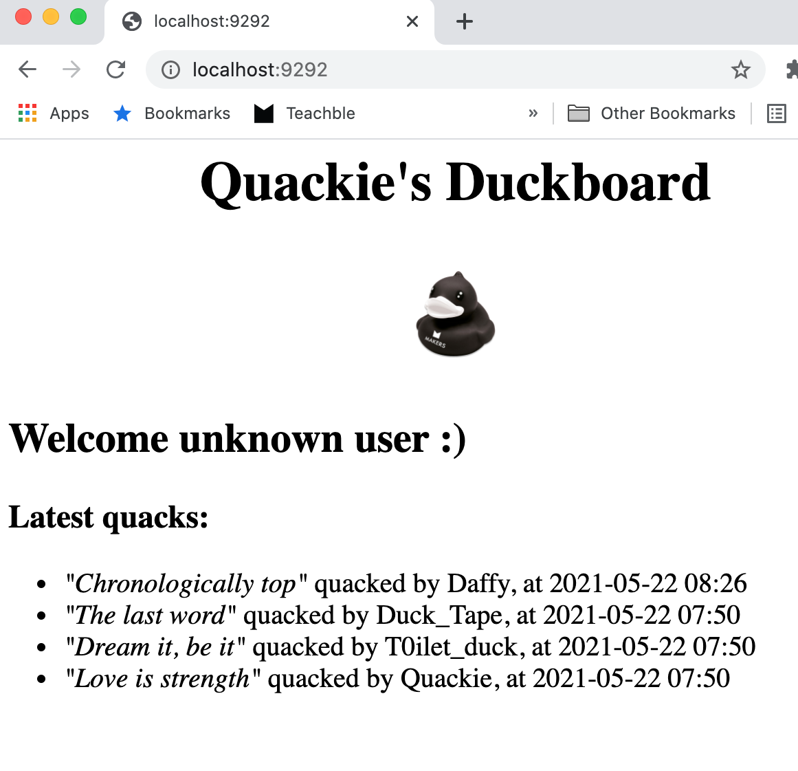
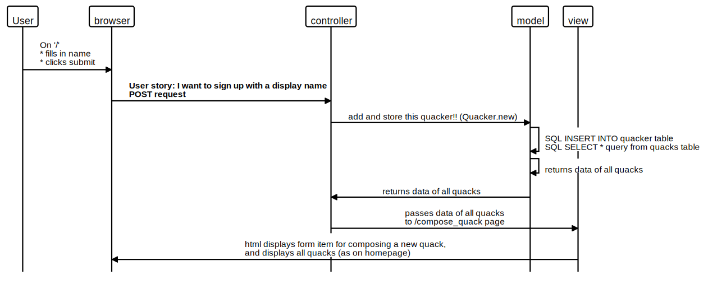
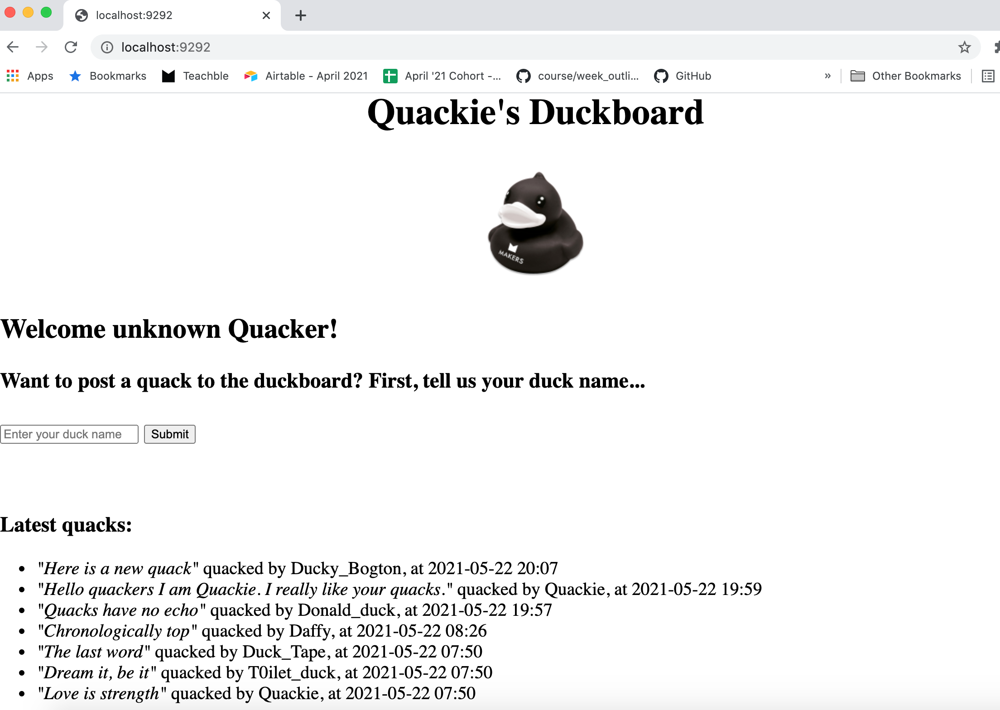

BecaLParker's Solution to Chitter Challenge: 

:speech_balloon: QUACKIE'S DUCKBOARD :speech_balloon: 
============================================================================

What does this code do?
-----------------------
In honour of Quackie (the Makers' Academy rubberducky debugger), I've made a small Twitter clone that will allow users (**Quackers**) to post messages (**Quacks**) to a public stream (**the Duckboard**).

Here are the [Class Responsibility Cards](https://docs.google.com/spreadsheets/d/11LzZXDbAgK_YshhwBttdjJfsn3WNQv_rbeffG_7G9rg/edit?usp=sharing) I made to plan this build.

>Next steps:  
>There are some edgecases I still want to solve (eg. throwing friendly errors if user's message is too long).   
>At present there is a known bug, where quacks won't post it they have apostrophes. I plan to fix that soon.     
>Currently, users can post **quacks** as a **guest quacker** (i.e. entering a display name and message content).    
>I plan to implement more detailed login/logout functionality (requiring username/password etc.) in a later phase of the build.  
>Please add other suggested next steps in issues or PR comments.  

Credits
-------
I referred to the [code review rubric](https://github.com/makersacademy/chitter-challenge/blob/master/docs/review.md) for this challenge during my build.   
I discussed Spearation of Concerns with a non-Rubyist Dev [@allymparker](https://github.com/allymparker) in relation to the [user stories](https://github.com/BecaLParker/chitter-challenge#features).

Technologies used
-----------------
Integrated database using the `PG` gem and `SQL` queries.

How to install and run the tests
--------------------------------
Use these commands in your terminal:  
`git clone https://github.com/BecaLParker/chitter-challenge`  
`cd chitter-challenge`  
`bundle`  

> Setup the databases on your local machine:  
> Connect to `psql`
> Create the live database and test database using the psql command `CREATE DATABASE duckboard;`    
> Connect to the database using the pqsl command `\c duckboard;`  
> Run the querys I have saved in the [migrations files](https://github.com/BecaLParker/chitter-challenge/tree/main/db/migrations) 
> exit psql `\q`

You can now run the feature and unit tests I built: `rspec`

To interact as a user:
`rackup`, then visit localhost:9292 in your browser and follow any onscreen instructions.  

Features
-------
User story | MVC model | Screenshot
--- | ---------------------------------------------------- | --- | 
As a Maker, so that I can see what others are saying, I want to see all quacks in reverse chronological order |  |
As a Maker, so that I can post messages on Duckboard as me, I want to submit my display name| |
As a Maker, so that I can let people know what I am doing, I want to post a quack on Duckboard | |
As a Maker, so that I can better appreciate the context of a quack, I want to see the time at which it was made |See above| See above

