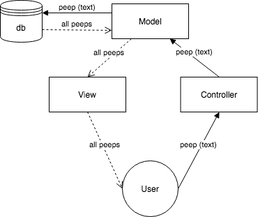
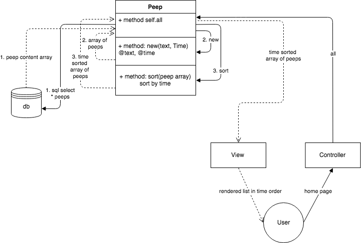

**Overview**
===================

This is a basic Twitter clone (*Chitter*) made for the fourth weekend challenge of the Makers Academy bootcamp course, using the sinatra framework. It supports sign-up and sign-in from multiple users (although not simultaneously) with password-protected accounts.

**Contents**
===================

*Main*
------
| root | /lib | /views/chitter|
|--|--|--|
|app.rb|database_connection.rb|index.erb|
|config.ru|peep.rb|sign_in.erb|
|Rakefil|user.rb|sign_up.erb|
|Gemfile| | |
|database_connection_setup.rb| | | |

*Test Suite*
------
| /spec | /spec/features |
|--|--|
|database_connection_spec.rb|posting_a_peep_spec.rb|
|peep_spec.rb|seeing_ordered_peeps_spec.rb|
|user_spec.rb|signing_in_spec.rb|
|spec_helper.rb|signing_up_spec.rb|
| |web_hepers.rb|

**Getting Started**
===================

****To setup the program for the first time:****

1. use ***bundle install*** to load all required gems.
2. use ***rake full_setup*** to create all required databases and database tables.

**Instructions for use**
========================

To use, a webserver application is needed to create a local web app on your machine. I recommend using the 'rerun' gem (included in the Gemfile). To run the app with rerun, use ***rerun app.rb*** from a terminal prompt inside the root folder of the app.

Once the application is running, visit http://localhost:4567/ to interact with the chittersphere.

You may peep new peeps as an anonymous user without signing up, but everyone will just mark you down as a potential griefer.

To peep with more legitimacy you must create an account. To sign up as a new user, navigate to the sign up page by clicking on 'New user sign up'. Fill in the details required and click on 'Register new user'. Your account will be created and you will be automatically logged in. Any peeps created while logged in will be logged and displayed as authored by you.

To sign out when logged in, simply click on the 'Sign out' button on the main peep page.

To sign back in with an existing account, navigate to the sign-in page by clicking on 'Existing user sign in'. Fill in your email and password, and then click on 'Sign in'.

**Resetting the databases**
===========================

The provided Rakefile has tasks that automate database administration. To wipe all data from existing databases, use ***rake hard_reset*** at a terminal prompt in the root folder of the app,  followed again by ***rake full_setup***.

**Running Test Suite**
======================

All tests were designed using the rspec framework with capybara. To run the suite, simply use ***rspec*** at a terminal prompt in the root folder of the app.

----------------------------------------
****Development****

----------------------------------------

Chitter Challenge
=================

* Challenge time: rest of the day and weekend, until Monday 9am
* Feel free to use Google, your notes, books, etc. but work on your own
* If you refer to the solution of another coach or student, please put a link to that in your README
* If you have a partial solution, **still check in a partial solution**
* You must submit a pull request to this repo with your code by 9am Monday morning

Challenge:
-------

As usual please start by forking this repo.

We are going to write a small Twitter clone that will allow the users to post messages to a public stream.

Features:
-------

```
STRAIGHT UP

As a Maker
So that I can let people know what I am doing  
I want to post a message (peep) to chitter
```


```
As a maker
So that I can see what others are saying  
I want to see all peeps in reverse chronological order
```


```
As a Maker
So that I can better appreciate the context of a peep
I want to see the time at which it was made
```

View displays peep creation time

```
As a Maker
So that I can post messages on Chitter as me
I want to sign up for Chitter
```

User can sign up and have their name displayed at the top and on their tweets

HARDER

As a Maker
So that only I can post messages on Chitter as me
I want to log in to Chitter
```

DONE

```
As a Maker
So that I can avoid others posting messages on Chitter as me
I want to log out of Chitter
```

DONE

```
ADVANCED

As a Maker
So that I can stay constantly tapped in to the shouty box of Chitter
I want to receive an email if I am tagged in a Peep
```

Notes on functionality:
------

* You don't have to be logged in to see the peeps.
* Makers sign up to chitter with their email, password, name and a username (e.g. samm@makersacademy.com, password123, Sam Morgan, sjmog).
* The username and email are unique.
* Peeps (posts to chitter) have the name of the maker and their user handle.
* Your README should indicate the technologies used, and give instructions on how to install and run the tests.

Bonus:
-----

If you have time you can implement the following:

* In order to start a conversation as a maker I want to reply to a peep from another maker.

And/Or:

* Work on the CSS to make it look good.

Good luck and let the chitter begin!

Code Review
-----------

In code review we'll be hoping to see:

* All tests passing
* High [Test coverage](https://github.com/makersacademy/course/blob/master/pills/test_coverage.md) (>95% is good)
* The code is elegant: every class has a clear responsibility, methods are short etc.

Reviewers will potentially be using this [code review rubric](docs/review.md).  Referring to this rubric in advance may make the challenge somewhat easier.  You should be the judge of how much challenge you want this weekend.

Notes on test coverage
----------------------

Please ensure you have the following **AT THE TOP** of your spec_helper.rb in order to have test coverage stats generated
on your pull request:

```ruby
require 'simplecov'
require 'simplecov-console'

SimpleCov.formatter = SimpleCov::Formatter::MultiFormatter.new([
  SimpleCov::Formatter::Console,
  # Want a nice code coverage website? Uncomment this next line!
  # SimpleCov::Formatter::HTMLFormatter
])
SimpleCov.start
```

You can see your test coverage when you run your tests. If you want this in a graphical form, uncomment the `HTMLFormatter` line and see what happens!
