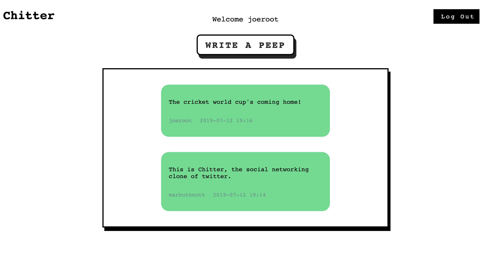

Chitter Challenge
=================



## INTRODUCTION

The aim of this project was to build a small Twitter clone that will allow the users to post messages to a public stream.

The project is provided by Makers Academy. It is the fourth weekend challenge and is the culmination of a week spent on the fundamentals of web app development with a database. It is written in ruby using the domain-specific framework, Sinatra.

## GETTING STARTED

1. Fork/clone this repository using `git clone https://github.com/marbuthnott/chitter-challenge`

2. Navigate to the route directory with `cd chitter-challenge`

3. Run `bundle install` to install the project's dependencies

4. Run `psql postgres` to open the psql prompt.

5. Create the chitter database with `\i ./db/01_create_chitter_database.sql;` and connect to it with `\c chitter`

6. Create the peeps table with `\i ./db/02_create_peeps_table.sql;`

7. Create the users table with `\i ./db/03_create_uers_table.sql;`

8. Open this server with `rackup` and navigate to the specified address. By default it's `localhost:9292`.

## HOW TO USE THE APP

SIGN UP
1. Click the 'Sign Up' button.
2. Fill in all the text fields with your details and click the 'Submit' button.

LOGIN
1. Click the 'Log In' button.
2. Fill in the fields with your login details and click 'Log In'. If you've entered incorrect details you'll see a flash notice.

WRITE A PEEP
1. Once you've logged in you'll see the 'Write a Peep' button.
2. Click on 'Write a Peep' and submit your peep!

Happy peeping!!

### USER STORIES

```
STRAIGHT UP

As a Maker
So that I can let people know what I am doing  
I want to post a message (peep) to chitter

As a maker
So that I can see what others are saying  
I want to see all peeps in reverse chronological order

As a Maker
So that I can better appreciate the context of a peep
I want to see the time at which it was made

As a Maker
So that I can post messages on Chitter as me
I want to sign up for Chitter

HARDER

As a Maker
So that only I can post messages on Chitter as me
I want to log in to Chitter

As a Maker
So that I can avoid others posting messages on Chitter as me
I want to log out of Chitter

ADVANCED

As a Maker
So that I can stay constantly tapped in to the shouty box of Chitter
I want to receive an email if I am tagged in a Peep
```

## TECH/FRAMEWORK USED

**Primary programming language:** *Ruby*

**Other programming languages:** *HTML*

**Web application framework:** *Sinatra*. Sinatra is a free and open source software web application library and domain-specific language written in Ruby.

**Unit testing framework:** *RSpec* is a Behaviour Driven Development for Ruby, run from the command line.

**Feature testing framework:** *Capybara* is used to test web applications by simulating how a real user would interact with your app. It is run through RSpec commands in the terminal.

**ORM:** *PostgreSQL* is an open-source relational database management system. It is designed to handle a range of workloads, from single machines to data warehouses or Web services. [Link](https://www.postgresql.org/) for more info.

**Web Server Interface:** *Rack*. While developing the app I used the Ruby web server interface, Rack. More info can be found at [Rack](https://rack.github.io/).

## RUNNING TESTS

Tests can be run from the root directory with `rspec`. The gem Simplecov will also be run to provide statistics on code coverage.

## MODELS/IMAGES

Over the course of this project I constructed two MVC models at different stages of development:


User story 1:


User story 2:


## APPROACH

The focus of this project was to cement my learnings from the previous week using `PG` and `SQL` queries. I wanted to demonstrate my understanding of a CRUD (Create, Read, Update, Delete) server, and to make the web app as RESTful (Representational State Transfer) as I could. Finally I wanted a better understanding of the  MVC relationship by sketching out the request/response cycle of each feature.

I started by reading through the user stories and mapping out what objects would be required and the methods they may include. Once I had mapped the objects and their methods I started iterating through the user stories using TDD. I would write the feature test, and then the passing code. Here is where the MVC models became extremely useful! As an MVC newbie having a model by your side while writing the code made it significantly easier to write the code, refactor, and debug.

## WHAT I WOULD DO DIFFERENTLY

For future projects it would be good to move away from using PG queries as an ORM (Object Relational Mapping), and try out the DataMapper or ActiveRecord plugins.
