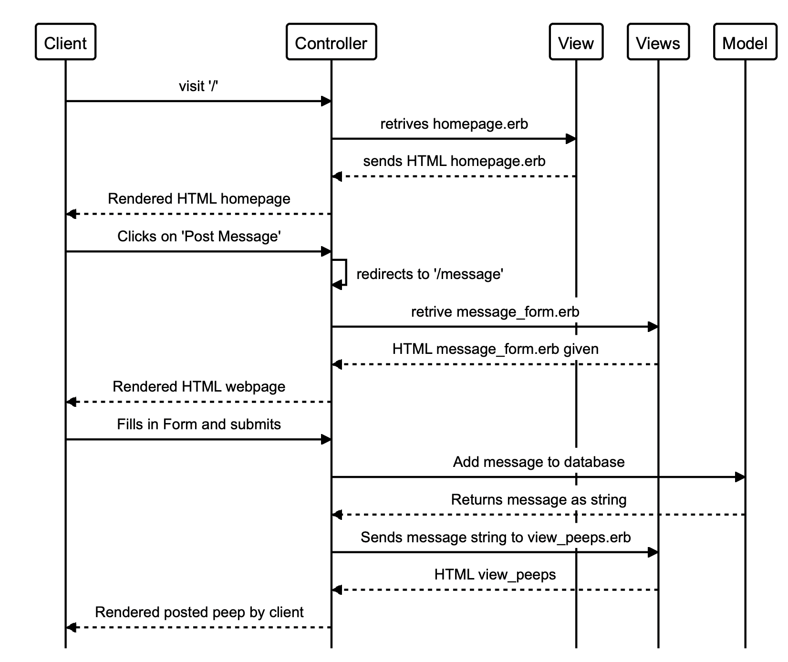

Chitter Challenge
=================
Challenge:
 -------
 We are going to write a small Twitter clone that will allow the users to post messages to a public stream.

 Features:
 -------
### User Stories
```
As a Maker
So that I can let people know what I am doing  
I want to post a message (peep) to chitter
```
```
As a maker
So that I can see what others are saying  
I want to see all peeps in reverse chronological order
```
```
As a Maker
So that I can better appreciate the context of a peep
I want to see the time at which it was made
```
```
As a Maker
So that I can post messages on Chitter as me
I want to sign up for Chitter
```

### Domain Model


| Nouns   | Verbs     |
|---------|-----------|
|Chitter| post a message, sign up |
|Peep | see in reverse order, see time it was made |


| Nouns   | Property/ Owner|
|---------|-----------     |
|Chitter | Owner          |
|Peep |Owner|


| Actions  | Owned by?  |
|--------- |----------- |
|post_message  | Chitter |
|sign_up| Chitter |
|see_in_reverse| Chitter|
|see_time| Peep |
|create_peep| Peep |


| Actions  |Property it reads or changes |
|--------- |-----------                  |
|post_message  | @message|
|sign_up| name, email, password, username  |
|see_in_reverse| @peep_list|
|see_time| @message, Time|
|create_peep| @message |


|Class     | Chitter    |
|--------- | ----------- |
|Responsibilities| Collaborators|
|post_message  | Peep|
|sign_up|    |
|reverse_list|   |


|Class     | Peep    |
|--------- | ----------- |
|Responsibilities| Collaborators|
|create | |
|time_created|    |


### Diagram  

User Story 1 diagram

## How to use
### To set up the project
Clone this repository and then run:
```
bundle
```
### To run the Chitter app:
 ```
 rackup -p 9292
 ```
 To view Chitter, navigate to `localhost:9292/`

### To run tests:
```
rspec
```
### To run linting:
```
rubocop
```
## To set up the database
------
 Connect to `psql` and create the `chitter` database:

 ```
 CREATE DATABASE chitter;
 ```
 ### To connect to database
 ```
 psql \c chitter;
 ```

 To set up the appropriate tables, connect to the database in `psql` and run the SQL scripts in the `db/migrations` folder in the given order.

### To Insert into table

```
INSERT INTO chitter VALUES(1, 'Test Peep');
```
### To view table
```
SELECT * FROM chitter;
```
### To delete a row from the table
```
DELETE FROM chitter WHERE message = 'Test Peep';
```
### To update a value from a row in the table
```
UPDATE chitter SET message = 'New Peep Testing!' WHERE url = 'Test Peep';
```
