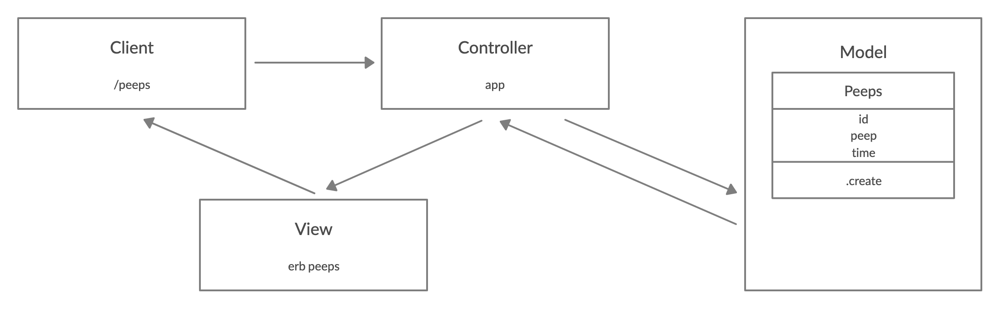

### User Stories

```
As a Maker
So that I can know what people are saying
I would like to see a list of peeps
```
## Domain Model



### To set up the Project
Clone this repository and then run:
```
bundle install
```

### Instructions for Setting up the Database

```
$ brew install postgresql
$ psql postgres
postgres=# CREATE DATABASE peeps;
postgres=# \c peeps
```
Then run the query saved in the file `01_create_peeps_table.sql`

### Instructions for Setting up the Test Database

```
$ psql postgres
postgres=# CREATE DATABASE peeps_test;
postgres=# \c peeps_test
```
Then run the query saved in the file `01_create_peeps_table.sql`

### To run the Chitter app:

```
rackup -p 3000
```

To view peeps, navigate to `localhost:3000/peeps`

### To run tests:

```
rspec
```
### To run linting:
```
rubocop
```
