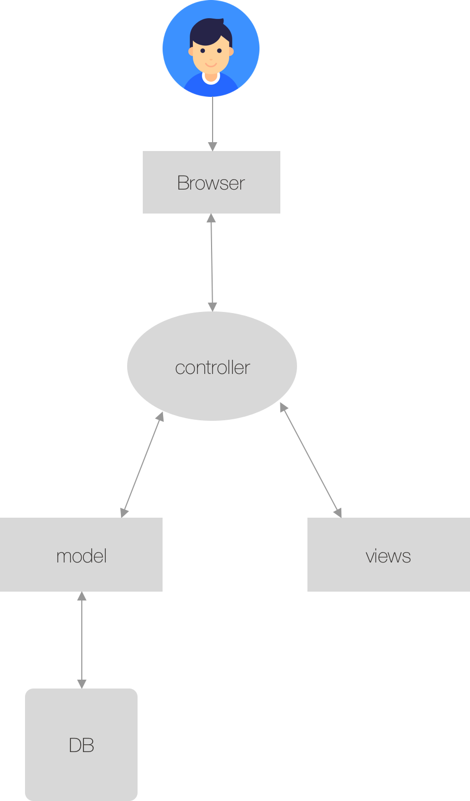

Chitter Challenge
=================

This is my attempt at the chitter challenge. You can sign up as a user, view posts and post. It encrypts passwords and uses two tables with data-mapper this time, for myself as a quick reminder: Object-Relational Mapping (ORM) is a technique that lets you query and manipulate data from a database using an object-oriented paradigm. 

I've used a lot of bootstrap components so things look a little better, test coverage with a focus on user functionality which I didn't really focus on too much before now (feature tests). 

I'd like to get mailgun working, and I'd love to be able to deploy on Heroku. 


Usage
-----

* clone repo
* Create databases (test, development and live database)
* bundle
* rackup

User stories
---------

```
STRAIGHT UP

As a Maker
So that I can let people know what I am doing  
I want to post a message (peep) to chitter

As a maker
So that I can see what others are saying  
I want to see all peeps in reverse chronological order

As a Maker
So that I can better appreciate the context of a peep
I want to see the time at which it was made

As a Maker
So that I can post messages on Chitter as me
I want to sign up for Chitter

HARDER

As a Maker
So that only I can post messages on Chitter as me
I want to log in to Chitter

As a Maker
So that I can avoid others posting messages on Chitter as me
I want to log out of Chitter

ADVANCED

As a Maker
So that I can stay constantly tapped in to the shouty box of Chitter
I want to receive an email if I am tagged in a Peep
```


MVC architecture diagram
---------

<p align="center"></p>


Stretch
------

Did some styling using bootstrap components. I also tried to get mailgun working, but i wasn't successful so i've saved this in a branch so I can come back to it later. I've also used Rack method overrides, but i'd like a bit more practice on what this can do. 
I have also tried to put things in place to get this up on Heroku, but i've been unsuccessful there, this you'll see in the Rakefile. I'd like to come back to that and get it running on Heroku. 
I have also expanded how I've used models and controllers, with a server.rb and app.rb to split things up more and mirror more of what i've seen at work so I can better understand things. 
I've also focused on features testing more than unit testing so the full functionality is tested.
