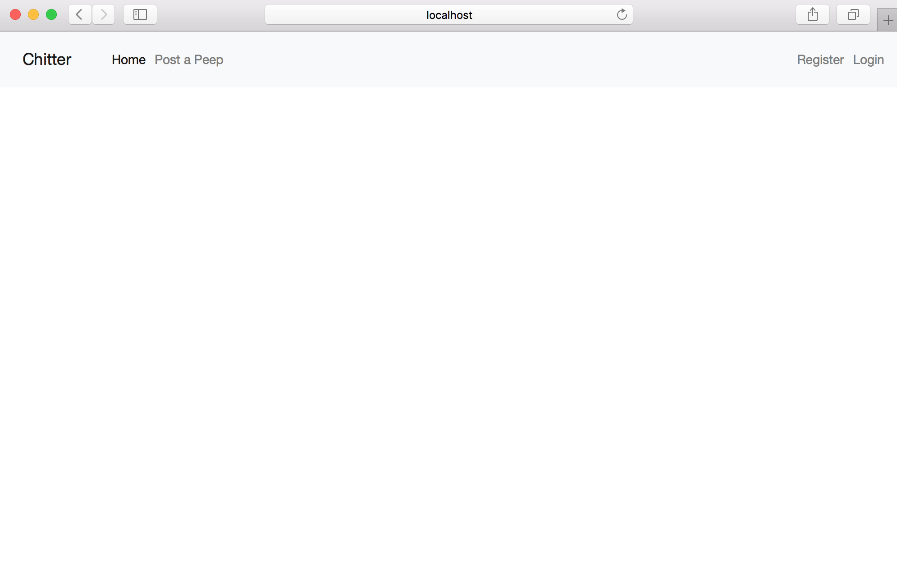
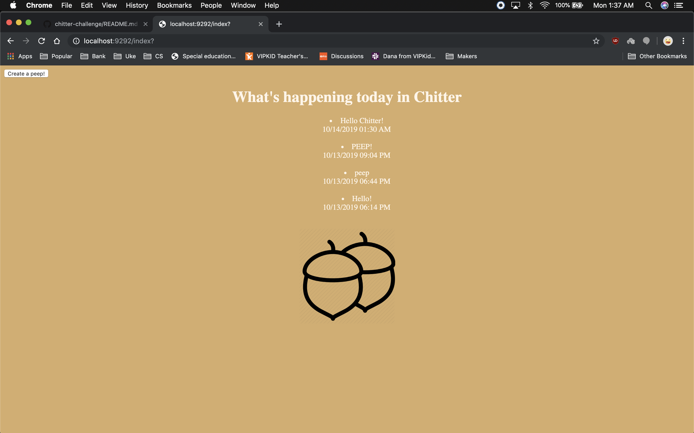

# Chitter Challenge

This was the fourth weekend challenge at Makers. It reinforced what I had learnt in the weeks work - how to add a database into web apps. Although the app is basic in it's styling, its functionality is quite complex. Adding a database (with a test database) was a heavy topic to learn. Most of the time was speant refactoring the databse connection into its own class, following Encapsulation and the SRP principal, whilst at the same time keeping DRY.

I followed the brief when making this web app and wrote the following list:

- Set up a database for posts to be stored on
- Set up a test database to mimic the real one, and have tests add and delete off that. This Truncates at the end of every test
- Have the connection to the database decided in its own class, wrapped in a Database Connection object

- User can post a 'peep' that is then stored on the database
- View the 'peeps' stored on the database in reverse chronological order
- Timestamps are shown on each 'peep'
- User can log in to chitter via a sign up page
- Password will be encrypted after Signed up

---

## How to Run

Clone this repo, and in the command line navigate to this directory. In the command line type in:

```
bundle install
```

Once the dependancies are installed, type in the command line:

```
psql
```

This will open up psql. From here you can create the Database by typing in the command line:

```
CREATE DATABASE chitter
```

Then connect to this Database by typing in the command line:

```
\c chitter;
```

You will then be able to create the tables necessary for the 'Peeps' and 'Users' to be stored in. Open up the [_db/migrations_](/db/migrations) folder, you will see the following 2 files:

```
01_create_bookmarks_table.sql
03_create_users_table.sql

```

Paste the commands into the 'chitter' Database you have just created via psql in the command line. The Tables will then be created. To launch the app locally, in the command line type:

```
rackup
```

Then visit [_localhost:9292_](http://localhost:9292/) in the browser.

To run the test suite (RSpec and Capybara), in the command line type:

```
rspec
```

This will display 11 passing tests with 100% coverage. These tests will run on the Test Environment, another Chitter/Test Database will need to be set up with the same tables in order to run the tests.

---

## Brief

```
As a Maker
So that I can let people know what I am doing
I want to post a message (peep) to chitter

As a maker
So that I can see what others are saying
I want to see all peeps in reverse chronological order

As a Maker
So that I can better appreciate the context of a peep
I want to see the time at which it was made

As a Maker
So that I can post messages on Chitter as me
I want to sign up for Chitter
```

---

### Homepage



### View Peeps


