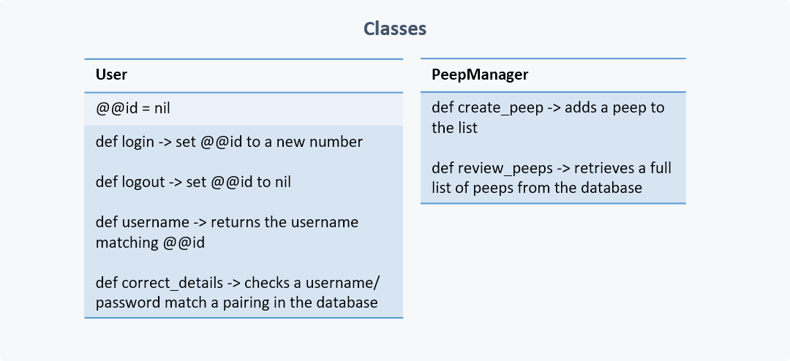
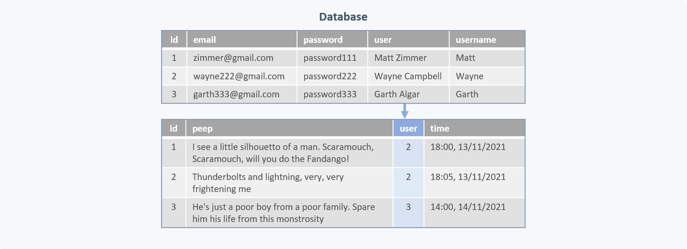
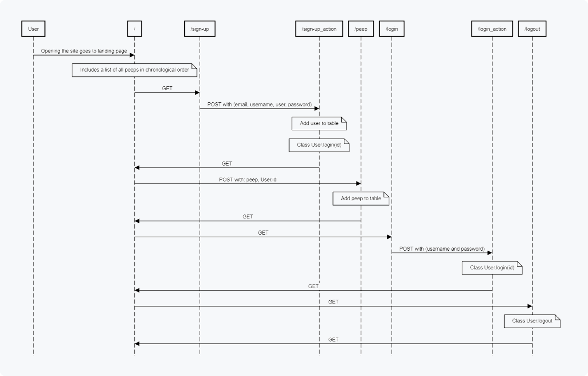

Introduction
---------
This repo contains the code I wrote for the Chitter Challenge, the Makers Academy Week 4 end-of-week challenge. This involved creating a very basic twitter clone using an MCV model and a database based on the following user stories:
```
STRAIGHT UP

As a Maker
So that I can let people know what I am doing  
I want to post a message (peep) to chitter

As a maker
So that I can see what others are saying  
I want to see all peeps in reverse chronological order

As a Maker
So that I can better appreciate the context of a peep
I want to see the time at which it was made

As a Maker
So that I can post messages on Chitter as me
I want to sign up for Chitter

HARDER

As a Maker
So that only I can post messages on Chitter as me
I want to log in to Chitter

As a Maker
So that I can avoid others posting messages on Chitter as me
I want to log out of Chitter

ADVANCED

As a Maker
So that I can stay constantly tapped in to the shouty box of Chitter
I want to receive an email if I am tagged in a Peep
```

My approach
---------
Throughout this challenge I created new coding assets (including .rb and .erb files) through a TDD approach, creating function tests for both code and web app functionality.

I took special care to begin this challenge with a planning session in which I mapped out the classes, database tables and user journeys I thought would be necessary to complete the STRAIGHT UP and HARDER user stories. I produced the following diagrams based on this:

### Classes


### Database tables


### User journey


As I began to develop the project by creating the necessary directories, testing-suite, files and relationships, I made several minor modifications to my original diagrammed plan, but ultimately the code I produced did closely resemble my original plan.

All four of the STRAIGHT UP user stories were implemented.

Unfortunately, although a lot of the scaffolding was put in place to complete the HARDER challenges, I did run out of time (partly because of the focus I chose to place on planning for this challenge) and was unable to finish the HARDER challenges. With more time, I would have liked to complete these. I would also have liked to work out the ADVANCED challenge and create new diagrams figuring out how this could be implemented. Finally, I would also have liked to spend some time updating the CSS to make the final app more aesthetically pleasing.

Total rspec testing coverage: 100%; 17 rspec tests; rubocop passed with no offences.

Technologies used
---------
The following technologies were used in this repo
1) VS Code was used for all coding requirements
2) Planning diagrams were made in Microsoft Powerpoint
3) Database hosting was done in TablePlus with PSQL


Instructions for use
---------
### Setup:
- Using PSQL, create two databases names 'chitter_zimmja' and 'chitter_zimmja_test'
- For each database, enter the SQL command lists in the db/migration folder
- Go to the file directory and enter 'rackup -p 4567' to the terminal
- Open a browser and go to http://localhost:4567/ to interact with the web app

### Interaction:
- A box appears at the top of the page to enter 'peeps' into. Filling this out and pressing 'Peep!' will add a peep to the list on the homepage
- Clicking the sign-up button will allow the user to enter a username, full name, password and email; this will change information displayed with peeps
