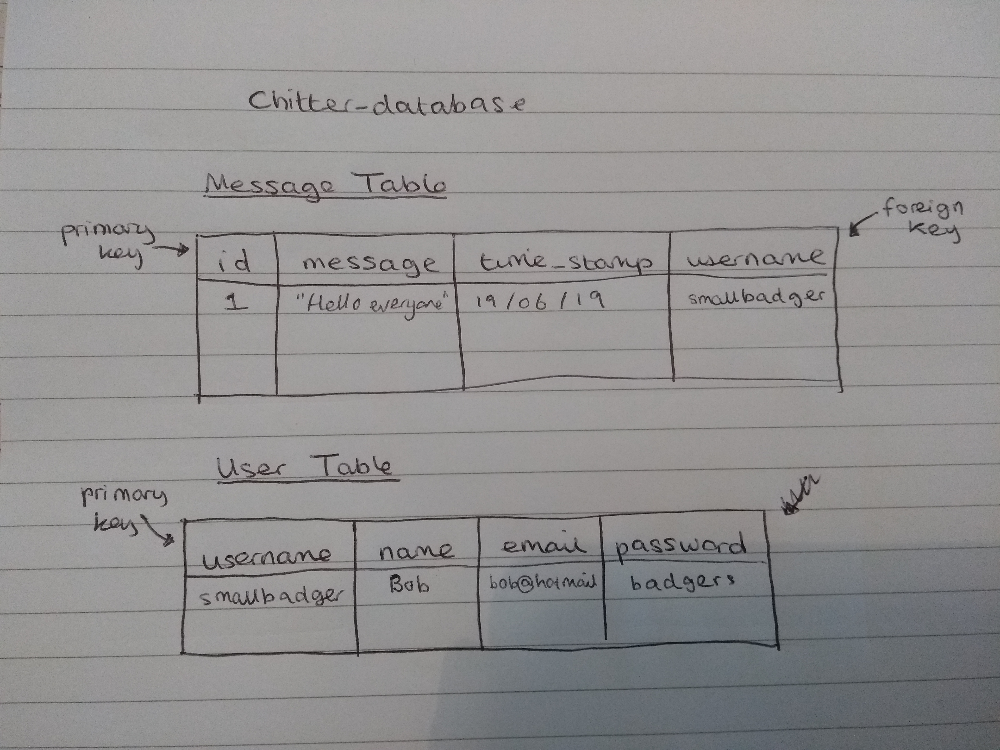
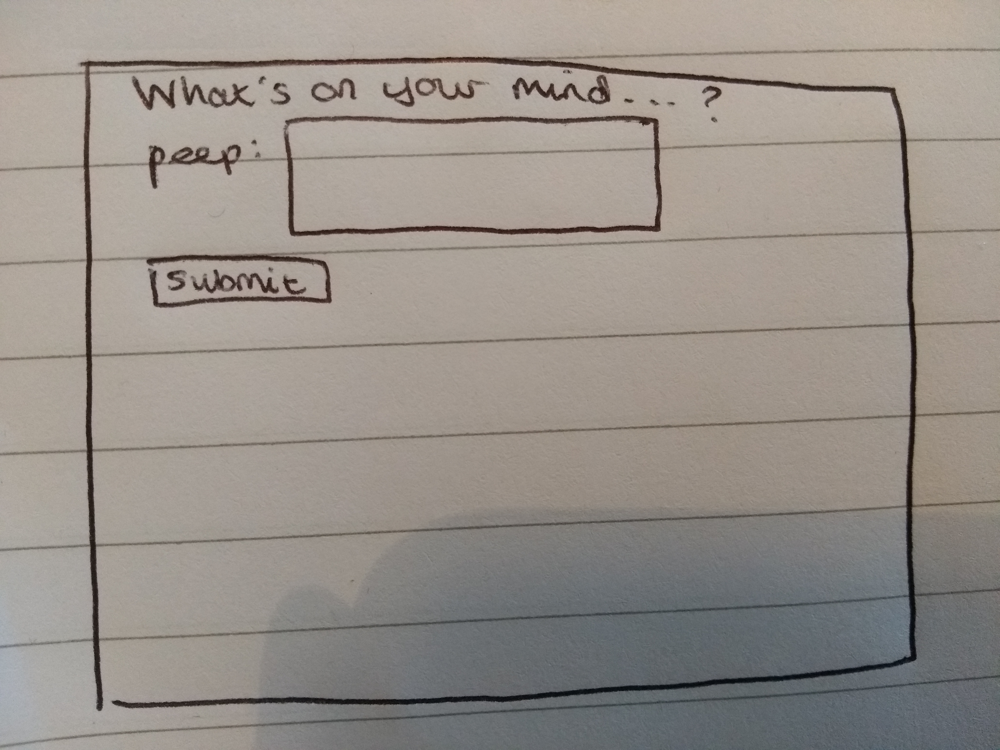

# Chitter Challenge

## User stories:

  *As a Maker  
  So that I can let people know what I am doing  
  I want to post a message (peep) to chitter*

    NOTE:  a message has the name of the maker and their user handle

  *As a Maker  
  So that I can see what others are saying  
  I want to see all peeps in reverse chronological order*

  *As a Maker  
  So that I can better appreciate the context of a peep  
  I want to see the time at which it was made*

  *As a Maker  
  So that I can post messages on Chitter as me  
  I want to sign up for Chitter*

    NOTE: user name and email are unique, sign up requires a email, password, name and username

## Classes:

- I have identified the need for two classes Message, and User

## Database Structure

- In the chitter-database there will be two tables with the following layout...

## Database Setup: Test and Development

1. **Connect to psql**
  - from the terminal type `psql postgres` and press enter, you are now in the psql environment where you can make your databases
2. **Making Databases**
  - You need to make a test database which is simply used when running RSpec and is cleared at the beginning of each test, and a development database which is what sinatra actually uses
  - Test Database:
    - `CREATE DATABASE chitter_test;`
    - you can see it has been created by doing `\l` which lists all current databases for the user
  - Development Database
    - `CREATE DATABASE chitter;`
3. **Connect to databases and add relevant tables**
  - Test Database:
    - `\c chitter_test` - which connects you to the test database
    - then go into the file 'db/migrations/create_message_table.sql' and copy and paste the contents into the psql environment
    - to view your newly created table `\dt`
    - to view the contents of the table `SELECT * FROM chitter_test;`
  - Development Database:
    - `\c chitter`- connecting you to the development database
    - again copy and paste the contents of the file `create_message_table.sql` into the terminal

## User stories as visuals

I want to post a message (peep) to chitter...

