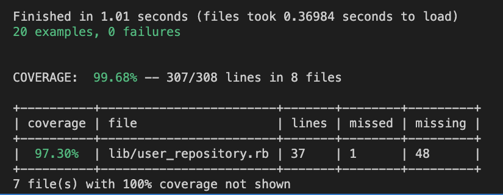
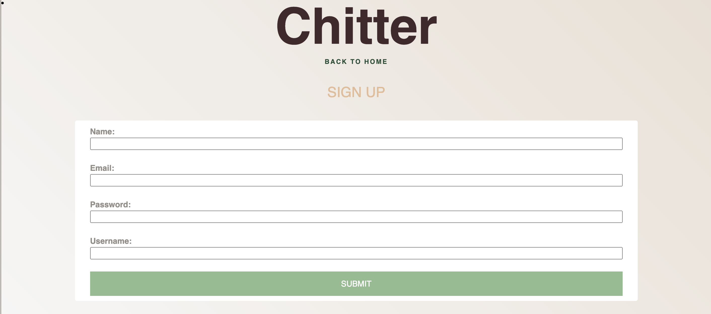
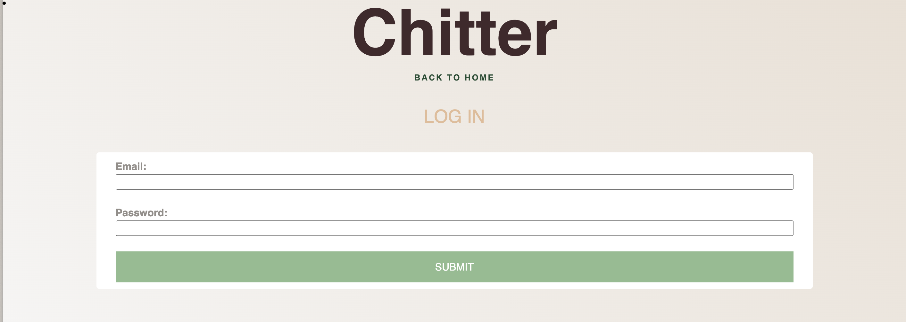
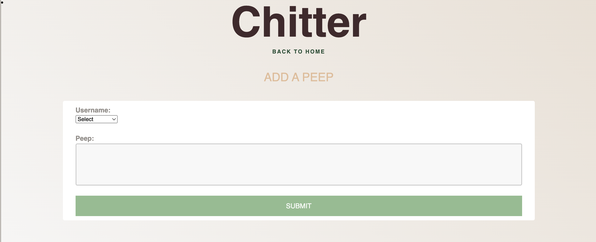
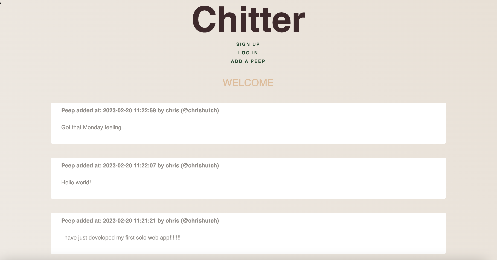

# Chitter Challenge

## Solo Project

In week 4 of the Makers course we started to build our first full stack Web Applications using Sinatra.

## Learning objectives

In this module we learnt how to:

- Explain how HTTP requests and responses work at a high level
- Write integration tests for a web application
- Implement web routes using a lightweight web framework
- Follow a debugging process for a web application
- Deploy a web application using a light cloud service such as Render

As a weekend solo project, we were tasked to build a more complex coding challenge using all of these new concepts.

## Challenge:

We were tasked to write a small Twitter clone that will allow the users to post messages to a public stream.

See [instructions](docs/instructions.md) for full details.

## How far did I get?

- Features
  - [ ] Sign up
  - [ ] Log in
  - [ ] Peeping
  - [ ] Listing Peeps
  - [ ] Display time of peep

## Installation/Usage Instructions

To download and initialise the project:

```
$ git clone https://github.com/ChrisHutchinson1982/chitter-challenge
$ cd chitter-challenge
$ bundle
```

To run the app:

```
$ cd chitter-challenge
$ rackup
```

Open http://localhost:9292 to view and use the app in your browser.

To run the tests:

```
$ cd chitter-challenge
$ rspec
```

## Technologies

- Ruby
- SQL
- PostgreSQL
- Sinatra
- RSpec
- HTML
- ERB
- CCS
- Bcrypt

## Test Coverage



## Screen shots

### Sign up



### Log in



### Peeping



### Listing Peeps


