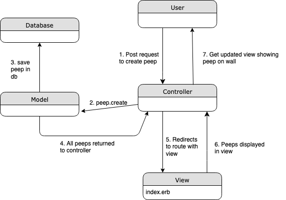

Chitter Challenge
=================

A small Twitter clone that allows users to post messages to a public stream.

User stories:
-------

```
# User story 1

As a Maker
So that I can let people know what I am doing  
I want to post a message (peep) to chitter
```

```
# User story 2

As a maker
So that I can see what others are saying  
I want to see all peeps in reverse chronological order

# User story 3

As a Maker
So that I can better appreciate the context of a peep
I want to see the time at which it was made

# User story 4

As a Maker
So that I can post messages on Chitter as me
I want to sign up for Chitter
```
Not currently implemented:

```
As a Maker
So that only I can post messages on Chitter as me
I want to log in to Chitter

As a Maker
So that I can avoid others posting messages on Chitter as me
I want to log out of Chitter

As a Maker
So that I can stay constantly tapped in to the shouty box of Chitter
I want to receive an email if I am tagged in a Peep
```

To use:
------

- Clone the repo
- `bundle`
- set up your databases - you'll need to make changes to `/lib/database_connection_setup.rb`
- run `rackup` to start the server
- navigate to `localhost:9292`
- run `rspec` for the tests

I have used:
----
- Ruby
- Sinatra
- Capybara and Rspec testing
- DataMapper ORM
- PostgreSQL databases
- Atom for editing

Notes on functionality:
------

* You don't have to be logged in to see the peeps.
* You sign up to chitter with your email, password, name and a username (e.g. peep@chitter.com, password123, Chit Peeper, ChitPeep4eva).
* The username and email are unique.
* Peeps (posts to chitter) have the username of the maker and the creation date and time.

Future development:
-----
- Not yet implemented:

In order to start a conversation as a maker I want to reply to a peep from another maker.

- In development

Work on the CSS to make it look better.

- Screen shots


