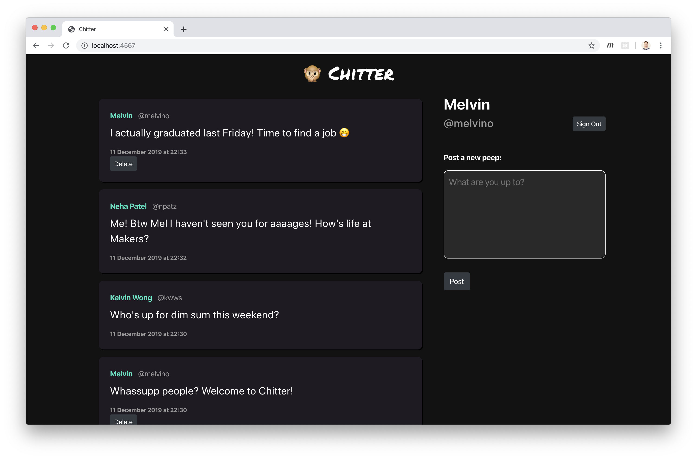

Chitter Challenge &nbsp; [](https://travis-ci.org/melvinlau/chitter-challenge) [](https://codeclimate.com/github/melvinlau/chitter-challenge/test_coverage) [](https://codeclimate.com/github/melvinlau/chitter-challenge/maintainability)
=================

## About

Chitter is a web app that allows users to register, sign in and post short messages ('peeps') to a public feed. It mimics the basic functionality of Twitter.

The purpose of this project is to practice test-driven development (TDD) using Ruby, by building a simple app with user interaction. This project was developed over a weekend. Here's a screenshot of how it looks:



### User stories

```
STRAIGHT UP

As a Maker
So that I can let people know what I am doing  
I want to post a message (peep) to chitter

As a maker
So that I can see what others are saying  
I want to see all peeps in reverse chronological order

As a Maker
So that I can better appreciate the context of a peep
I want to see the time at which it was made

As a Maker
So that I can post messages on Chitter as me
I want to sign up for Chitter

HARDER

As a Maker
So that only I can post messages on Chitter as me
I want to log in to Chitter

As a Maker
So that I can avoid others posting messages on Chitter as me
I want to log out of Chitter
```

## How to run the app locally

1. Clone this repo: `git clone git@github.com:melvinlau/chitter-challenge.git`

2. `cd` into the `chitter-challenge` directory then run `bundle install` to install dependencies.

3. Set up the database tables on your local computer.

    From your terminal, run `psql`:
    ```
    $ psql postgres
    ```
    In `psql` (the user prompt appearing after `postgres=#`) create and connect to the `chitter` database.

    ```
    postgres=# CREATE DATABASE chitter;
    postgres=# \c chitter
    ```

    Still in the `psql` terminal, set up the required database tables by pasting in the following commands:

    ```
    CREATE TABLE users(
      id SERIAL PRIMARY KEY,
      email VARCHAR(60),
      password VARCHAR(160),
      name VARCHAR(60),
      username VARCHAR(60)
    );

    CREATE TABLE peeps(
      id SERIAL PRIMARY KEY,
      content VARCHAR(280),
      timestamp TIMESTAMP DEFAULT CURRENT_TIMESTAMP,
      user_id INTEGER REFERENCES users (id)
    );
    ```

    Exit `psql` by typing `\q` and hitting return. This will return you to the normal command line.

4. Use command `ruby app.rb` to start the local server.

5. Open your browser, navigate to [http://localhost:4567](http://localhost:4567) and **have fun!**

## Tech Stack

This is a full-stack web app developed using the Model-View-Controller design pattern.

- PostgreSQL database
- Ruby (Sinatra framework)
- HTML / CSS
- Bootstrap 4

Additional technical note:  
Rather than using an object relational mapper (ORM) library, I chose to write my own Ruby methods to query the PostgreSQL database via the PG interface - mainly as a learning experience but also to appreciate the work that goes into an ORM!

## How to test

This app was developed following the principles of TDD using the Capybara and RSpec test frameworks. To run the tests, run the command `rspec` from within the `chitter-challenge` directory.
