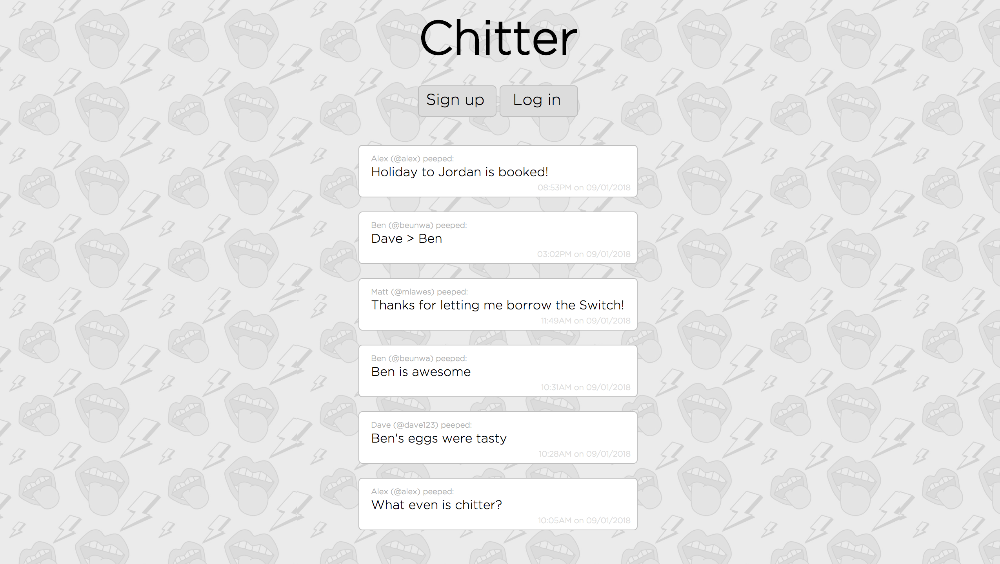
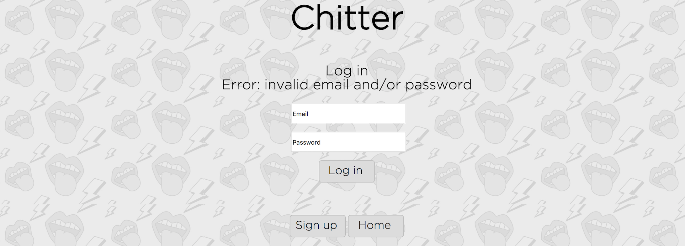

# Chitter Challenge

Chitter's a bit like Twitter... it's a simple web app that lets different users post (and then view) all the 'peeps' within the Chitter domain.

Tags: OOP, TDD, Ruby, HTML, CSS, Sinatra, MVC, RSpec, Capybara, Relational Databases (SQL), Web Applications


## Domain Model

The model of the web app is based on MVC architecure. The model is based on three classes `Peep`, `DatabaseConnection` and `User`. The domain model for app is demonstrated below. 

`Peep` controls the creating and viewing of all peeps.

The `User` class is responsible for managing user data (name, email, pw, handle) during sign-up and log-in.

`DatabaseConnection` is used to facilitate communications with the database. The class enables connection to either the 'development' or 'test' database and facilitates SQL queries/returns.


```
   Client
╔════════════╗  
║            ║ Sends HTTP requests
║  Browser   ║ (GET, POST, PATH, DELETE)      
║            ║
╚════════════╝
      |
      |
      |
Server (Sinatra Framework) is listening on a specific port
╔════════════╗
║            ║ Rack maps HTTP requests/response into/from Ruby
║    RACK    ║ Rack provides the DSL to write the web app
║            ║
╚════════════╝
      |
      |
      |
   app.rb                       Model                 
╔════════════╗             ╔════════════╗       
║            ║------------>║            ║       
║ Controller ║             ║    Peep    ║  
║            ║<------------║   (class)  ║       
╚════════════╝             ╚════════════╝ 
      |                           |
╔════════════╗                    |              ╔════════════╗
║            ║                    |              ║            ║            
║   Views    ║                    |------------->║    User    ║
║            ║                    |              ║  (class)   ║
╚════════════╝                    |              ╚════════════╝
 Embedded Ruby                    | 
                                  |              ╔════════════╗    SQL query    ╔════════════╗
                                  |              ║  Database  ║---------------->║    SQL     ║
                                  |------------->║ Connection ║ {result object} ║  Database  ║
                                                 ║  (class)   ║<----------------║            ║
                                                 ╚════════════╝                 ╚════════════╝
                                                 PG gem required
```

## Database Model

The web app utilises two tables within the `chitter` database:

Table name: peeps

| Column name   | Data type        |
| ------------- | -------------    |
| id            | serial primary key  |          
| text          | varchar(240)          |
| time          | varchar(60)          |
| user_id       | integer reference to users(id)  | 


Table name: users

| Column name   | Data type        |
| ------------- | -------------    |
| id            | serial primary key |
| name          | varchar(60)          |
| email         | varchar(60)          |
| password      | varchar(60)          |
| username      | varchar(60)          |


When a user signs up to Chitter a unique id is assigned to them. When the user posts a peep, their user_id is stored (along with the text and time of the peep) in the peeps table. When we view the peeps on the homepage, an SQL `JOIN` query is used to manage these relational databases and link the peep's `user_id` to their `name` and `username`:

`"SELECT text, time, username, name FROM peeps JOIN users ON peeps.user_id=users.id;"`

In this way "table normalisation" has been applied to the database design: the unique data (the text string for name and username) is recorded only once in the database.


## How to Install

Fork this repo, clone to your pc and then run `bundle install`. 

You'll need to create two PostgreSQL databases on your local machine: `chitter` and `chitter_test`. The tables should be created according to the [database model](#database-model).

After creating the databases the web app is ready to use. I'd suggest using `rackup -p 4567` to start the webserver on your local machine.

Then, in your browser, go to url: `localhost:4567`, this will take you to the Chitter homepage.


## How to Use

When visiting the homepage of Chitter you'll see something like this (every peep is shown with the peep-ee, their username and when the peep was made):
<p align="center"></p>

Without a valid email address and password you can only view the peeps, not post any yourself. If you want to join in the conversation you first have to sign up:
<p align="center"></p>

If your email address, or your chosen username, is already on our database then you'll see an error message:
<p align="center"></p>

Once you've signed up successfully, you're automatically logged in and taken back to the homepage.

If you've signed up before, you can go straight to the login page:
<p align="center"></p>

If you enter your details incorrectly then Chitter will let you know:
<p align="center"></p>

After successful sign up or login you're ready to go  :tada:  now you can post your own peeps!


## Running Tests

Run `rspec` from the root of the project folder to see the test results (with this build all tests are passing and test coverage is 100%).

The following test specs are included:
`./spec/features/features_spec.rb`
`./spec/peep_spec.rb`
`./spec/user_spec.rb`
`./spec/database_connect_spec.rb`

I also have some simple methods in `./spec/features/web_helpers.rb` to keep my feature tests DRY.

To ensure that the application connects to the correct database, when `app.rb` is first executed I run `database_connection_setup`. This connects to the correct database (either the test or development version). I determine which database to connect to by evaluating an environment variable (within my rspec `spec_helper.rb` file I set the RACK_ENV to `test`; if the app is not called from the RSpec environment then this variable is set to `development`).

See also `./spec/spec_helper.rb` where I've included method `setup_test_database` to be called before each rspec test, ensuring my test database is clean before any tests (all tables are truncated before carrying out a test). 


## Some areas for improvement

Thinking on what I'd like to do more on:

- Currently the peeps can't contain apostrophes: they break the SQL query. To include these characters I'd like to include a method to evaluate the peep string and include double '', e.g. 'This isn't a test' would become 'This isn''t a test'. Alternatively I could look at using ORMS gems ActiveRecord/DataMapper and whether they would handle these cases.
- Currently the passwords for Chitter are stored in plain text. Ideally these would be encrypted with the model, and saved in the encrypted format. I'd also need a decrypter in my model to check password upon login.
- I'd like users to be able to respond to existing peeps, either with more comments or some kind of validation.
- Maybe my users could get notification (email, text) when their peeps gets a response?


## User Stories

```
As a Maker
So that I can let people know what I am doing  
I want to post a message (peep) to chitter

As a maker
So that I can see what others are saying  
I want to see all peeps in reverse chronological order

As a Maker
So that I can better appreciate the context of a peep
I want to see the time at which it was made

As a Maker
So that I can post messages on Chitter as me
I want to sign up for Chitter

As a Maker
So that only I can post messages on Chitter as me
I want to log in to Chitter

As a Maker
So that I can avoid others posting messages on Chitter as me
I want to log out of Chitter
```
