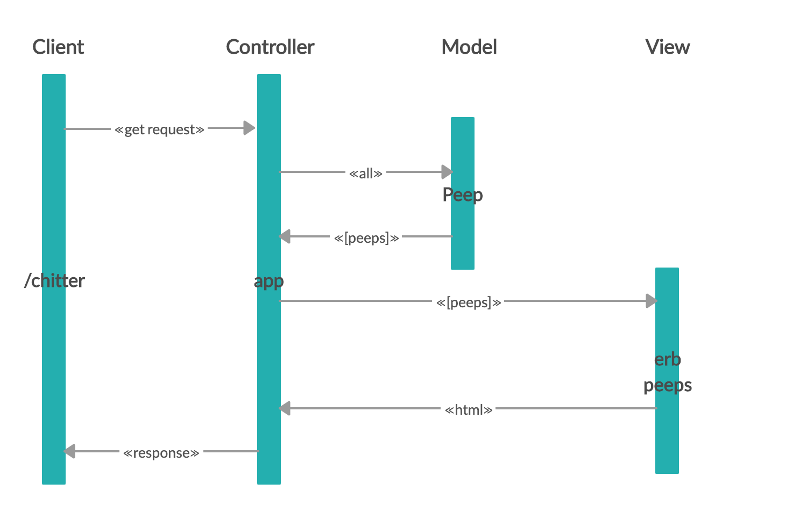

# Chitter Challenge
Makers weekend challenge (week 4)

**Tech used**:
Ruby,
Sinatra,
PostgreSQL,
Capybara,
Rspec,
Rubocop

## Project aim
To write a small Twitter clone that will allow the users to post messages to a public stream.

### Primary aims
* Post a message (peep) to Chitter. Peeps must have the name of the maker and their user handle.
* View peeps in reverse chronological order (newest first).
* Be able to view the time a peep was posted.
* Be able to sign up to Chitter using email, password, name and a username. The username and email must be unique.

### Secondary aims
* Be able to log in to Chitter (using email and password)
* Be able to log out of Chitter
* Receive an email if tagged in a peep

**User stories**

```
STRAIGHT UP

As a Maker
So that I can let people know what I am doing  
I want to post a message (peep) to chitter

As a maker
So that I can see what others are saying  
I want to see all peeps in reverse chronological order

As a Maker
So that I can better appreciate the context of a peep
I want to see the time at which it was made

As a Maker
So that I can post messages on Chitter as me
I want to sign up for Chitter

As a Maker
So that my identity remain unique
I don't want anyone else having the same username as me

As a Maker
So that my identity remains secure
I want my email address to remain unique

HARDER

As a Maker
So that only I can post messages on Chitter as me
I want to log in to Chitter

As a Maker
So that I can avoid others posting messages on Chitter as me
I want to log out of Chitter

ADVANCED

As a Maker
So that I can stay constantly tapped in to the shouty box of Chitter
I want to receive an email if I am tagged in a Peep
```

## Domain Model


| Component   | Responsibility                                | Refactor                                |
|------------ |---------------------------------------------  |---------------------------------------- |
| Model       | Encapsulate logic with relevant data          | Encapsulate peep data in a class    |
| View        | Display the result to a user                  | Show the peep data in a list        |
| Controller  | Get data from the model and put in the view   | Render peep data into to the view   |

## Installation instructions
**Setting up the databases**
Connect to `psql` and create the `chitter` and `chitter_test` databases:
```
CREATE DATABASE chitter;
CREATE DATABASE chitter_test;
```
To set up the appropriate tables, connect to each database in `psql` 
``` 
\c chitter;
\c chitter_test;
```
 Run the SQL scripts in the `db/migrations` folder in the given order.

**Installing the program**
1. Requires Ruby. Instructions to install are [here](https://www.ruby-lang.org/en/documentation/installation/).
2. Fork this repo, and clone to your local machine
3. Run the command `gem install bundle`
4. When the installation completes, run `bundle` 
5. Input `rake setup`
6. Input `rake migrate`
7. Make sure that rspec is up and running.
5. Navigate to the root folder and input 
```rackup```
This will show you the port that you should use in your browser (in this case it is `port=9292`).
6. Input the following into your browser:
```http://localhost:9292/```

### Challenges
* Took a long time to correctly link the users and peeps table together so that the user_id column was the user.id number.

Some useful resources:
**DataMapper**
- [DataMapper ORM](https://datamapper.org/)
- [Sinatra, PostgreSQL & DataMapper recipe](http://recipes.sinatrarb.com/p/databases/postgresql-datamapper)

**ActiveRecord**
- [ActiveRecord ORM](https://guides.rubyonrails.org/active_record_basics.html)
- [Sinatra, PostgreSQL & ActiveRecord recipe](http://recipes.sinatrarb.com/p/databases/postgresql-activerecord?#article)

Bonus:
-----

If you have time you can implement the following:

* In order to start a conversation as a maker I want to reply to a peep from another maker.

And/Or:

* Work on the CSS to make it look good.

Good luck and let the chitter begin!

Code Review
-----------

In code review we'll be hoping to see:

* All tests passing
* High [Test coverage](https://github.com/makersacademy/course/blob/master/pills/test_coverage.md) (>95% is good)
* The code is elegant: every class has a clear responsibility, methods are short etc.

Reviewers will potentially be using this [code review rubric](docs/review.md).  Referring to this rubric in advance may make the challenge somewhat easier.  You should be the judge of how much challenge you want this weekend.

Automated Tests:
-----

Opening a pull request against this repository will will trigger Travis CI to perform a build of your application and run your full suite of RSpec tests. If any of your tests rely on a connection with your database - and they should - this is likely to cause a problem. The build of your application created by has no connection to the local database you will have created on your machine, so when your tests try to interact with it they'll be unable to do so and will fail.

If you want a green tick against your pull request you'll need to configure Travis' build process by adding the necessary steps for creating your database to the `.travis.yml` file.

- [Travis Basics](https://docs.travis-ci.com/user/tutorial/)
- [Travis - Setting up Databases](https://docs.travis-ci.com/user/database-setup/)

Notes on test coverage
----------------------

Please ensure you have the following **AT THE TOP** of your spec_helper.rb in order to have test coverage stats generated
on your pull request:

```ruby
require 'simplecov'
require 'simplecov-console'

SimpleCov.formatter = SimpleCov::Formatter::MultiFormatter.new([
  SimpleCov::Formatter::Console,
  # Want a nice code coverage website? Uncomment this next line!
  # SimpleCov::Formatter::HTMLFormatter
])
SimpleCov.start
```

You can see your test coverage when you run your tests. If you want this in a graphical form, uncomment the `HTMLFormatter` line and see what happens!
