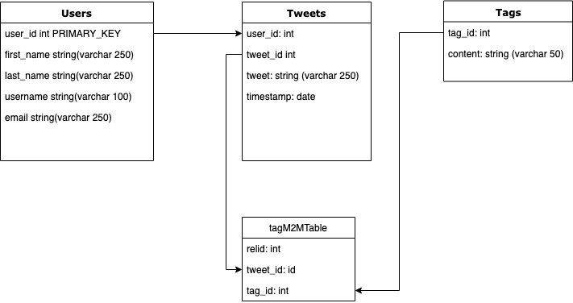

## Challenge:

[](https://travis-ci.org/micosmin/chitter-challenge)

Week 4 Makers Weekend challenge:

We are going to write a small Twitter clone that will allow the users to post messages to a public stream.

## DB Diagram



## Features:

```
STRAIGHT UP

As a Maker
So that I can let people know what I am doing
I want to post a message (peep) to chitter

As a maker
So that I can see what others are saying
I want to see all peeps in reverse chronological order

As a Maker
So that I can better appreciate the context of a peep
I want to see the time at which it was made

As a Maker
So that I can post messages on Chitter as me
I want to sign up for Chitter

HARDER

As a Maker
So that only I can post messages on Chitter as me
I want to log in to Chitter

As a Maker
So that I can avoid others posting messages on Chitter as me
I want to log out of Chitter

ADVANCED

As a Maker
So that I can stay constantly tapped in to the shouty box of Chitter
I want to receive an email if I am tagged in a Peep
```

# Setting up

- fork repo
- bundle
- install postgresql
- run these commands to create the databases

```sql
-- log in the psql cli

psql$: CREATE TABLE chitter
psql$: CREATE TABLE chitter_test

-- connect to chitter db
psql$: \c chitter
psql$: \i path_to_02_create_peeps_table
psql$: \i path_to_03_create_users_table
psql$: \i path_to_04_create_chitter_test_db
psql$: \i path_to_06_create_tag_table_db
psql$: \i path_to_07_create_usertags_table_db
psql$: \c chitter_test
-- connect to chitter_test_db
-- repeate the creation of peeps and users inside the chitter_test database
--or run:
```

# Run the app

```
- run app.rb

or

- rackup -p 4567

Visit page at: localhost:4567
```

# Technologies used

- ruby
- rspec
- capybara
- sinatra
- postgresql
- html / css

# How did it go?

Implemented all user stories, however more work is needed on:

- validation
- testing messaging class
- inject dependency on other classes
- css styling

## More information about appoach and steps

[Repo: Approach file](https://github.com/micosmin/chitter-challenge/blob/master/APPROACH.md)

## Reflection

- Commit more often. I usually commit very often, but on this task I neglected this step
- Test travis ci on a different branch if every in this situations of having builds fail due to database settings and migration errors
- :development was not registerting sinatra flash in travis tests - took me a while to uncover this, which means i need to spend a bit of time better understanding environments

To improve:

- more testing needed - 80% of the time I test before I write any code, however, towards the end of the project I start writting code before tests, to see how a feature would work, but end up not having time to go back and write my tests
- spend some time playing with rake and db creation/migration
- implement many to many relation and querying in an app. No time during the weekly challenge for this
- css
- work on finishing week challenges as the last items contain some very useful information
- give more time to refactor, as ran out of time to do dependency injection
- add validation to user input
