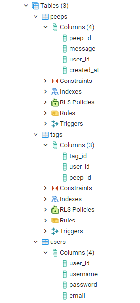
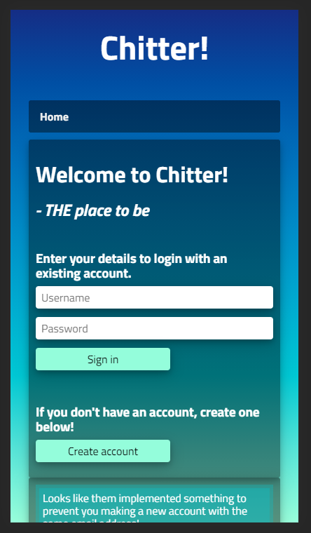

# Chitter Challenge [](https://travis-ci.com/StuBehan/chitter-challenge) [](https://codebeat.co/projects/github-com-stubehan-chitter-challenge-master)


~~Content comming soooon!~~

## Instructions: 

1. clone to your system
   
2. run `bundle install`
   
3. download and install [postgresql](https://www.postgresql.org/) for your system
   
4. do `psql postgres`, then `\i ./db/migrations/chitter_db.sql` to load the schema
   
5. you can then run the app `ruby app.rb`
   
6. head to `127.0.0.1:4567` to take a look around
   
7. you can preseed the db tables by using `irb` and the file `./spec/test_helper.rb`


## Ok here it is:

### STRAIGHT UP 

- [X] I want to post a message (peep) to chitter

- [X] I want to see all peeps in reverse chronological order

- [X] I want to see the time at which it was made

- [X] I want to sign up for Chitter

### HARDER

- [X] I want to log in to Chitter

- [X] I want to log out of Chitter

### ADVANCED

- [ ] I want to receive an email if I am tagged in a Peep

So I nearly got there, but I spent so much time on the CSS and making the reply feature work that I ran out of time to finish the email part of it. I kinda got halfway there with it though, as I made the 'tagged in a Peep' bit work!

There are a few things I would go back and do if I could but I'm happy with how it is at the momment and I learned a lot refactoring and integrating the Tag feature. 

There are a few tests that are on the long side which could do with tidying up too.


## Responsive web design with CSS 

I tried to make the web app responsive, so that it would look good on either a large screen or a small mobile device. When the view is less than 800px the columns have their width increased to 100% forcing the right most one below and it looks quite good to me.

```
@media screen and (max-width: 800px) {
  .leftcolumn, .rightcolumn {   
    width: 100%;
    padding: 10px;
    margin: 0px;
  }
}
```
I spent a lot of time on the CSS, perhaps at the detriment of the other areas, but it was really fun and it was the weekend!