Chitter Challenge
==================

Introduction
-------
The purpose of this challenge was to build a basic twitter clone. This was a solo project created for the Makers Academy week 4 weekend challenge. The app has been built using Ruby and the Sinatra framework, with a HTML and CSS front-end. The PostreSQL database management system has been utilized to provide data persistence of user account and peeps (Chitter's equivalent of tweets). bcrypt has been used to provide password security by encrypting user passwords before they are stored in the database, and validating login passwords against the encrypted data. Rspec was implemented as to provide feature and unit testing of the Ruby code, with Capybara implemented to test front-end interactions. Selenium WebDriver was also utilized in order to visualize the capybara tests in the Firefox browser.

Features modeled include the following:

* Ability to sign up to Chitter with an email address, name, username, password and password confirmation.
* Ability to view the latest peeps in descending chronological order even when not logged in.
* Once logged in, the ability to create a new peep is provided.
* Upon adding a new peep it is saved to the database, and its text is displayed on the peeps page, along with the name and username of the user who added the peep, plus the date and time that the peep was added.
* The user is greeted with their name upon logging in. Similarly a 'Goodbye!' message is shown upon log out.
* Various front-end and back-end validations exist to ensure that all user data is filled in upon signing up, and that the password and confirmation passwords match. Similar validations are provided for the logging in procedure. In the event that any data is withheld upon sign up or log in a message will appear explaining which data is missing.

Instructions
-------
Note that the below instructions describe the process of installing and running a local copy of the project, which will require a working PostgreSQL installation, and the requisite databases to be created. In order to simply test the project from a user perspective consider visiting the [online version](https://chitter-challenge-bkg.herokuapp.com/peeps).

* Open the terminal and clone the repository locally using `git clone https://github.com/barrygrubb/chitter-challenge.git`.
* `cd` in to the project directory and use the `bundle` command to install all required dependencies.
* Run `psql` to gain access to the PostgreSQL databases and commands. Use `create database chitter_challenge_test;`, and `create database chitter_challenge_development;` to create both of the required databases.
* Use `\l` to list all databases, and ensure that the two databases created in the previous step are listed. You may then have to use `q` to regain control of the terminal. Use `\q` to quit psql.
* Run `ruby app/app.rb` to start the local server, and browse to the location mentioned in the terminal logs (likely localhost:4567). Be sure to append '/peeps' to the end of the path. The peeps page was added at '/peeps', because presumably for a final production application the root page would be reserved for a home page or similar.
* You should be greeted by the page below, displaying all peeps in reverse chronological order.

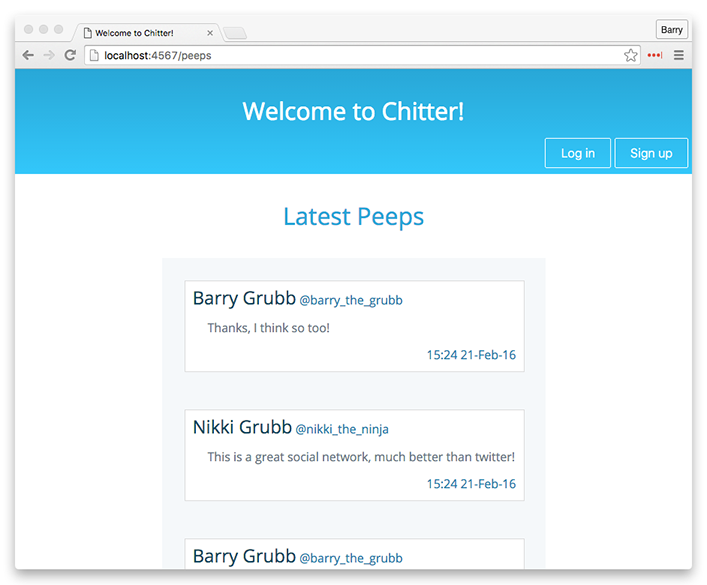

* Clicking the 'Sign up' button will take you to the new user page, as shown below.

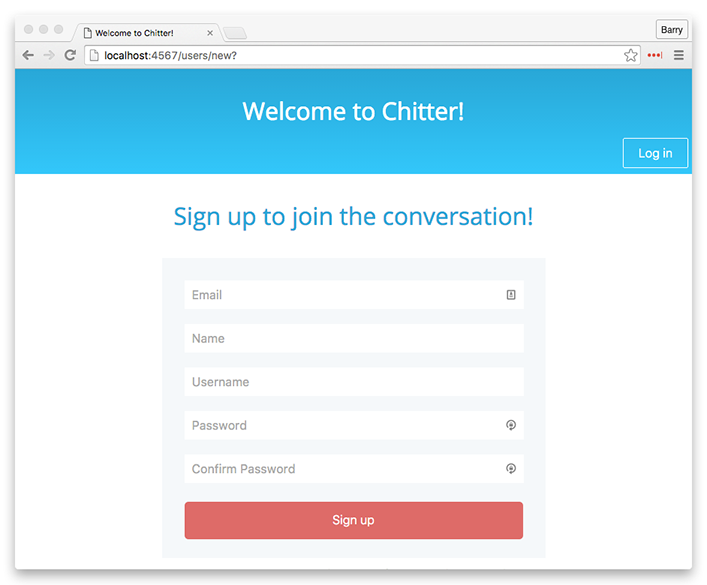

* Fill out your user details as shown below and press the 'Sign up' button to sign up to Chitter.

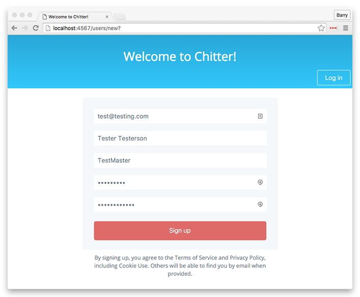

* In the event that an error was made during signup an error message will be shown describing the problem, as shown below.

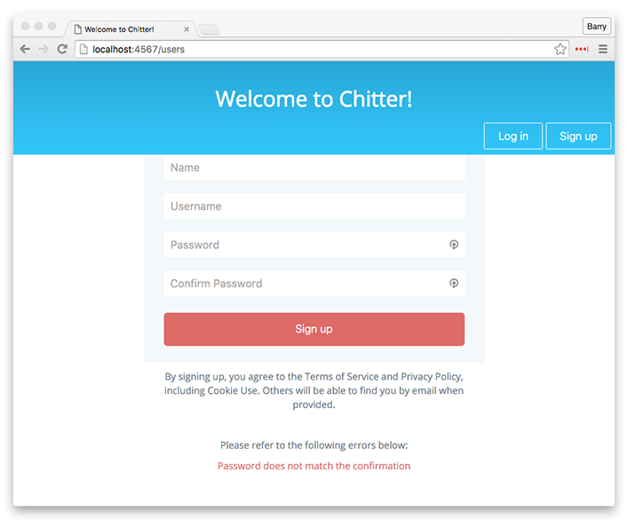

* Once the signup details are entered correctly the new user account will be created and automatically logged in. You will be taken back to the peeps page, and a greeting will appear in the top left corner.

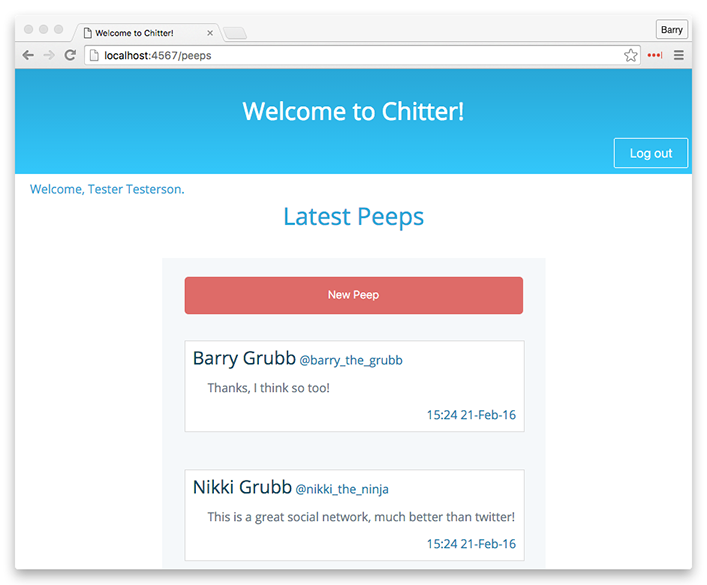

* Notice that now you are logged in a 'New Peep' button has appeared at the top of the peep list. Click the 'New Peep' button, to be taken to the new peep page, as shown below. You can enter a peep of up to 140 characters long (just like twitter).

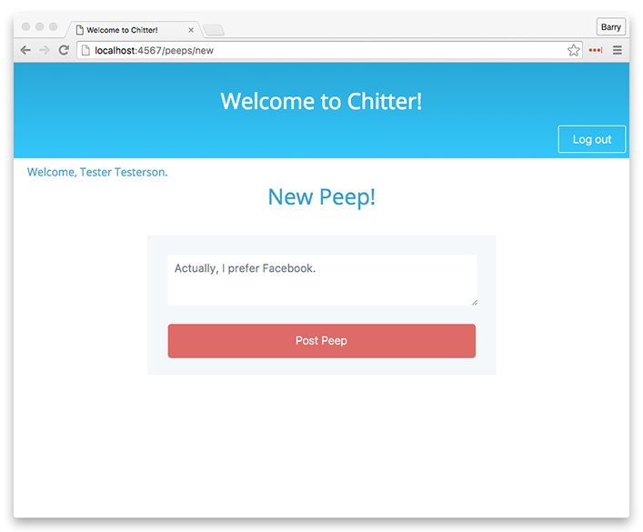

* Once you have entered your Peep and clicked the 'Post Peep' button, you will be returned to the peeps page, and will notice your newly created peep at the top of the list, proudly displaying not only its text, but also your name, username and the time and date that the peep was created.

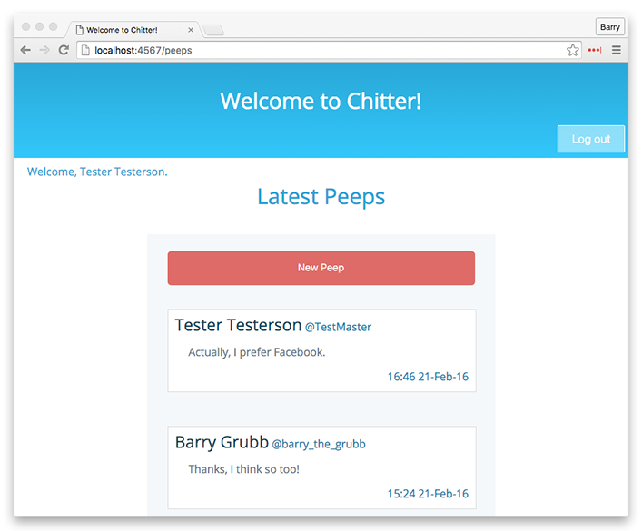

* When you are done adding peeps, click the 'Log out' button to be signed out of Chitter, as shown below. A 'Goodbye!' message will be shown in the top left corner. Notice that once logged out you will no longer be able to add any new peeps until you have logged back in again, but you may still view all peeps on the Peeps page.

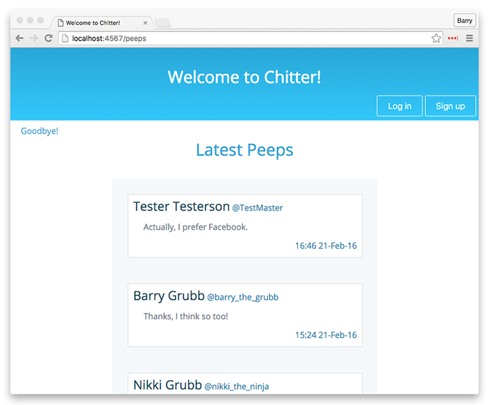

* In order to log in again, click the 'Log in' button, which will take you to the log in page, as shown below.

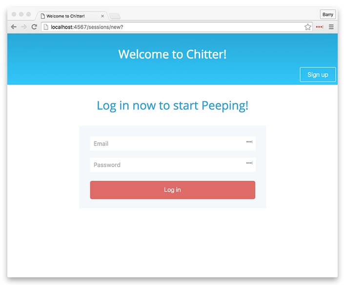

* Enter your previously registered email address and password before clicking the 'Log in' button, to log in to Chitter. If any errors are made during the login process a message will appear alerting the user to the error, as shown below.

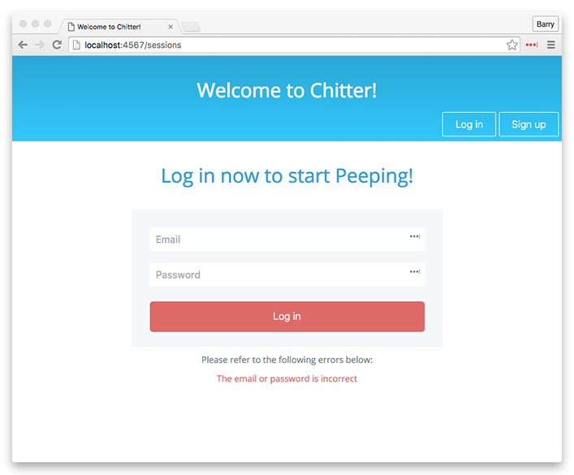

Points of interest
-------
* From any page and at any time you can click the 'Welcome to Chitter!' title in the top bar to return to the peeps page.

* The buttons in the header are smart enough to appear and disappear when necessary, so for example once logged in the 'Log in' and 'Sign up' buttons disappear, so that only the 'Log out' and 'New Peep' buttons are visible. Once logged out the 'Log in and Sign up' buttons will appear, but not the 'Log out' and 'New Peep' buttons. This is designed to safeguard against users doing things that they should not be able to, for example attempting to add a peep whilst not logged in. However it may be noted that the 'New Peep' button simply takes the user to the '/peeps/new' path, which if known can be entered manually in to the browser address bar, bypassing the disappearing button safeguard. Due to this further checks have been put in place, so that upon visiting the '/peeps/new' path whilst not logged in, a 'Please Log in' message will be shown in the top left corner, and the new peep form will not be accessible, as shown below.

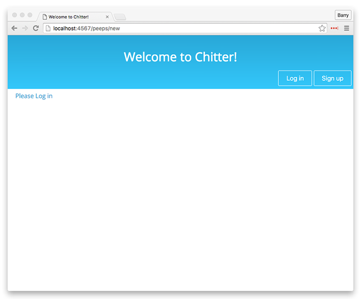
