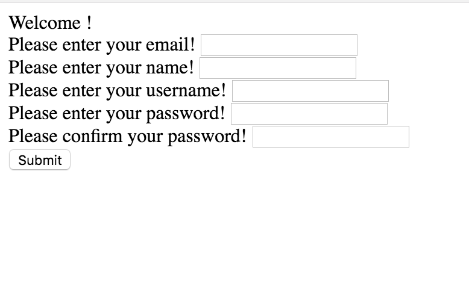
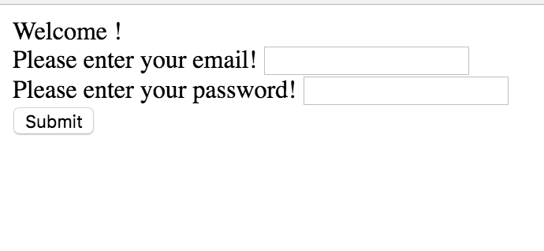
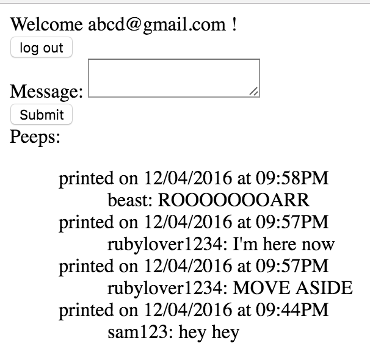

Chitter Challenge
=================

Twitter clone that will allow users to post messages to a public stream.

Features:
----------
* A user can sign up with an email, username and password to create an account.

* Once logged in, users can create a post (or peep).

* Users can log out so no more posts are made.

* Anyone can view all of the posts on the 'peeps' page.

* Only users that are logged in can create a post.


Approach and Technologies used:
-------------------------------

This project uses Datamapper ORM to store instances of User and Peep the two classes as tables. Database cleaner wipes the database after each test is run and RACK switches the database depending whether the application is run in the development or test environment.

Instructions and Installation:
-------------------------------

Fork and clone this repo, then in the command prompt run the following:

```
$ bundle install
```

You will then need to create two databases, you can do this using PostgreSQL by running the following. This downloads all the necessary Gems.

```
$ psql

=# CREATE DATABASE chitter_test;
=# CREATE DATABASE chitter_development;
```

To run the application enter:

```
$ rackup
```

then visit http://localhost:4567

Screenshots:
------------








Further features to implement:
-----

* Users can reply to a post made on the peeps page

* Password recovery
