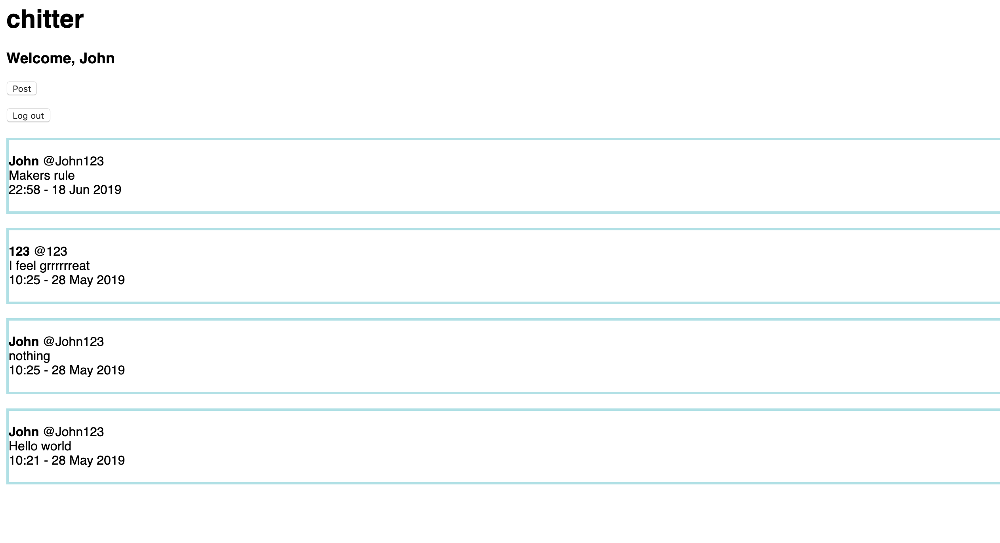

Chitter Challenge
=================

The challenge:
-------

* The goal was to create a twitter clone, which lets a user sign up, log in, post, and log out

* User stories as follows:

```
As a Maker
So that I can let people know what I am doing  
I want to post a message (peep) to chitter

As a maker
So that I can see what others are saying  
I want to see all peeps in reverse chronological order

As a Maker
So that I can better appreciate the context of a peep
I want to see the time at which it was made

As a Maker
So that I can post messages on Chitter as me
I want to sign up for Chitter

As a Maker
So that only I can post messages on Chitter as me
I want to log in to Chitter

As a Maker
So that I can avoid others posting messages on Chitter as me
I want to log out of Chitter

```

* Signing up with an in-use email or username should display a relevant prompt

* Logging in with incorrect details should display a prompt


Notes on functionality:
------

* You don't have to be logged in to see the peeps.
* Users sign up to chitter with their email, password, name and a username (e.g. samm@makersacademy.com, password123, Sam Morgan, sjmog).
* The username and email are unique.
* Peeps (posts to chitter) have the name of the maker and their user handle.
* Your README should indicate the technologies used, and give instructions on how to install and run the tests.


How to use:
-----

* Clone this directory

* Download postgres sql (e.g. by typing brew install postgressql in the command line)

* Open postgres (psql in the command line) and create two databases called chitter and chitter_test using the following command:

```
CREATE DATABASE database_name
```

* For each database enter the commands in db/migrations (in order!)

* Run bundle install in the command line

* Run rackup in the command line and visit localhost in a browser with the correct port number

* To run tests enter rspec in the command line from the root directory

* Visit the /peeps route and interact! Click 'Sign up' to register a username/ email,
'Peep' to post a peep, 'Log out' to sign out and 'Log in' to sign in


Viewing the page while logged out: only the sign up and sign in options are available.


Viewing the sign up page.


While signed in users have the options to post and sign out!


Technical Approach:
-----

* TDD approach, outside-in (i.e. feature tests first, then unit tests)

* Used the MVC pattern

* Stored user and peep information (timestamp, text, username and so on) within tables of a database. Accessed these using sql and wrapped them in user and peep ruby objects respectively

* One-to-many relationship between users and peeps meant storing userid as a foreign key within the peeps table


Thoughts
-----

* Storing passwords in plaintext, probably not a good idea! Could use a gem to encrypt these

* Did not test the timestamping, could use Time.now in ruby rather than handling this on the database
side. Would make testing easier (e.g. using the gem timecop or a mock)

* Parts of the controller are a little long, will have to consider if it's possible to refactor

* Could have used an ORM such as datamapper

* Improvements to HTML/ CSS would be nice to have
