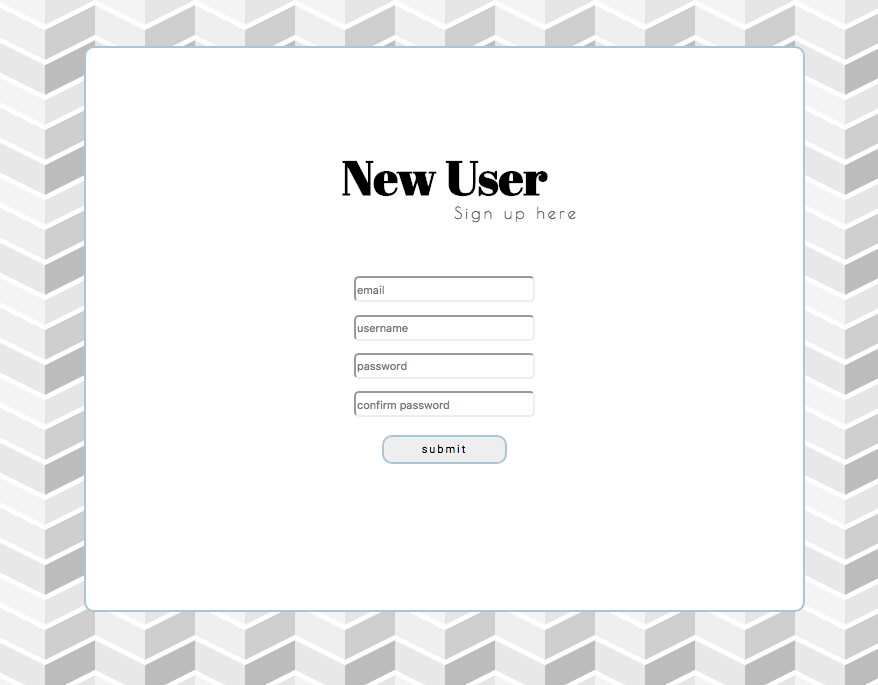

# Chitter Challenge

[](https://travis-ci.org/aabolade/chitter-challenge)
[](https://coveralls.io/github/aabolade/chitter-challenge?branch=master)


Twitter clone that will allow users to post messages to a public stream. Visit the app [here](https://tranquil-forest-58353.herokuapp.com)

Features
========
* A user can sign up with an email, username and password to create an account.

* Once logged in, users can create a post (or peep).

* Users can log out so no more posts are made.

* Anyone can view all of the posts on the 'peeps' page.

* Only users that are logged in can create a post.


Approach and Technologies used
==============================

* Code written in Ruby.

* Feature testing using Capybara, unit testing using RSpec.

* Datamapper ORM to store instances of User and Peep, the two classes as tables.

* Database cleaner wipes the tables after each test is run

* Sinatra to run and host the local server.

* BCrypt to encrypt the user's password before it is stored in the database.

* RACK switches the database depending whether the application is run in the development or test environment.

Instructions and Installation
=============================

Fork and clone this repo, then in the command prompt run the following:

```
$ bundle install
```

You will then need to create two databases, you can do this using PostgreSQL by running the following. This downloads all the necessary Gems.

```
$ psql

=# CREATE DATABASE chitter_test;
=# CREATE DATABASE chitter_development;
```

To run the application enter:

```
$ rackup
```

Then visit http://localhost:4567 (please note the last four digits of the url will depend on which port Sinatra uses. You can check this in the terminal when you run the command.)

Screenshots
===========

Signing up.



Signing in.


Posting a peep.


Further features to implement
=============================

* Users can reply to a post made on the peeps page

* notifications when a user's peep is replied to.
