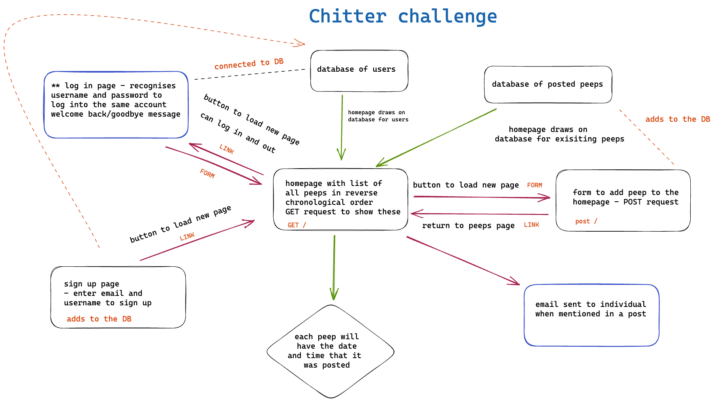

Chitter Challenge
=================

Write a small Twitter clone that will allow the users to post messages to a public stream.

## How to use

```ruby
$ git clone https://github.com/aliceswood/chitter-challenge.git
$ cd chitter-challenge
$ bundle install
$ createdb chitter_test
$ psql -h 127.0.0.1 chitter_test < spec/seeds/accounts_and_peeps_tables.sql
$ rspec
$ rackup
$ http://localhost:('Port in use')/
```

## Initial plan



## Initial Approach

1. Set up the Chitter database with test accounts and test peeps so that the homepage has some information prepopulated

2. Create AccountRepository, Account & PeepRepository, Peep classes so that new instances of each can be made

3. Create the homepage using GET request so that the test peeps are shown

4. Create a form to add new peeps using POST request

5. Once peep is submitted, return to homepage with list of peeps

6. Create a sign up page so that details are added to the database and user is registered, with error for non unique details

7. Add a log in and log out page, which checks the database to match log in details


## Techonologies used

- Excalidraw
- Ruby
- RSpec
- PostgreSQL
- Sinatra
- HTML
- BCrypt
- rack
- rubocop

## Reflection

	This challenge to recreate Twitter was a rather daunting project from first look as it was very easy to compare to the platform and think of all the additional features.
	
	It was important and useful for me to keep referring back to the user stories to ensure that I was working on the most important and key features to have a MVP.
	
	I started making my initial plan on Excalidraw and to breakdown the requirements into steps to use as a starting to-do list.
	
	I found that usig the recipe templates helped me to plan my tables  for the database (one for accounts and one for peeps)and create some base seed data to prepopulate the site with and test with.
	
	I wrote the account model and repository classes and also the peep account and repository classes to achieve the main functionality of the app.
	
	I found it useful to build up the HTML view files as I completed the http routes along side as sometimes I found myself encountering 500 status errors that would not give much away in the error message. It was useful for me to be able to have a bit more feedback from my web app itself.
	
	I worked through the ability to add and display peeps before adding the opportunity to sign up, with the functionality to check for unique user details. At this point, the homepage had most of the details but it was not recognising whether a user was signed in.
	
	I was able to use sessions in Sinatra to register when a user was logged in and who it was, they were then able to post as this user.
	
	At this point it was a priority for me to encrypt the passwords stored on the database using bcrypt. This took some playing around with to try and understand what was needed and where and it was interesting to use irb to ensure my seed data was also encrypted to ensure my rspec tests were passing also.
	
	I then tried to implement some basic CSS, this is something that I have never used before so it was nice to see some visual changes to my web app.
	

## Goals going forward
	
	As mentioned before, this project was a big one and there was always more I was wanting to achieve.
	
	I would start by adding some better functionality for the sign up page. I would want to add tests to ensure that the user input is in the right format, for example including REGEXs for email addresses and ensuring that forms have no missing data or blank fields. I would also like to work on sanitising user input before storing it to the database.
	
	Going on from this, I think it would be fun to have a looking into Sinatra flash messages to display error or confirmation messages to the user.
	
	I would also like to have a go at the stretch goals of implementing user emailing notifications and implementing threads and replies on the homepage. This would make the web app more interactive with other users.
	
	I would also like to put more time into the CSS styling as I am very aware it is basic at the moment. It would be fun to try implementing navigation bars or a side menu to help with the user direction and use of the site.
	
	In conclusion I would say that I am happy with the progress I have made on this project and I am glad I got to complete the MVP basic level product needed from the user stories.
