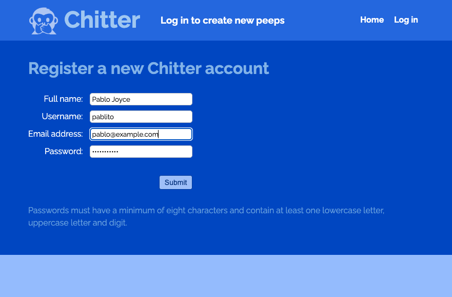

# Chitter Challenge by Pablo Joyce

[Getting Started](#getting-started) | [Using the application](#using-the-application) | [Running the tests](#running-the-tests) | [Design](#design) | [Screenshots](#screenshots) | [Technologies used](#technologies-used) | [Notes on test coverage](#notes-on-test-coverage)

<p align="left">


</p>

* This project is a solo Ruby project completed at the end of the web applications module of the Makers Academy bootcamp.
* The application is built with the Sinatra web framework, rendering view files using ERB
* The application uses a PostgresSQL database
* The database connection is established in `lib/database_connection.rb` using the `pg` gem
* Seed data for tests is included in `spec/seeds.sql`

## The Brief

To create a basic Twitter clone that will allow the users to post messages.
We were given the following user stories as a starting point:

```
STRAIGHT UP

As a Maker
So that I can let people know what I am doing  
I want to post a message (peep) to chitter

As a maker
So that I can see what others are saying  
I want to see all peeps in reverse chronological order

As a Maker
So that I can better appreciate the context of a peep
I want to see the time at which it was made

As a Maker
So that I can post messages on Chitter as me
I want to sign up for Chitter

HARDER

As a Maker
So that only I can post messages on Chitter as me
I want to log in to Chitter

As a Maker
So that I can avoid others posting messages on Chitter as me
I want to log out of Chitter

ADVANCED

As a Maker
So that I can stay constantly tapped in to the shouty box of Chitter
I want to receive an email if I am tagged in a Peep
```

We were given the following notes on functionality:

* You don't have to be logged in to see the peeps.
* Makers sign up to chitter with their email, password, name and a username (e.g. samm@makersacademy.com, password123, Sam Morgan, sjmog).
* The username and email are unique.
* Peeps (posts to chitter) have the name of the maker and their user handle.

## Getting Started 
[Top](#chitter-challenge-by-pablo-joyce) | [Use](#using-the-application) | [Tests](#running-the-tests) | [Design](#design) | [Screenshots](#screenshots) | [Tech](#technologies-used) | [Coverage](#notes-on-test-coverage)

At time of writing, this project has a version deployed on Render at [https://chitter-7pam.onrender.com/](https://chitter-7pam.onrender.com/). Please note that this may take 30 seconds or longer to 'spin up' as it is deployed on a free tier of Render.
At some point in the future, this version may be taken down as Render only allows a single database instance on the free tier.

For the local version, clone this repository to your local machine:
`git clone https://github.com/pablisch/chitter-challenge.git`

Switch to the `local-server` branch:
`git switch local-server`

cd to the project and install dependencies:
`bundle install`

Ensure that your postgres server is accessable at the IP address 127.0.0.1.
Create the postgreSQL databases for running and testing the project:
```bash
createdb chitter
createdb chitter_test
```
Create the tables in the databases:
```bash 
psql -h 127.0.0.1 chitter < spec/tables.sql
psql -h 127.0.0.1 chitter_test < spec/tables.sql
```
Populate the test database with seed data:
```bash
psql -h 127.0.0.1 chitter < spec/seeds.sql
psql -h 127.0.0.1 chitter_test < spec/seeds.sql
```
Start the development server:

`rackup`

Access the website in your browser at [localhost:9292](http://localhost:9292/).

## Using the application
[Top](#chitter-challenge-by-pablo-joyce) | [Getting Started](#getting-started) | [Tests](#running-the-tests) | [Design](#design) | [Screenshots](#screenshots) | [Tech](#technologies-used) | [Coverage](#notes-on-test-coverage)

Be default uses can see all messages posted by all users, but cannot post messages.

Follow the link to register as a user, you will then be prompted to redirect to login.

After login, you will be redirected to the home page where you can post a new message. messages posted by all users will appear here in reverse chronological order.

## Running the tests

`rspec`

All tests should pass with a total code coverage of **99.41%**. 

Screenshots of the tests and coverage can be found in the [Coverage](#notes-on-test-coverage) section of this readme.

## Design
[Top](#chitter-challenge-by-pablo-joyce) | [Getting Started](#getting-started) | [Use](#using-the-application) | [Tests](#running-the-tests) | [Screenshots](#screenshots) | [Tech](#technologies-used) | [Coverage](#notes-on-test-coverage)

The design planning used at the time of making can be seen in recipes/chitter_plan.md.

I started by creating a [diagram of the user experience]([.images/chitter3.png](https://github.com/pablisch/chitter-challenge/blob/main/images/chitter3.png?raw=true)) and incorporated the routes and validations into this diagram:


The design itself changed a lot during the design process as the diagramming revealed issues and solved many problems before I started coding.
This gave me a good roadmap from which to build the app.

* The application is built with the Sinatra web framework, rendering view files using ERB
* Each database table has a corresponding Ruby class defined with a singular version of the name of the table.
* Each table has an additional 'TABLENAME_repository' class with methods that allow for CRUD operations on the DB.
* The database connection is established in `lib/database_connection.rb` using the `pg` gem
* The database tables have a one-to-many relationship with the users table. This is implemented by storing the user_id in the peeps table.
* Route handling occurs in the `Application` class defined in [./app.rb](./app.rb). [./config.ru](./config.ru) executes the code inside of `Application` when `rackup` is run at the command line.
* Passwords are hashed using the [BCrypt](https://rubygems.org/gems/bcrypt/versions/3.1.12) gem.

## Screenshots
[Top](#chitter-challenge-by-pablo-joyce) | [Getting Started](#getting-started) | [Use](#using-the-application) | [Tests](#running-the-tests) | [Design](#design) | [Tech](#technologies-used) | [Coverage](#notes-on-test-coverage)

Register a new user:



Main screen when logged in:


Create a new peep:


Display new peep:


## Technologies used
[Top](#chitter-challenge-by-pablo-joyce) | [Getting Started](#getting-started) | [Use](#using-the-application) | [Tests](#running-the-tests) | [Design](#design) | [Screenshots](#screenshots) | [Coverage](#notes-on-test-coverage)

This project uses:
* Ruby
* PostgreSQL
* ERB
* Rackup
* Sinatra
* Webrick
* Git
* GitHub
* Bcrypt

In development, this project also used:
* Postman
* TablePlus
* RSpec

## Notes on test coverage
[Top](#chitter-challenge-by-pablo-joyce) | [Getting Started](#getting-started) | [Use](#using-the-application) | [Tests](#running-the-tests) | [Design](#design) | [Screenshots](#screenshots) | [Tech](#technologies-used)

The following code **at the top** of spec_helper.rb causes test coverage stats to be generated
on pull request:

```ruby
require 'simplecov'
require 'simplecov-console'

SimpleCov.formatter = SimpleCov::Formatter::MultiFormatter.new([
  SimpleCov::Formatter::Console,
  # Want a nice code coverage website? Uncomment this next line!
  # SimpleCov::Formatter::HTMLFormatter
])
SimpleCov.start
```

Coverage: 


Test results:


