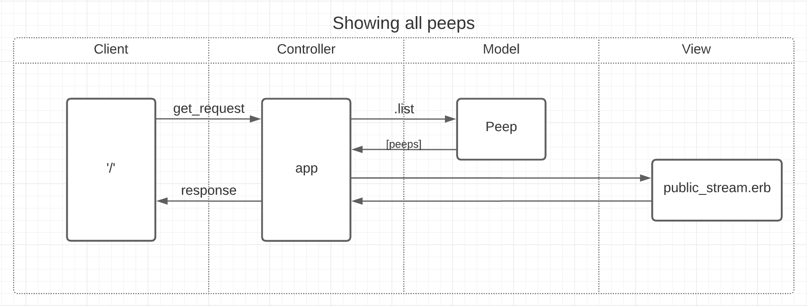

# Chitter
=================


## Setting up your databases:

**Create Peep Manager DB**

1. Connect to ```psql``` in your terminal.
2. Create the database using the psql command ```CREATE DATABASE peeps_manager;```
3. Connect to the database using the pqsl command ```\c peeps_manager;```
4. Run the query we have saved in the file ```01_create_peeps_table.sql```

**Create Peeps Test Manager DB**

Do the above again, with the following changes:

- Step 2: ```CREATE DATABASE peeps_test_manager;```
- Step 3: ``` \c peeps_test_manager;```

## How to Run:

After setting up your databases, run the app using rackup with ```rackup -p 2345```.
From here, navigate to ```localhost:2345``` in your browser.
Once you're there, you will be able to see the public Chitter stream (which will be empty, unless you have already added Peeps!), and a 'log in' feature. Type in your username, and click 'log in' to sign in. Now you can add peeps! Don't forget to log out!


------------

## The Process

I first looked through the features/user stories to create a domain model and diagrams to help structure my database and system. Unfortunately I was only able to successfully implement the first 4 user stories, as I ran out of time and was not able to complete the 'Harder' user stories (signing in and signing out securely). Fortunately, I was able to partially implement these features, and have diagrams in place if I decide to tackle this at a later date.

That being said, my table for 'ChitterAccounts' is slightly inaccurate, after spending some time researching password security, and would need to be revised moving forward.

------------

Features:
-------

```
STRAIGHT UP

As a Maker
So that I can let people know what I am doing  
I want to post a message (peep) to chitter

As a maker
So that I can see what others are saying  
I want to see all peeps in reverse chronological order

As a Maker
So that I can better appreciate the context of a peep
I want to see the time at which it was made

As a Maker
So that I can post messages on Chitter as me
I want to sign up for Chitter

HARDER

As a Maker
So that only I can post messages on Chitter as me
I want to log in to Chitter

As a Maker
So that I can avoid others posting messages on Chitter as me
I want to log out of Chitter

ADVANCED

As a Maker
So that I can stay constantly tapped in to the shouty box of Chitter
I want to receive an email if I am tagged in a Peep
```

Object | Behaviour
------ | ---------
Peep | .add, .list (reverse order/newest-oldest), @time, @message
ChitterAccount | .create_account, .sign_in, .sign_out

Tables:

Peep
----
id | time | message | user
-- | ---- | ------- | ----
SERIAL | Time created | Message written(MAX: 280 chars) | Created By

ChitterAccounts
---------------
id | username | password | email
-- | -------- | -------- | -----
SERIAL | username | pwd1234 under 14 chars, but more than 8 | email

## Diagrams



