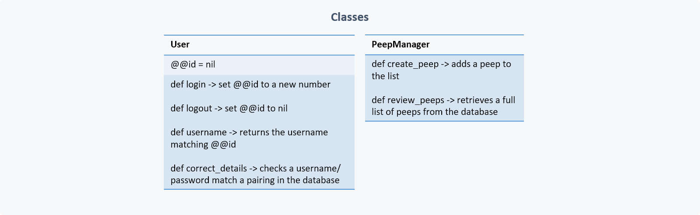

Introduction
---------
This repo contains the code I wrote for the Chitter Challenge, the Makers Academy Week 4 end-of-week challenge. This involved creating a very basic twitter clone using an MCV model and a database based on the following user stories:
```
As a Maker
So that I can let people know what I am doing  
I want to post a message (peep) to chitter

As a maker
So that I can see what others are saying  
I want to see all peeps in reverse chronological order

As a Maker
So that I can better appreciate the context of a peep
I want to see the time at which it was made

As a Maker
So that I can post messages on Chitter as me
I want to sign up for Chitter
```

My approach
---------
Throughout this challenge I created new coding assets (including .rb and .erb files) through a TDD approach, creating function tests for both code and web app functionality.

I took special care to begin this challenge with a planning session in which I mapped out the classes, database tables and user journeys I thought would be necessary. I produced the following diagrams based on this:

#### Classes


#### Database tables


#### User journey


#### User journeys

I began by setting up the files I believed would be necessary. This included x3 pages: a sign-in page, a game page, and a results page. I created two classes to support the main app class: Game and Player. I later expanded this to include a Weapon class when I found this might be useful. I created a sign-in page and styled it with CSS and HTML. I then proceeded to a create a page for the game to take place, and a page to display results. Once all functionality was implemented, I formatted the app with CSS and HTML. Once that was done, I expanded the scope of the project as a personal challenge.

Both user stories have been addressed and the bonuses have been completed (see Instructions for use below).

For my own enjoyment and education, I went beyond the required user stories and bonuses in the following 5 ways:
1) I went beyond the requested 5-item system to an extensive 16-item system. As I'd hoped, this proved very challenging and required a lot of planning to devise an appropiate system. I decided to use a system I'm familiar with: the Pokemon weaknesses and strengths system, which I adapted into a rock-paper-scissors-like game using Pokemon characters
2) I introduced image assets from external websites (permissions stated all assets were free for public use) to represent the characters
3) I spent time formatting all .erb files with HTML and CSS to create a relatively aesthetic format
4) I retained the ability to play single-player games as well as multiplayer games
5) I added a system to prevent the game being played if users didn't enter a nam

With more time, I would have done the following:
1) Added credits for the image assets I used (this felt unnecessary as of now as this app is not ready for public use)
2) Investigated how to subsititute global variables and implemented my findings
3) Introduced a scoring system
4) I felt the game.rb file became to extensive; I would decrease this by extracting at least one other Class and a Module

Total rspec testing coverage: 100%; 28 rspec tests; rubocop passed with no offences.


Instructions for use
---------
### Setup:
1) Clone this repository to a local directory
2) Open a command line and navigate to the cloned directory
3) Enter "rackup -p 4567" into the terminal
4) Open a browser and visit http://localhost:4567 to see the sign-in page

### Interaction:
1) Enter a name for Player 1 and press Enter to play a single-player game against the computer. If you also enter a name for Player 2, you will play a multiplayer game
2) Choose a Pokemon for Player 1
3) If playing a multiplayer game, Player 2 will then be prompted to choose their Pokemon
4) You will be presented with the result. Play again, or return to the sign-in page
