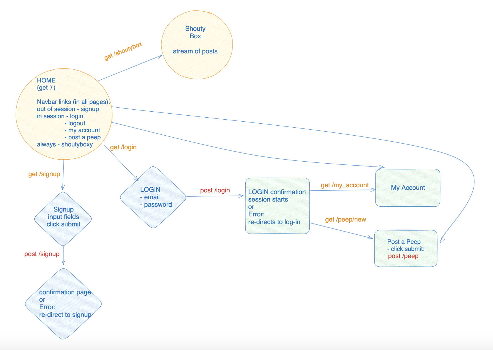

# Chitter Challenge


## To Run App
```
 git clone https://github.com/veritywong/chitter-challenge.git
 cd chitter-challenge
 bundle install
 createdb chitter_test
 psql -h 127.0.0.1 chitter_challenge < spec/tables_seeds.sql
 rspec
 rackup
 http://localhost:('Port in use')/
```

## Description
This app is the start of a Twitter clone, that allows users to post messages to a public stream. In order to post they must signup and login, however anybody can view the public stream on the 'Shouty Box'.

## Approach
This was the first web app that we created on the course, so the goal was to get a good understanding of sending HTTP requests from the frontend and how they were then run in the backend.
I begun by following the recipe to decide database structure, which in this case includes posts and users tables, which have a many to many relationship.
From there I used TDD to create the user repository and post repository, implementing methods towards creating CRUD functionality.
Next I worked between the app.rb file and HTML files, completing the features such as signup, login and posting a new peep.

## Diagrams
This diagram shows the differente pages in the app. The user can only post or view their account when logged in.



Below is a diagram of clicking the link for the stream of posts:


## Technology Used
* Ruby
* Sinatra & ERB
* BCrypt
* PostgreSQL
* HTML & CSS

## Tests
This is a screen shot of the passing tests and test coverage.


# Initial Project Information

Below is the instructuctions given at the start of the project.

Gems added:
time
sinatra sinatra-contrib webrick rack-test
pg
bcrypt

=================

* Feel free to use Google, your notes, books, etc. but work on your own
* If you refer to the solution of another coach or student, please put a link to that in your README
* If you have a partial solution, **still check in a partial solution**
* You must submit a pull request to this repo with your code by 10am Monday morning

Challenge:
-------

As usual please start by forking this repo.

We are going to write a small Twitter clone that will allow the users to post messages to a public stream.

Features:
-------

```
STRAIGHT UP

As a Maker
So that I can let people know what I am doing  
I want to post a message (peep) to chitter

As a maker
So that I can see what others are saying  
I want to see all peeps in reverse chronological order

As a Maker
So that I can better appreciate the context of a peep
I want to see the time at which it was made

As a Maker
So that I can post messages on Chitter as me
I want to sign up for Chitter

HARDER

As a Maker
So that only I can post messages on Chitter as me
I want to log in to Chitter

As a Maker
So that I can avoid others posting messages on Chitter as me
I want to log out of Chitter

ADVANCED

As a Maker
So that I can stay constantly tapped in to the shouty box of Chitter
I want to receive an email if I am tagged in a Peep
```

Technical Approach:
-----

In the last two weeks, you integrated a database using the `pg` gem and Repository classes. You also implemented small web applications using Sinatra, RSpec, HTML and ERB views to make dynamic webpages. You can continue to use this approach when building Chitter Challenge.

You can refer to the [guidance on Modelling and Planning a web application](https://github.com/makersacademy/web-applications/blob/main/pills/modelling_and_planning_web_application.md), to help you in planning the different web pages you will need to implement this challenge. If you'd like to deploy your app to Heroku so other people can use it, [you can follow this guidance](https://github.com/makersacademy/web-applications/blob/main/html_challenges/07_deploying.md).

If you'd like more technical challenge now, try using an [Object Relational Mapper](https://en.wikipedia.org/wiki/Object-relational_mapping) as the database interface, instead of implementing your own Repository classes.

Some useful resources:
**Ruby Object Mapper**
- [ROM](https://rom-rb.org/)

**ActiveRecord**
- [ActiveRecord ORM](https://guides.rubyonrails.org/active_record_basics.html)
- [Sinatra & ActiveRecord setup](https://learn.co/lessons/sinatra-activerecord-setup)

Notes on functionality:
------

* You don't have to be logged in to see the peeps.
* Makers sign up to chitter with their email, password, name and a username (e.g. samm@makersacademy.com, password123, Sam Morgan, sjmog).
* The username and email are unique.
* Peeps (posts to chitter) have the name of the maker and their user handle.
* Your README should indicate the technologies used, and give instructions on how to install and run the tests.

Bonus:
-----

If you have time you can implement the following:

* In order to start a conversation as a maker I want to reply to a peep from another maker.

And/Or:

* Work on the CSS to make it look good.

Good luck and let the chitter begin!

Code Review
-----------

In code review we'll be hoping to see:

* All tests passing
* High [Test coverage](https://github.com/makersacademy/course/blob/main/pills/test_coverage.md) (>95% is good)
* The code is elegant: every class has a clear responsibility, methods are short etc.

Reviewers will potentially be using this [code review rubric](docs/review.md).  Referring to this rubric in advance may make the challenge somewhat easier.  You should be the judge of how much challenge you want at this moment.

Notes on test coverage
----------------------

Please ensure you have the following **AT THE TOP** of your spec_helper.rb in order to have test coverage stats generated
on your pull request:

```ruby
require 'simplecov'
require 'simplecov-console'

SimpleCov.formatter = SimpleCov::Formatter::MultiFormatter.new([
  SimpleCov::Formatter::Console,
  # Want a nice code coverage website? Uncomment this next line!
  # SimpleCov::Formatter::HTMLFormatter
])
SimpleCov.start
```

You can see your test coverage when you run your tests. If you want this in a graphical form, uncomment the `HTMLFormatter` line and see what happens!
