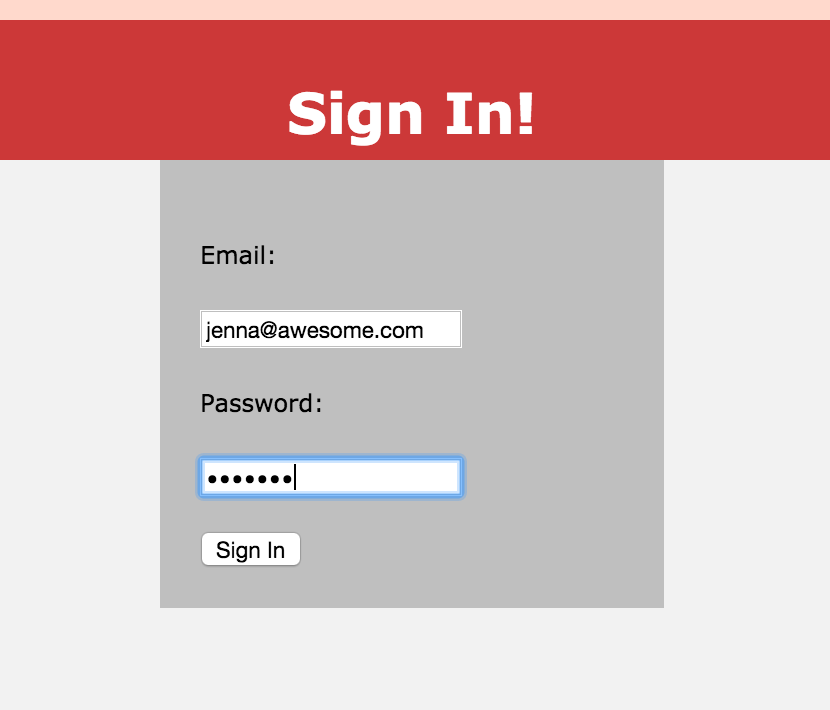
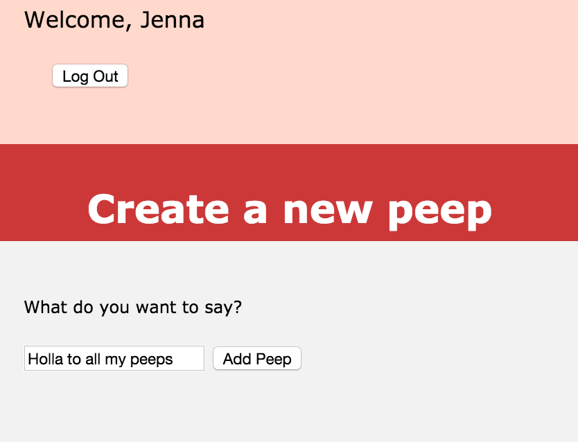

###Purpose:
-------------
A little Twitter clone that will allow its users to post messages to a public stream.


###Technologies Used:
-------------
* PostgreSQL database
* DataMapper for object relational mapping
* Sinatra framework
* Database Cleaner
* RSpec & Capybara testing
* Heroku for web hosting


###Features:
-------------

```
As a Maker
So that I can post messages on Chitter as me
I want to sign up for Chitter

As a Maker
So that I can post messages on Chitter as me
I want to log in to Chitter

As a Maker
So that I can avoid others posting messages on Chitter as me
I want to log out of Chitter

As a Maker
So that I can let people know what I am doing  
I want to post a message (peep) to chitter

As a maker
So that I can see what others are saying  
I want to see all peeps in reverse chronological order

As a maker
So that I can better appreciate the context of a peep
I want to see the time at which it was made
```

###How to Use:
-------------
Visit `https://chitter-jenna.herokuapp.com`


If you already have an account, click "Sign In"



Otherwise, sign up by clicking "Sign Up"


User is taken to peeps page that shows a list of all peeps, along with the name, username of the writer, and the time at which the peep was created


User can click to add a peep, and is taken to a new page



Page navigates back to the list of peeps, which now includes the most recently added peep


