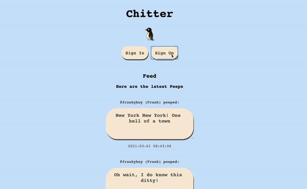
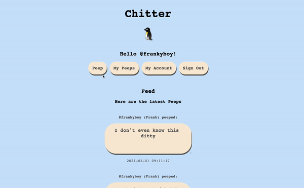
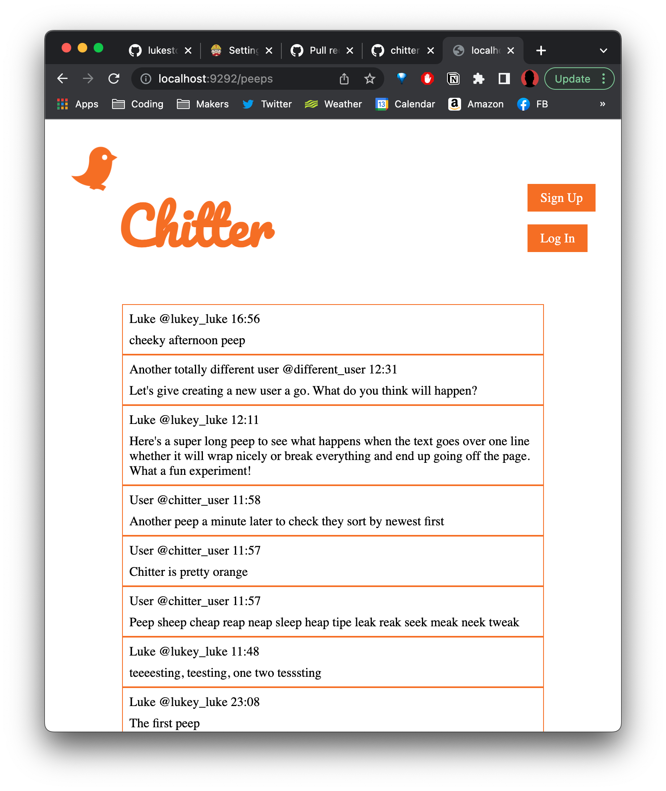

# Chitter

[](https://travis-ci.com/AJ8GH/chitter-challenge) [](https://coveralls.io/github/AJ8GH/chitter-challenge?branch=master) [](https://codeclimate.com/github/AJ8GH/chitter-challenge/maintainability)

Version 1.0.0 deployed through Heroku: [Chitter](https://gentle-mountain-55342.herokuapp.com/)
----------------------------------------------------------------------------------------------


## Ruby version

- `2.7.2`

## Dependencies

- `bcrypt`
- `capybara`
- `coveralls_reborn (~> 0.20.0)`
- `pg`
- `puma`
- `rack`
- `rake`
- `rspec`
- `rubocop (= 0.79.0)`
- `simplecov`
- `simplecov-console`
- `sinatra-flash`
- `sinatra`

## Getting Started

### Initial Setup

* You will need Ruby installed, this project uses version 2.7.2
  * Use of a version manager tool such as RVM is recommended
  * You can find documentation for installing RVM [here](https://rvm.io/rvm/install)

* Clone this repository and navigate to the root of the project

```shell
git clone git@github:AJ8GH/chitter-challenge.git
cd chitter-challenge
```

* Install `bundler` if you do not already have it

```shell
gem install bundler
```

* Install the dependencies

```shell
bundle install
```

* This app uses a PostgreSQL database, so you will need to install and set up Postgres
  * Using a package manager such as Homebrew is recommended
  * You can install Homebrew [here](https://brew.sh/)
  * Then install PostgreSQL with: `brew install postgresql`
  * After Homebrew has downloaded PostgreSQL it will show you some installation instructions: follow them!
  * Next run: `brew services start postgresql` to keep PostgreSQL running in the background

* Create the test and development databases and migrate the table schema

```shell
rake db:create:all
rake db:migrate:all
```

## Running Tests

To run all tests with documentation format
```shell
rspec
```

### Using the app

Run the Server:

```
rackup
```

Go to [http://localhost:9292](http://localhost:9292) in your browser


## Usage

Check your peeps in reverse chronological order - no need to be signed in for this feature.

Sign in to access more features such as peeping and editing your peeps / details.


If you're new to Chitter, you'll need to sign up to start peeping. Your password will be stored safely.



Edit and delete your peeps any time.



As well as your user account data.


## Reflections

### Design and approach

- I set out to build a an app which ticks boxes for:
  - CRUD features
  - Use of ORM with postgres database
  - Polished look using CSS
  - Well designed RESTful routing
  - Encryption of passwords and authentication of users using sessions
  - Adhering to MVC standards and separation of concerns / SRP.

- User Stories have all been hit, bar email notifications. Instead I prioritised implementing all of the CRUD features for the user info and peeps.
- I went for an approach of using ORM and wrapping my database connection in a class. - I applied rake tasks to handle everything to do with environment and db setup. I setup tasks for connecting to the correct database depending on the environmnent, cleaning the database and creating and migrating the database.

### Skills Applied

- Rake tasks for automated building of db
- Rake tasks for connecting to and cleaning the database
- Password encryption using BCrypt
- Object relational mapping
- RESTful routing
- CRUD capable app, all create read update and delete actions possible on both peep and user data
- Applying a favicon icon:


- Using test and development environments

In my test environment:
- my db connection rake task automatically connects to the test database, and outputs a confirmation to the terminal

- Bcrypt is set up with minimum cost factor, so as not to slow down the tests
```ruby
BCrypt::Engine.cost = 1
```
- db cleaning raketask truncates the database before each test

### Extending the application

Future features include:
- Email notifications
- Replies and favourites
- Building a frontend interface with React or vanilla JS

## User Stories

```
STRAIGHT UP

As a Maker
So that I can let people know what I am doing
I want to post a message (peep) to chitter

As a maker
So that I can see what others are saying
I want to see all peeps in reverse chronological order

As a Maker
So that I can better appreciate the context of a peep
I want to see the time at which it was made

As a Maker
So that I can post messages on Chitter as me
I want to sign up for Chitter

HARDER

As a Maker
So that only I can post messages on Chitter as me
I want to log in to Chitter

As a Maker
So that I can avoid others posting messages on Chitter as me
I want to log out of Chitter

ADVANCED

As a Maker
So that I can stay constantly tapped in to the shouty box of Chitter
I want to receive an email if I am tagged in a Peep
```


