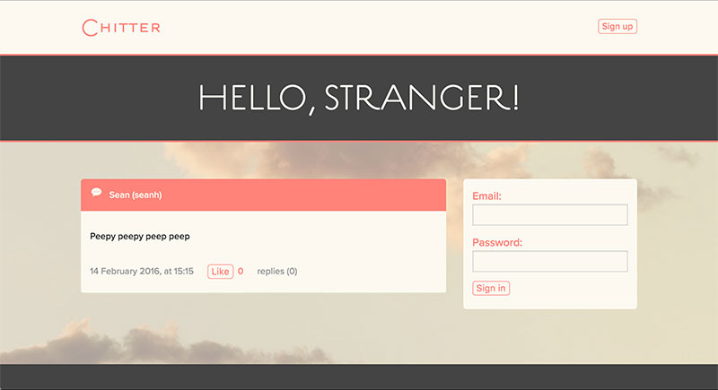

Chitter Challenge
=================

The Challenge:
-------

Build a small twitter-esque messaging service, where users can sign up, log in, post messages and replies, and log out.

My Approach:
-------

I began by setting up a new Sinatra environment, testing environment and Postgres databases. Using the user stories, I then test-built the app one route at a time, starting with signing-up Users and working towards an app where Users can log in, post content ('Peeps' and replies), and log out.

The app uses classes for Users, Peeps and Replies.

The app is (almost) fully feature-tested using Capybara.

Once the functionality was in place I wrote some styles for the site, and used Foundation for some quick structure.

Finally, I deployed the app to Heroku.

The app uses Sinatra, Postgres and DataMapper, with Rspec and Capybara for testing. The front end was built using HTML, SCSS and a tiny bit of jQuery. The typefaces are from TypeKit.

Installing the app:
-------------------

* Fork this repo
* Clone to your local environment
* run `bundle install`
* run `createdb chitter_development`
* run `rake db:auto_migrate RACK_ENV=development`
* run `rackup` or equivalent

On Heroku
----------

https://sh-chitter.herokuapp.com

Using the app:
---------------

Visit the site

Sign Up

Write a Peep

Post a Peep

Add a reply

Sign Out
