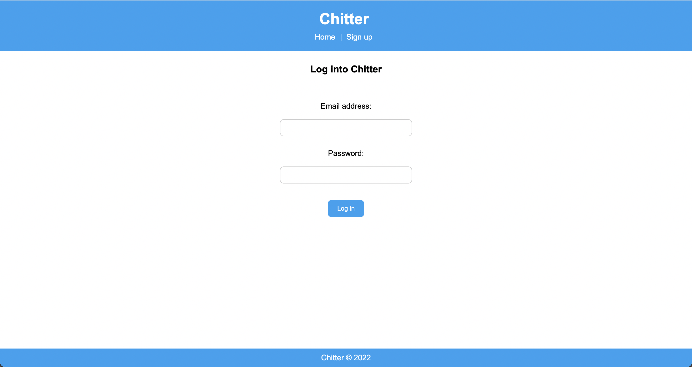

Chitter
=================

## About this project
Chitter is a Twitter clone web-app that I built using Ruby and Sinatra. It allows users to sign up, log in, post peeps (like tweets), and comment on peeps. Users can also view their own profile, the profiles of other users, and individual peeps.

## Learnings from this project
Through creating this app, I improved my ability to:
- Build fullstack web applications using Ruby and the Sinatra framework
- Create SQL databases and implement routes that interact with and manipulate data in these databases
- Implement user authentication using bcrypt
- Carry out unit and integrations tests with RSpec
- Use Embedded Ruby (ERB) to dynamically edit HTML view pages
- Style websites with CSS

## Installation
### How to install the code
- Clone this repository to your local machine:
``git clone git@github.com:atcq9876/chitter-challenge.git``
- Navigate into the project directory:
``cd chitter-challenge``
- Install the necessary dependencies:
``bundle install``

### How to set up the databases
- Install PostgreSQL database (if necessary)
- Create a development database:
``createdb chitter``
- Create a test database:
``createdb chitter_test``
- Set up the tables in the development database:
``psql -h 127.0.0.1 chitter < chitter_tables.sql``
- Set up the tables in the test database:
``psql -h 127.0.0.1 chitter_test < chitter_tables.sql``
- Set up the seeds in the test database:
``psql -h 127.0.0.1 chitter_test < /spec/seeds_chitter.sql``

### How to run the code
- Navigate into the project directory:
``cd chitter-challenge``
- Run rackup:
``rackup``
- Open your web browser and go to http://localhost:9292/
- You can then browse the website. Please note that you will need to sign up and log in if you want to be able to post peeps or comment on peeps.

### How to run the tests
- Navigate into the project directory:
``cd chitter-challenge``
- Run the tests:
``rspec``

## Screenshots
- All 34 tests passing with 98.43% total coverage

- Feed when logged in

- Peep when logged in

- Logged in user's profile page

- Login page

- Signup page


## Challenge spec
This project is my completed end-of-week challenge for week 4 of the Makers bootcamp. Below is the original spec / acceptance criteria for the challenge. My Chitter site meets all of the 'straight up', 'harder' and 'bonus' criteria listed below.

### Features
```
STRAIGHT UP

As a user
So that I can let people know what I am doing  
I want to post a message (peep) to Chitter

As a user
So that I can see what others are saying  
I want to see all peeps in reverse chronological order

As a user
So that I can better appreciate the context of a peep
I want to see the time at which it was made

As a user
So that I can post messages on Chitter as me
I want to sign up for Chitter

HARDER

As a Maker
So that only I can post messages on Chitter as me
I want to log in to Chitter

As a Maker
So that I can avoid others posting messages on Chitter as me
I want to log out of Chitter
```

### Notes on functionality
* You don't have to be logged in to see the peeps.
* Makers sign up to Chitter with their email, password, name and a username (e.g. samm@makersacademy.com, password123, Sam Morgan, sjmog).
* The username and email are unique.
* Peeps (posts to Chitter) have the name of the maker and their user handle.

### Bonus
If you have time you can implement the following:
* In order to start a conversation I want to reply to a peep from another user.
And/Or:
* Work on the CSS to make it look good.
