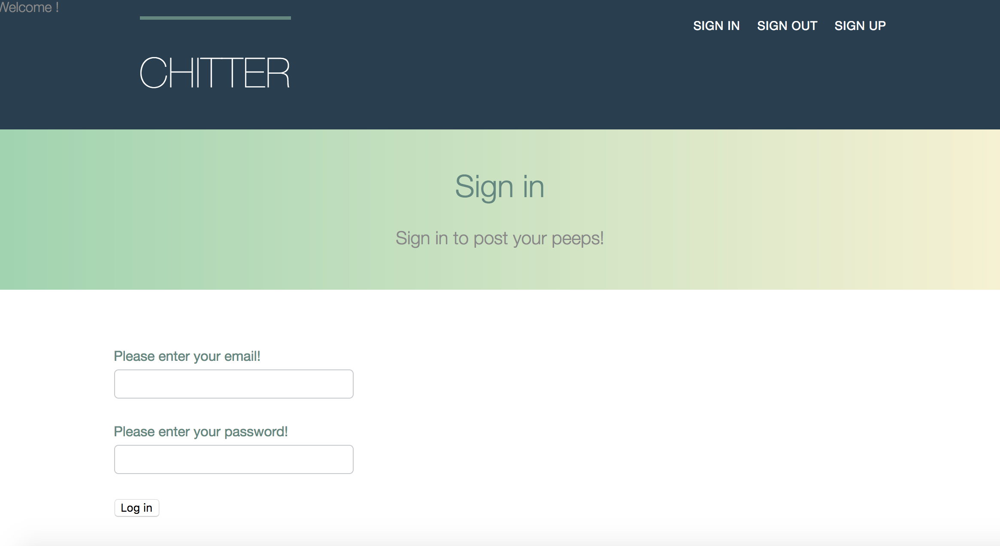
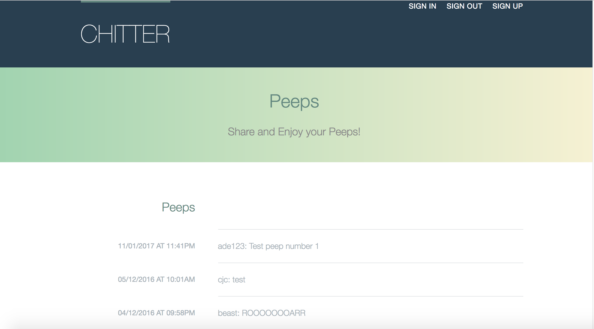

Chitter Clone
=============

Twitter clone that will allow the users to post messages to a public stream.

Features:
----------
* Users sign up with an email, username and password

* Users create make a post by logging

* Users can log out so no more posts are made.

* Anyone can view all of the posts on the 'peeps' page.


Instructions and Installation:
-------------------------------

Fork and clone this repo, then in the command prompt run the following:

```
$ bundle
```

This downloads all the necessary gemfiles. To launch in a browswer enter:

```
$ ruby app/app.rb
```

Then visit http://localhost:4567

Screenshots:
------------






Further features to implement:
-----

* Users can reply to a post made on the peeps page

* Work on the css to make it look good
