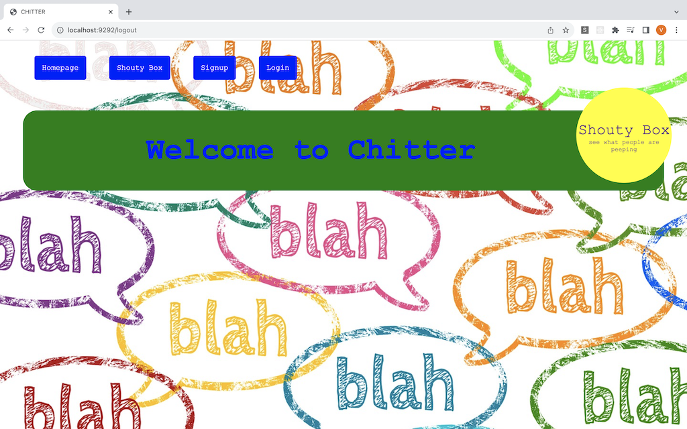
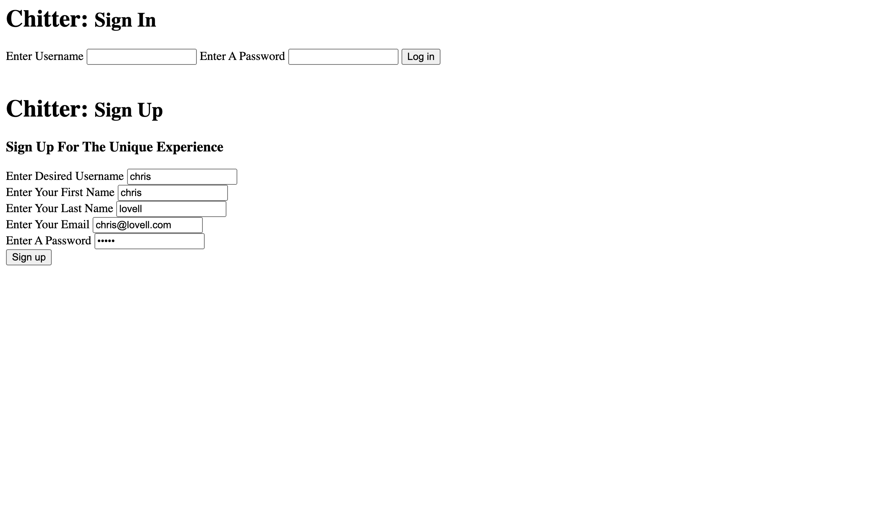

Chitter Challenge
=================


How to set up:
-------
Clone this repo by typing the following into your terminal:
```
git clone https://github.com/clovellbsc/chitter-challenge.git
```

install bundler:
```
gem install bundler
```

run bundler
```
bundle install
```

go to the migrations folder and follow the steps in psql, each step is numbered:
```
cd db/migrations
```

run rackup in terminal
```
rackup
```

go to your browser of choice, enter the following url
```
http://localhost:9292/
```

## the home page should load:


## click the sign up button:


## fill in the fields under Chitter: Sign Up and then click the sign up button. This should display the home page:



## you can log out by clicking log out: 


## if you try to log in with an unknown account it raises a message:


## if you try to input a wrong password when signing in it raises an error:


## if you try to sign up without filling in all the fields it raises an error:


## you can now sign in again or sign up a new account


## you now have access to posting and comments, fill in the field after create new post and click Send Peep:


## you can comment on a peep by clicking the Add Comment button, you should see what post you're commenting on and who posted it:


## fill in the field and click submit:


## This will display on the homepage:


## if you add a new post it is displayed on the top of the chitter feed:


To run tests type the following into your terminal from the main directory
```
rspec
```

Challenge:
-------

We are going to write a small Twitter clone that will allow the users to post messages to a public stream.

Features:
-------

As a User
So that I can let people know what I am doing  
I want to post a message (peep) to chitter

As a User
So that I can see what others are saying  
I want to see all peeps in reverse chronological order

As a User
So that I can better appreciate the context of a peep
I want to see the time at which it was made

As a User
So that I can post messages on Chitter as me
I want to sign up for Chitter

As a User
So that only I can post messages on Chitter as me
I want to log in to Chitter

As a User
So that I can avoid others posting messages on Chitter as me
I want to log out of Chitter


Notes on functionality:
------

* You don't have to be logged in to see the peeps.
* Users sign up to chitter with their email, password, first name, last name and a username (e.g. samm@makersacademy.com, password123, Sam Morgan, sjmog).
* The username and email are unique.
* Peeps (posts to chitter) have the name of the maker and their user handle.
* Your README should indicate the technologies used, and give instructions on how to install and run the tests.
* In order to start a conversation as a maker I want to reply to a peep from another maker.

