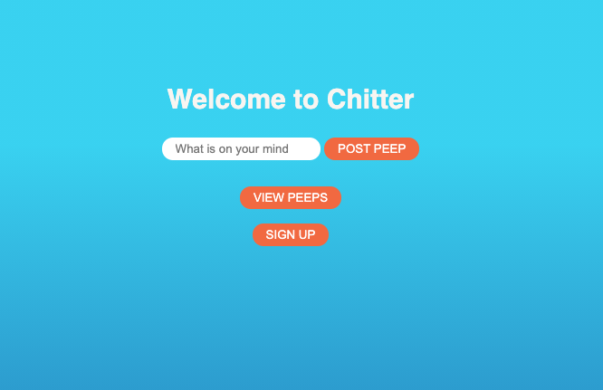

## A Twitter Clone



Features:
-------

```

As a Maker
So that I can let people know what I am doing  
I want to post a message (peep) to chitter

As a maker
So that I can see what others are saying  
I want to see all peeps in reverse chronological order

As a Maker
So that I can better appreciate the context of a peep
I want to see the time at which it was made

As a Maker
So that I can post messages on Chitter as me
I want to sign up for Chitter

---------

As a Maker
So that only I can post messages on Chitter as me
I want to log in to Chitter

As a Maker
So that I can avoid others posting messages on Chitter as me
I want to log out of Chitter

As a Maker
So that I can stay constantly tapped in to the shouty box of Chitter
I want to receive an email if I am tagged in a Peep
```

# How to Use 
## To Set up the project 
Ruby Version: 
`2.6.5`

```
git clone git@github.com:phileeep/chitter-challenge.git
bundle
```
Connect to psql:
```
psql postgres
```

Create Databases:
```
CREATE DATABASE chitter;
CREATE DATABASE chitter_test;
```

Then to finish the set up connect to the tables shown in the `/db` folder

To run the App
```
rackup
```

## Technologies Used 
- Ruby
- Sinatra web framework
- RSpec/Capybara
- HTML / CSS

# Goals
- To Complete User stories for log in and log out. 
- Update the code to work with an ORM. 
- Update CSS Styling


