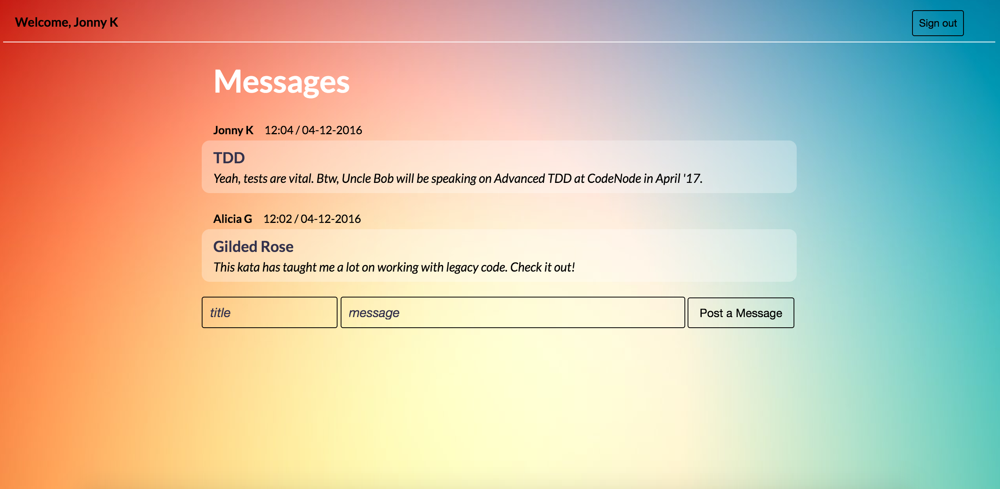

Chitter Chatter
=================



A simple messaging app built in Ruby, Sinatra, DataMapper ORM and PostgreSQL database.

 [Chitter Chatter](https://chitter-chatter-app.herokuapp.com/) demo

Features:
-------

```
As a Maker
So that I can post messages on Chitter as me
I want to sign up for Chitter

As a Maker
So that I can post messages on Chitter as me
I want to log in to Chitter

As a Maker
So that I can avoid others posting messages on Chitter as me
I want to log out of Chitter

As a Maker
So that I can let people know what I am doing  
I want to post a message (peep) to chitter

As a maker
So that I can see what others are saying  
I want to see all peeps in reverse chronological order

As a maker
So that I can better appreciate the context of a peep
I want to see the time at which it was made
```

Installation:
-------
- clone this repo: **https://github.com/lcbeh/chitter-challenge**
- access the directory: **cd chitter-challenge**
- run **bundle install**
- PostgreSQL database has to be set up locally on machine. See Setting up PostgreSQL section below.
- for test, run **rspec**
- to use the app, run **ruby app/app.rb** and go to **http://localhost:4567/** in your browser.

Setting up PostgreSQL
-------
- install [homebrew](http://brew.sh/)
- then **brew install postgresql**
- then **ln -sfv /usr/local/opt/postgresql/*.plist ~/Library/LaunchAgents
launchctl load ~/Library/LaunchAgents/homebrew.mxcl.postgresql.plist**
- run **psql**
- the command line will let you know that "your_computer_username" database does not exist. Create it by running:  
  **psql postgres**  
  **create database "your_user_name";**  
  **\q**
- then we create chitter database for test and development environment:  
  **psql**  
  **create database "chitter_test";**  
  **create database "chitter_development";**  
  **\q**

  ---
[](https://coveralls.io/github/makersacademy/chitter-challenge?branch=rjlynch)
