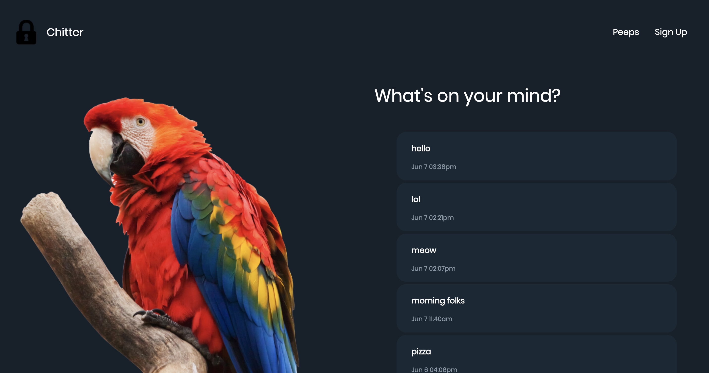

Chitter Challenge
=================


Write a small Twitter clone, make it look awesome.


Features:
-------

```
As a Maker
So that I can let people know what I am doing  
I want to post a message (peep) to chitter

As a maker
So that I can see what others are saying  
I want to see all peeps in reverse chronological order

As a Maker
So that I can better appreciate the context of a peep
I want to see the time at which it was made

As a Maker
So that I can post messages on Chitter as me
I want to sign up for Chitter
```


Functionality:
------

* You don't have to be logged in to see the peeps.
* Makers sign up to chitter with their email, password, name and a username (e.g. samm@makersacademy.com, password123, Sam Morgan, sjmog).
* The username and email are unique.
* Peeps (posts to chitter) have the name of the maker and their user handle.
* Your README should indicate the technologies used, and give instructions on how to install and run the tests.


Design Choices:
-----

I took this challenge as an opportunity to brush up on using containers without Bootstrap or any library, as this was always something I found quite difficult.

Extra challenge I've set myself: Having no Photoshop on this Makers MacBook (I unfortunately had to bury mine), I made use of other software like Affinity Photo and Figma for prototyping and basic edits. Will properly re-edit later.

My first idea was to get as far away from the normal Twitter as possible and to create some sort of secret club, thus the color choices and the picture with the girl, including a landing page which you can see here:


While I was coding the website I changed my mind through and switched to a design that was closely inspired by Twitter.
The colour palette I've used is the exact same as Twitters' dark mode. To keep some sort of link to my first prototype, I've kept the lock logo to refer to it. Instead for going for a cartoonish looking bird like in the original, I decided to go a bit more realistic and to crop 3 different bird photos.
See screenshots of the finished design (colour true) here:




And see it in action here:


Summary of how I approached this challenge:
------

### General setup:

1) Install Gem files
2) Add config to spec helpers and curse bundler
3) check testing environment and write first useless but funny feature test
4) see it fail – RED
5) make it pass by cursing a bit more at bundler - GREEN


### Setting up database

1) Hard code data in controller
2) add view folder and index.erb file
3) set up spec for peep class – RED
4) create peep.rb file - GREEN
5) linked Peep class in controller, now making use of model - REFACTOR
6) setting up database & test database, making sure test database gets wiped


### User Stories

1) setting up feature test, seeing it fail - RED
2) changing view files, adding button and specify new route
3) creating new .rb files with submit forms
4) setting new route in controller, GET and POST
5) establishing connection to database - GREEN
6) REFACTOR so we use the model instead of the controller to deal with data


### Layout

I didn't use bootstrap or any library for this, as I like to design everything myself.

1) setting HTML structure to work with nav bar and containers
2) style.css for general page Layout
3) changing design to birds
4) changing design again back to original
5) nah. let's stay with birds.
6) analyzed colour scheme from twitter, copying it ("homage")
7) edited pictures of birds and made sure I have a different one for every page


How to actually use the finished product:
------

Run psql, head over to db/migrations and copy and paste it to create the tables needed.
