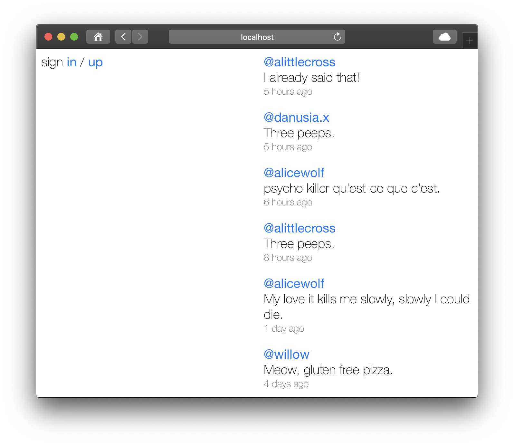
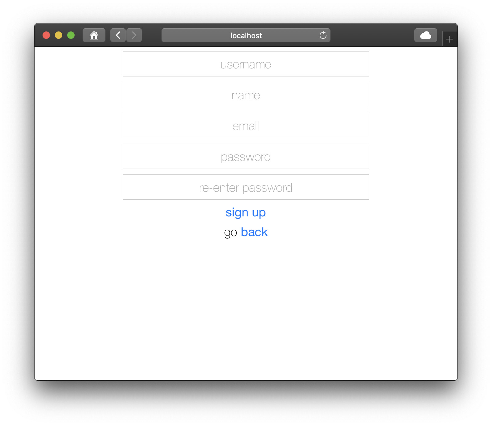
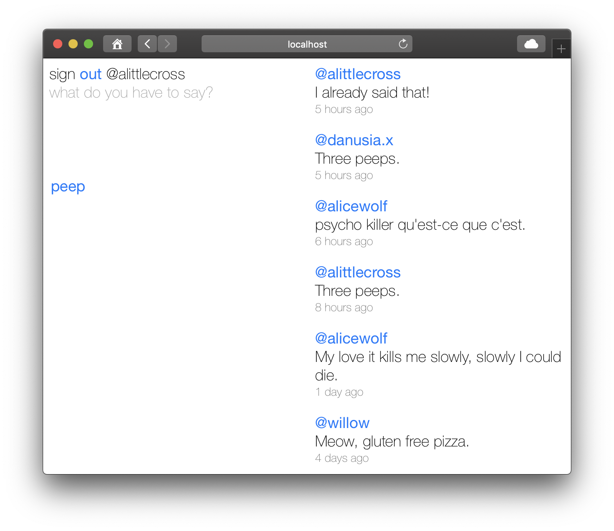
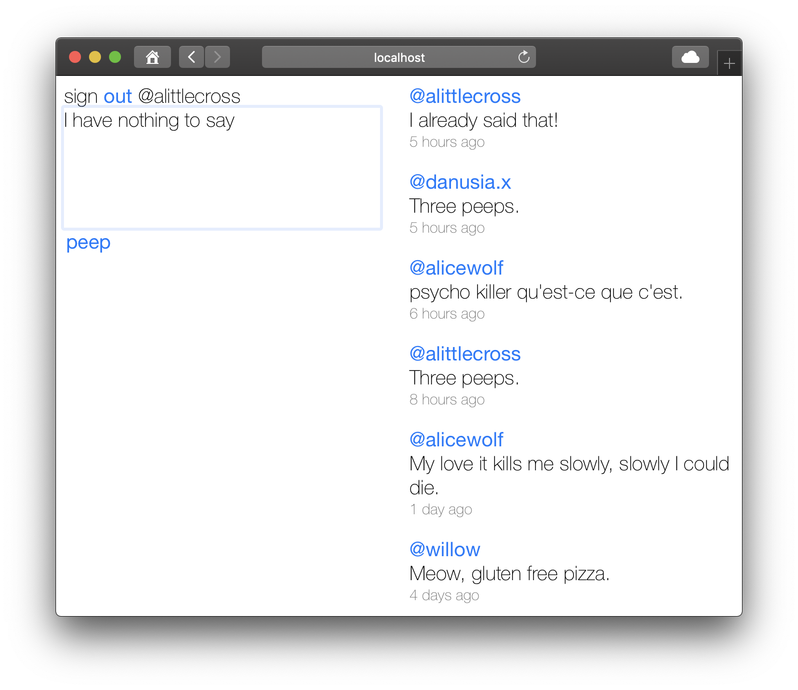
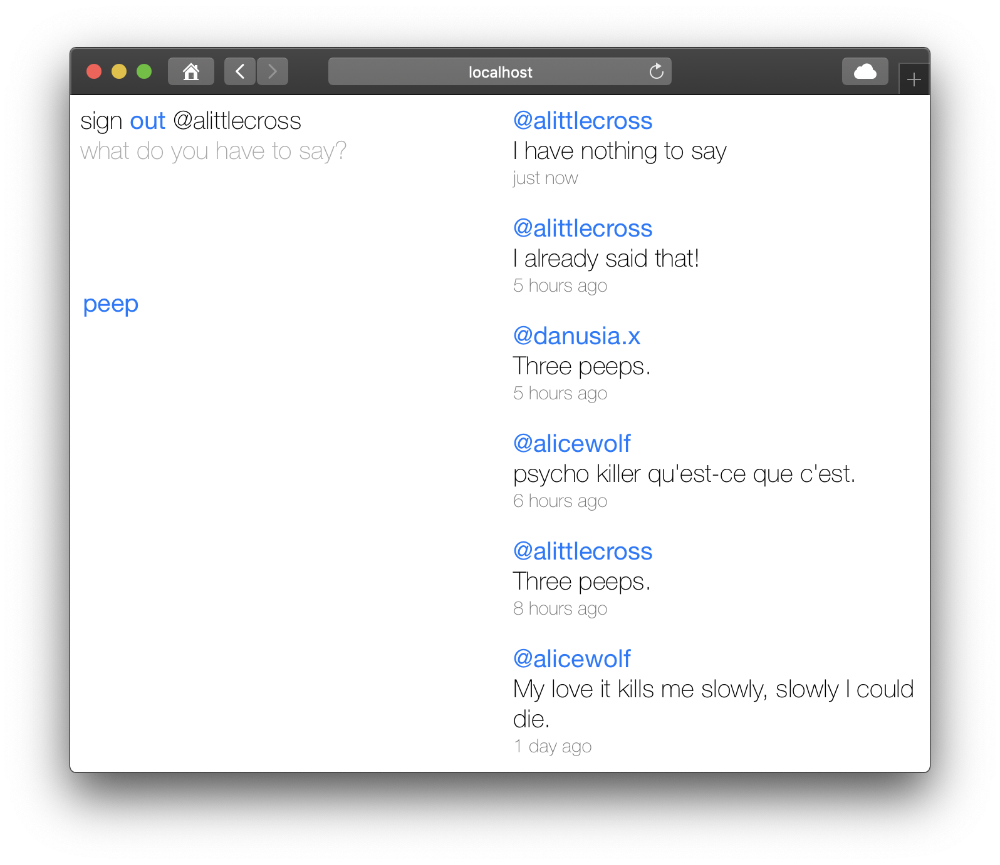

# Chitter Challenge

Makers Week 4 (Friday) - This project is a web app that replicates some of the functionality of Twitter.

**(Note. you will need to enter an outlook email address and password in `email.rb` to test the `mentions` functionality)**

## Getting started

Assuming you have `git` installed, in the location of your choice, in Terminal:

`git clone git@github.com:alittlecross/chitter-challenge.git`

`cd` into the `chitter-challenge` folder.

Assuming you have `Ruby` and `Bundler` installed, in that same location, in Terminal:

`bundle`

## Database Setup

In Terminal:

```
brew install postgresql

ln -sfv /usr/local/opt/postgresql/*.plist ~/Library/LaunchAgents
launchctl load ~/Library/LaunchAgents/homebrew.mxcl.postgresql.plist

psql postgres
```

Then paste the SQL script `00_create_databases` from the `db/migrations` folder.

Change database using `\c chitter`

Then paste the remaining SQL scripts from the `db/migrations` folder in the given order.

Change to `chitter_test` and repeat the above step if you intend to run rspec.

## Usage

In that same location, in Terminal:

`rackup`

Then in the browser of your choice:

`http://localhost:9292/`

You should see the chitter feed of all peeps:



You can sign in if you are already registered:


Or else you can sign up to create a new account:



Once signed in, you can see the feed and also the form to post a peep:



You can complete the form and click the 'peep' button:



And your peep will be shown in the feed, displayed with most recent at the top:



If a peep mentions another user using their chitter username (e.g. @alittlecross) they will be sent an email.

## Running tests

In that same location, in Terminal:

`rspec`

## Linting

In that same location, in Terminal:

`rubocop`
