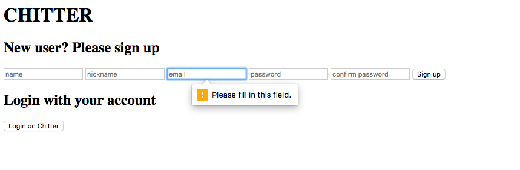

Chitter Challenge
=================

This is a little Twitter clone that will allow the users to post messages to a public stream.

Drive the creation of my app using rspec tests.

Used data mapper and postgres to save the data.

User sign up to chitter with their email, password, name and a user name.

Used bcrypt to secure the passwords.

You only can peep if you are logged in.


instructions:
-------
 - start by cloning this repo
 - `bundle`
 - use `rspec` to test
 - `rackup`
 - `localhost:9292/users/new`




Features:
-------

```
STRAIGHT UP

As a Maker
So that I can let people know what I am doing  
I want to post a message (peep) to chitter

As a maker
So that I can see what others are saying  
I want to see all peeps in reverse chronological order

As a Maker
So that I can better appreciate the context of a peep
I want to see the time at which it was made

As a Maker
So that I can post messages on Chitter as me
I want to sign up for Chitter

HARDER

As a Maker
So that only I can post messages on Chitter as me
I want to log in to Chitter

As a Maker
So that I can avoid others posting messages on Chitter as me
I want to log out of Chitter
```

### Notes on functionality:

* Need to work on the css to make it look good (we all like beautiful things)

* Implement a route so that you don't have to be logged in to see the peeps

* Work on validation :the username and email to be unique
