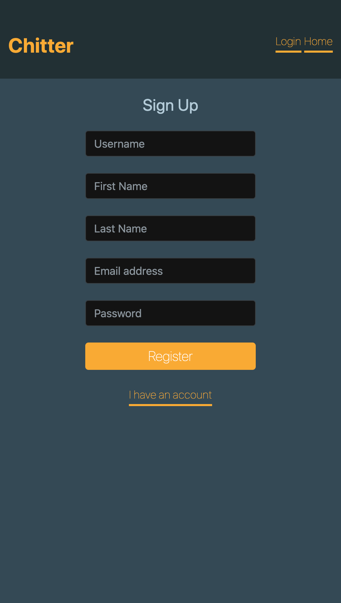

##Weekend 4 - Chitter Challenge

[](https://travis-ci.org/AAMani5/chitter-challenge)
[](https://coveralls.io/github/AAMani5/chitter-challenge?branch=master)


Have a go at [Ashwini's Chitter](https://chitter-ash.herokuapp.com)

Started the challenge by writing feature test for signing up (including the validations required). Then made the required views and then the models to store users. Followed the same approach for sign in and sign out features as well. When I moved on to users being able to post peeps, I had an idea about the association between Peep and User model. Once I finished the MVP, I refactored the tests using helper modules in Rspec. I decided on trying to implement an extra feature of adding comments to existing peeps by users. Was wondering if I should use 'one to many' or 'one to many through'. I decided to go with one to many to keep things simple. Should think about what impact these two ways have on speed of querying data in database. Took me sometime to add styling but I think the website looks better :)

User Stories:

```
As a Maker
So that I can post messages on Chitter as me
I want to sign up for Chitter

As a Maker
So that I can post messages on Chitter as me
I want to log in to Chitter

As a Maker
So that I can avoid others posting messages on Chitter as me
I want to log out of Chitter

As a Maker
So that I can let people know what I am doing  
I want to post a message (peep) to chitter

As a maker
So that I can see what others are saying  
I want to see all peeps in reverse chronological order

As a maker
So that I can better appreciate the context of a peep
I want to see the time at which it was made

As a maker
In order to start a conversation as a maker
I want to reply to a peep from another maker
```


## Contributor
- Ashwini Mani

## Bahaviors practised
- [BDD](https://github.com/makersacademy/course/blob/master/pills/bdd_cycle.md)
- [OOP](https://en.wikipedia.org/wiki/Object-oriented_programming)

## Framework
- Sinatra
- Data Mapper(ORM)

## DBMS
- postgresql

## Cloud Application Platform
- Heroku

## Technologies Used
- Rspec
- Ruby
- Capybara

Please check our my web app [here](https://chitter-ash.herokuapp.com)

Screenshots:
<p align="center">
  
</p>

<p align="center">
  
</p>
