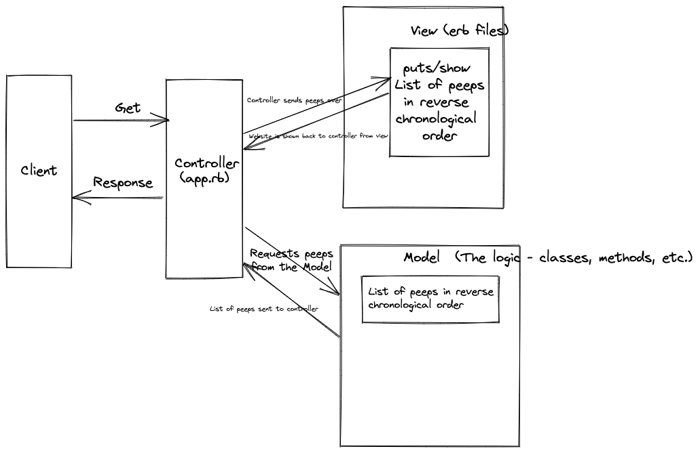

chitter-challenge specifications:

```
The website, a small Twitter clone, will have the following specifications:

You don't have to be logged in to see the peeps (posts to chitter).
Makers sign up to chitter with their email, password, name and a username.
The username and email are unique.
Peeps have the name of the maker and their user handle.

```

```
User stories:

As a Maker
So that I can let people know what I am doing  
I want to post a message (peep or chitter) to chitter

As a maker
So that I can see what others are saying  
I want to see all peeps / chitters in reverse chronological order

As a Maker
So that I can better appreciate the context of a peep
I want to see the time at which it was made

As a Maker
So that I can post messages on Chitter as me
I want to sign up for Chitter
```

Domain Model:




Instructions for 'chitter' database creation within psql.:

1. Connect to psql
2. Create the database using the psql command CREATE DATABASE chitter_manager;
3. Connect to the database using the pqsl command \c chitter_manager;
4. Run the query we have saved in the file 01_create_chitters_table.sql
5. Run the query we have saved in the file 02_add_message_column_to_chitters.sql


Instructions for 'chitter' test database creation within psql.:

1. Connect to psql
2. Create the database using the psql command CREATE DATABASE chitter_manager_test;
3. Connect to the database using the pqsl command \c chitter_manager_test;
4. Run the query we have saved in the file 01_create_chitters_table.sql
5. Run the query we have saved in the file 02_add_message_column_to_chitters.sql
