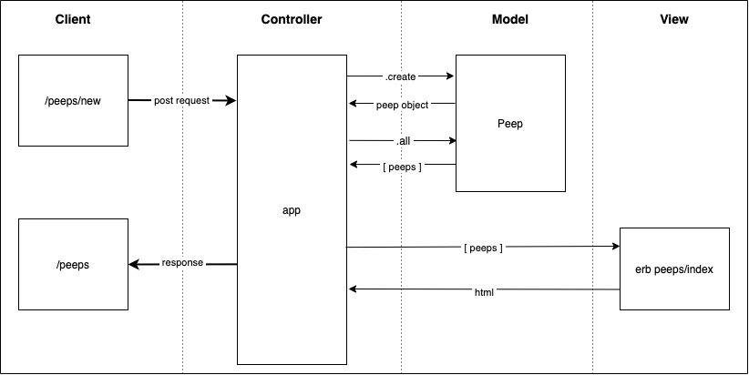

## Chitter Challenge

To write a small Twitter clone that will allow the users to post messages to a public stream.

### Technologies Used

Sinatra and Rack for handling requests and responses
Capybara for feature testing
RSpec for unit testing
PostgreSQL for the database
Ruby Gemfile ```pg``` for connecting and executing SQL on PostgreSQL database

#### Setting Up Databases

##### Test Database
To utilise the tests within the ```spec``` directory please set up the following database:
1. Connect to ```psql```
2. Create the database using the ```psql``` command <br>
```CREATE DATABASE chitter_test;```
3. Connect to the database using the ```psql``` command <br>
```\c chitter_test;```
4. Run the all the queries detailed in the ```migrations``` directory <br>
```
.
├── db
    └── migrations
        └── 01_create_chitter_table.sql
        └── etc
``` 

##### Development Database
The following database should be set up for when the application is run locally:
1. Connect to ```psql```
2. Create the database using the ```psql``` command <br>
```CREATE DATABASE chitter;```
3. Connect to the database using the ```psql``` command <br>
```\c chitter;```
4. Run the all the queries detailed in the ```migrations``` directory <br>
```
.
├── db
    └── migrations
        └── 01_create_chitter_table.sql
        └── etc
``` 


### User Stories

```
As a Maker
So that I can let people know what I am doing  
I want to post a message (peep) to chitter

As a maker
So that I can see what others are saying  
I want to see all peeps in reverse chronological order
```



#### Walkthrough

- When the User visits the '/peeps/new' path, their browser sends a request to the Controller.
- The Controller receives the request and requests the html information from the peep/new view.
- The Controller recives the html and sends it as a response to the Client.
- The User submits the form to post a new 'peep', and so the Client sends a post request to the Controller.
- The Controller receives the request and sends the 'peep' params to the Model for it to create a new 'peep' object with.
-The Controller recives the 'peep' object from the Controller and makes a redirect to the '/peeps' route, thus requesting all the 'peeps' from the Peep class (Peep.all).
- The Peep class returns all the 'peeps' in an array to the controller, (which have been stored as an instance variable on the Peep class object).
- The Controller renders the array of 'peeps' to a webpage, which it sends as a response to the user.

