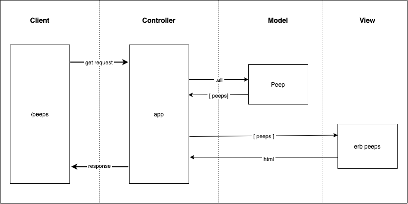

## Chitter Challenge

To write a small Twitter clone that will allow the users to post messages to a public stream.

### User Stories

```
As a Maker
So that I can let people know what I am doing  
I want to post a message (peep) to chitter
```



#### Walkthrough

- When the User visits the '/peeps' path, their browser sends a request to the Controller.
- The Controller gets the request and requests all the 'peeps' from the Peep class (Peep.all).
- The Peep class returns all the 'peeps' in an array to the controller, (which have been stored as an instance variable on the Peep class object).
- The Controller renders the array of 'peeps' to a webpage, which it sends as a response to the user

