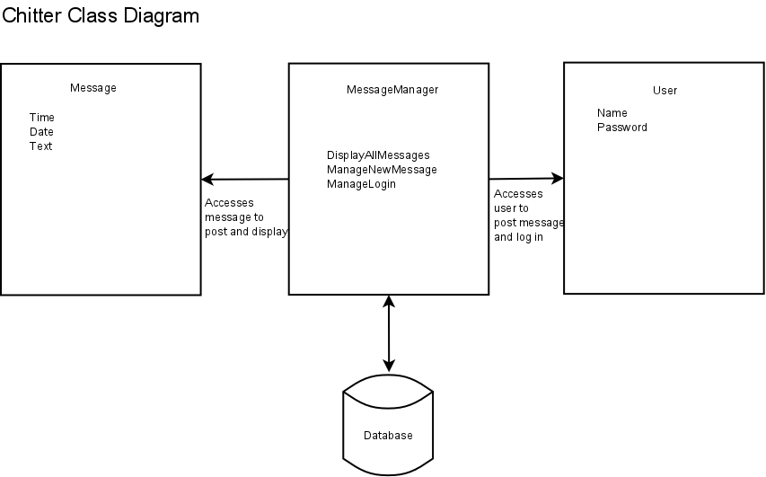

# Design process for chitter

## Using the user stories to gather nouns and verbs for guidance on classes and data

The focus will be on the third line of the given user stories, i.e.

1. I want to post a message (peep) to chitter

2. I want to see all peeps in reverse chronological order

3. I want to see the time at which it was made

4. I want to sign up for Chitter

### Nouns

- Message
- User (when signing up)

### Verbs

- Post
- See order (of peeps in reverse chronological order)
- See time (at which peep made)
- Sign up

## CRC cards, data model and collaboration diagram

- MessageManager additionally identified

