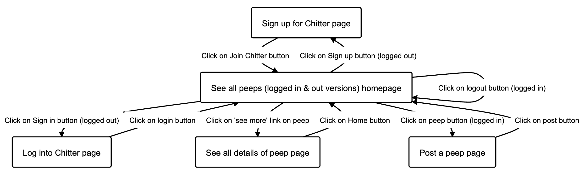

# Modelling and Planning Chitter application

## Step 0: User stories or specification

```
STRAIGHT UP

As a Maker
So that I can let people know what I am doing  
I want to post a message (peep) to chitter

As a maker
So that I can see what others are saying  
I want to see all peeps in reverse chronological order

As a Maker
So that I can better appreciate the context of a peep
I want to see the time at which it was made

As a Maker
So that I can post messages on Chitter as me
I want to sign up for Chitter

HARDER

As a Maker
So that only I can post messages on Chitter as me
I want to log in to Chitter

As a Maker
So that I can avoid others posting messages on Chitter as me
I want to log out of Chitter

ADVANCED

As a Maker
So that I can stay constantly tapped in to the shouty box of Chitter
I want to receive an email if I am tagged in a Peep
```

## Step 1: Planning pages

So could have a class that shows if user is logged in or not.
Then in the erb file you can do a if statement using that to show 
what buttons to display.

Might just redirect logout button to logged out version of homepage.
Also do the same for the email, don't need to notify the peep, just the person being tagged.



## Step 2: Planning routes


```md
# Homepage: list of peeps

## Request:
GET /
No parameters

## Response (200 OK)
HTML view with list of entries
```

```md

# Page: form to login

## Request:
GET /login
No parameters

## Response (200 OK)
HTML view with form to login
```

```md

# Page: form to sign up

## Request:
GET /signup
No parameters

## Response (200 OK)
HTML view with form to sign up
```

```md

# Page: make a new peep

## Request:
GET /peep
No parameters

## Response (200 OK)
HTML view with form to submit new peep (to POST /peeps)
```

```md

# Page: see full details of peep

## Request:
GET /peep/:id
With path parameter :id

## Response (200 OK)
HTML view with details of a single peep
```

```md

# Page: new peep sent

## Request:
POST /peep
With body parameters:
  content="My first peep" # only parameter user should have to manually input
  name = "Samuel Badru"
  username ="sobad" #pre-fill name and username with stored logged in details
  when = #automatically give current date & time?

## Response (200 OK)
Sends back to homepage - user should see their peep top of the list

# Page: log in

## Request:
POST /login
With body parameters:
  email="samuelbadru@outlook.com"
  password = "securepassword23"


## Response (200 OK)
Sends back to logged in version of homepage - user should see buttons such as 'Create a peep' and 'Sign out'

# Page: sign up

## Request:
POST /signup
With body parameters:
  email="samuelbadru@outlook.com"
  name="Samuel Badru"
  username="sobad"
  password = "securepassword23"


## Response (200 OK)
Sends back to logged in version of homepage - user should see buttons such as 'Create a peep' and 'Sign out'


# Page: sign out button on homepage

## Request:
POST /signout
With body parameters:
  email="samuelbadru@outlook.com"
  password = "securepassword23"


## Response (200 OK)
Sends back to logged out version of homepage - user should see buttons such as 'Log in' and 'Sign up'


## Step 3: Test-drive and implement

