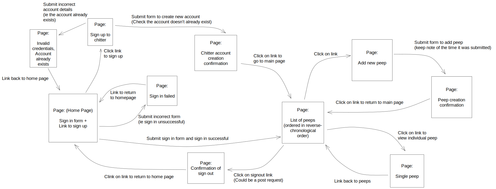

# Modelling and Planning a Web application

## Step 0: User stories or specification

```
STRAIGHT UP

As a Maker
So that I can let people know what I am doing  
I want to post a message (peep) to chitter

As a maker
So that I can see what others are saying  
I want to see all peeps in reverse chronological order

As a Maker
So that I can better appreciate the context of a peep
I want to see the time at which it was made

As a Maker
So that I can post messages on Chitter as me
I want to sign up for Chitter

HARDER

As a Maker
So that only I can post messages on Chitter as me
I want to log in to Chitter

As a Maker
So that I can avoid others posting messages on Chitter as me
I want to log out of Chitter

ADVANCED

As a Maker
So that I can stay constantly tapped in to the shouty box of Chitter
I want to receive an email if I am tagged in a Peep
```

## Step 1: Planning pages

You'll have to adopt the perspective of a user browsing your website. What are the
different pages that they will use? How does the user navigate to these pages (links,
forms)?

At this point, it's good to do a small diagram of the different pages and their
relationship. If you want to do more complex mockups with the details of the elements on
the page, you can also do it, but it's not necessary to go into this level of detail for
this step.

Here's an example of how the user stories above can be planned. Note that this is only one
of the many possible flows that could be planned for these user stories.



## Step 2: Planning routes

Remember that a web application flow is all based on the HTTP request-response cycle, from
the web browser to the server application. You'll now need to draw your routes from the
pages you planned at the previous step.

This time, we're switching from the user perspective to the HTTP application engineer's
perspective - thinking of the application's behaviour in requests and responses, rather
than pages.

For example:

 * A page (such as the home page) is usually returned by a `GET` route. For example, the
   home page (which is almost always the first route you'll start with), is usually `GET
   /`.
 * If the user navigates to a different page using a link, you will need a `GET` route for
   this other page.
 * If the user submits a form that leads to a different page, you will need a `POST` route
   to submit this form to.

From the pages planned above, here are the routes we could plan. Once again, this is only
a possible list of routes for this case — you could come up with slightly different ones,
which would still satisfy the initial user stories.

```md
# Home Page: Sign in

## Request:
GET /
No parameters

## Response (200 OK)
HTML view with sign in form and link to sign up
```

```md
## Request:
POST /signin
Body:
  Username,
  Password

## Response (200 OK)
Redirects to `/peeps`

## Response (400 Bad Request)
HTML view saying you entered the wrong credentials,
link back to the homepage
```

```md
# Page: Signup 

## Request:
GET /signup
No parameters

## Response (200 OK)
HTML view with form to create a new chitter account


## Request:
POST /signup

## Response (200 OK)
HTML view confirming successful signup and a link to view peeps

## Response (400 Bad Request)
HTML view saying an account with this username already exists, linking back to home page
```

```md
# Page: list of peeps

## Request:
GET /peeps
No parameters

## Response (200 OK)
HTML view with a list of peeps in reverse chronological order


## Request:
POST /peeps
Body parameters:
  account_id,
  message,
  time_sent

## Response (200 OK)
HTML view confirming a peep has been created

## Response (400 Bad Request)
HTML view with an error and a link back to peeps
```

```md
# Page: Add new peep

## Request:
GET /peeps/new
No parameters

## Response (200 OK)
HTML view with form to create a new peep
```

```md
# Page: View single peep

## Request:
GET /peeps/:id
Path Parameters:
  id (int): id of the peep

## Response (200 OK)
HTML view with all the details of the peep and a link back to `/peeps`
```
